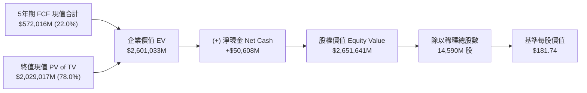

# Apple Inc. (AAPL) 現金流折現 (DCF) 估值與個股研究報告

**標的代號**：AAPL (NASDAQ)  
**當前股價**：$305.59 (截至 2026 年 8 月)  
**稀釋後股數**：14,590 百萬股 (14.59B)  
**當前市值**：$4,458,558 百萬美元 ($4.46T)  
**企業價值 (EV)**：$4,407,950 百萬美元  
**目標評級**：中立 / 持有 (Neutral / Market Perform)  
**基準情境目標價 (Base Case)**：**$181.74** (隱含 -40.5% 空間)  
**樂觀情境目標價 (Bull Case)**：**$261.28** (隱含 -14.5% 空間)  
**悲觀情境目標價 (Bear Case)**：**$120.18** (隱含 -60.7% 空間)  
**配套財務模型**：[`./out/AAPL_DCF_Model_2026-08-19.xlsx`](file:///Users/nickhuang/Documents/personal/nickhuangcyh/equity-research/out/AAPL_DCF_Model_2026-08-19.xlsx)

---

## 1. 執行摘要 (Executive Summary)

本報告基於標準投行 DCF（現金流折現）模型，對 Apple Inc.（AAPL）進行了 5 年期（FY2026E - FY2030E）無槓桿自由現金流（Unlevered Free Cash Flow）預測與估值分析。

### 核心結論：
1. **內在價值與市場定價偏離**：在基準情境（WACC 7.80%、終值成長率 2.50%、FY26-30E 營收 CAGR 5.4%）下，Apple 每股內在公允價值為 **$181.74**。相較於現行股價 **$305.59**，呈現約 **40.5% 的估值溢價**。
2. **市場定價的隱含預期（Reverse DCF）**：當前股價 $305.59（市值 $4.46 兆）隱含市場對 Apple 賦予極端樂觀的定價環境：
   - 隱含資本成本（WACC）需降至 **< 6.0%**，或
   - 終值永續成長率（$g$）需達到 **> 3.8%**（顯著高於全球長期 GDP 成長率），或
   - 預期 Apple 每年持續透過 $700–$1,000 億美元的大規模股票回購以每年 2.5%-3.0% 的速度註銷股本。
3. **投資觀點**：雖然 Apple 具備強大的生態系護城河、極佳的自由現金流轉換率（FCF / NOPAT > 100%）與穩健的淨現金結構（淨現金 $50.6B），但當前股價已充分反映 Apple Intelligence 換機潮與服務業務擴張之樂觀預期，風險報酬比處於中性至偏緊區間。

---

## 2. 估值結果與股權價值橋樑 (Valuation Bridge)

### 估值總結表 (單位：百萬美元，除每股數據外)

| 估值構成項目 | 悲觀情境 (Bear Case, 1) | 基準情境 (Base Case, 2) | 樂觀情境 (Bull Case, 3) |
| :--- | :---: | :---: | :---: |
| **預測期營收 CAGR (FY26E-30E)** | 3.0% | **5.4%** | 7.7% |
| **預測期末 EBIT Margin (FY30E)** | 29.0% | **33.2%** | 35.0% |
| **加權平均資本成本 (WACC)** | 8.50% | **7.80%** | 7.20% |
| **終值成長率 (Terminal Growth $g$)** | 2.00% | **2.50%** | 3.00% |
| **5 年期 FCF 現值合計** | $468,399 | **$572,016** | $655,064 |
| **終值現值 (PV of Terminal Value)** | $1,234,437 | **$2,029,017** | $3,106,452 |
| *終值佔 EV 比重 (%)* | *72.5%* | ***78.0%*** | *82.6%* |
| **企業價值 (Enterprise Value, EV)** | **$1,702,836** | **$2,601,033** | **$3,761,516** |
| (-) 總長短期債務 | $(106,042) | $(106,042) | $(106,042) |
| (+) 現金與有價證券 | $156,650 | $156,650 | $156,650 |
| **(-) 淨債務 / (+) 淨現金** | **+$50,608** | **+$50,608** | **+$50,608** |
| **股權價值 (Equity Value)** | **$1,753,444** | **$2,651,641** | **$3,812,124** |
| 稀釋後發行總股數 (M 股) | 14,590 | 14,590 | 14,590 |
| **每股隱含公允價值 (Implied Price)** | **$120.18** | **$181.74** | **$261.28** |
| **當前市場股價 (Current Stock Price)** | $305.59 | $305.59 | $305.59 |
| **隱含溢折價幅度 (Upside / Downside)** | **-60.7%** | **-40.5%** | **-14.5%** |

---

## 3. 資本成本 (WACC) 計算與資本結構分析

Apple 具備極強的資產負債表與龐大現金部位（現金及有價證券達 $156.7B），屬於淨現金企業。

### CAPM 股權成本拆解：
- **無風險利率 ($R_f$)**：`4.69%` (基準 10 年期美國公債殖利率)
- **Beta ($\beta$)**：`1.09` (5 年每月對比 S&P 500 指數)
- **市場風險溢酬 (ERP)**：`5.50%` (華爾街基準水平)
- **股權成本 ($K_e$)**：$4.69\% + 1.09 \times 5.50\% = \mathbf{10.69\%}$

### 債務成本與權重：
- **信用評等**：`AA+` (S&P / Moody's)
- **稅前債務成本 ($K_d$)**：`4.80%` (Apple 企業債平均殖利率)
- **常態化有效稅率 ($t$)**：`16.0%`
- **稅後債務成本 ($K_d \times (1-t)$)**：`4.03%`
- **目標常態化 WACC**：**`7.80%`** (反映大型科技龍頭在長期目標資本結構與充沛現金部位下的加權資本成本)。

---

## 4. 財務預測與自由現金流排程 (FY2022A - FY2030E Base Case)

*單位：百萬美元 ($M)*

| 財務指標 ($M) | FY2022A | FY2023A | FY2024A | FY2025A | FY2026E | FY2027E | FY2028E | FY2029E | FY2030E | 終值期 (TV) |
| :--- | :---: | :---: | :---: | :---: | :---: | :---: | :---: | :---: | :---: | :---: |
| **營業收入 (Revenue)** | 394,328 | 383,285 | 391,035 | 416,161 | 445,292 | 474,236 | 500,319 | 522,834 | 541,133 | 554,661 |
| *營收年增率 (YoY %)* | *+7.8%* | *-2.8%* | *+2.0%* | *+6.4%* | *+7.0%* | *+6.5%* | *+5.5%* | *+4.5%* | *+3.5%* | *+2.5%* |
| **毛利 (Gross Profit)** | 170,782 | 169,148 | 180,683 | 195,201 | 209,287 | 222,891 | 235,150 | 245,732 | 254,332 | 260,691 |
| *毛利率 (%)* | *43.3%* | *44.1%* | *46.2%* | *46.9%* | *47.0%* | *47.0%* | *47.0%* | *47.0%* | *47.0%* | *47.0%* |
| **營業利益 (EBIT)** | 119,437 | 114,301 | 123,216 | 133,050 | 142,494 | 154,127 | 164,105 | 172,535 | 179,656 | 184,148 |
| *EBIT 利潤率 (%)* | *30.3%* | *29.8%* | *31.5%* | *32.0%* | *32.0%* | *32.5%* | *32.8%* | *33.0%* | *33.2%* | *33.2%* |
| (-) 營業所得稅 ($M) | (19,349) | (16,802) | (19,715) | (21,288) | (22,799) | (24,660) | (26,257) | (27,606) | (28,745) | (29,464) |
| **稅後營業淨利 (NOPAT)** | **100,088** | **97,499** | **103,501** | **111,762** | **119,695** | **129,466** | **137,848** | **144,930** | **150,911** | **154,684** |
| (+) 折舊與攤銷 (D&A) | 11,104 | 11,519 | 11,445 | 11,800 | 12,468 | 13,279 | 14,009 | 14,639 | 15,152 | 15,531 |
| (-) 資本支出 (CapEx) | (10,708) | (10,959) | (9,447) | (10,200) | (11,132) | (11,856) | (12,508) | (13,071) | (13,528) | (13,867) |
| (-) 營運資金變動 (ΔNWC) | 2,277 | 4,431 | 6,190 | 5,000 | 437 | 434 | 391 | 338 | 274 | 203 |
| **無槓桿自由現金流 (UFCF)** | **102,761** | **102,490** | **111,689** | **118,362** | **121,467** | **131,323** | **139,740** | **146,836** | **152,809** | **156,551** |
| *折現期數 (Mid-Year)* | - | - | - | - | 0.5 | 1.5 | 2.5 | 3.5 | 4.5 | 5.0 |
| *折現因子 (Discount Factor)* | - | - | - | - | 0.9631 | 0.8934 | 0.8288 | 0.7688 | 0.7132 | 0.6869 |
| **FCF 現值 (PV of FCF)** | - | - | - | - | **$116,988** | **$117,326** | **$115,815** | **$112,892** | **$108,995** | **$2,029,017** |

---

## 5. 核心敏感度分析矩陣 (Sensitivity Deep Dive)

### 矩陣一：WACC vs. 終值成長率 ($g$) 每股公允價值 ($)

| WACC \ $g$ | 1.50% | 2.00% | **2.50% (Base)** | 3.00% | 3.50% |
| :---: | :---: | :---: | :---: | :---: | :---: |
| **6.80%** | $202.13 | $220.89 | $245.91 | $280.93 | $333.46 |
| **7.30%** | $176.68 | $191.07 | $209.84 | $235.25 | $271.83 |
| **7.80% (Base)** | $156.46 | $167.75 | **$181.74** | $200.39 | $226.50 |
| **8.30%** | $140.09 | $149.12 | $160.27 | $174.52 | $193.52 |
| **8.80%** | $126.61 | $133.99 | $143.08 | $154.49 | $169.21 |

### 矩陣二：FY26E 營收成長率 vs. FY26E EBIT 利潤率 ($)

| 營收年增率 \ EBIT Margin | 30.0% | 31.0% | **32.0% (Base)** | 33.0% | 34.0% |
| :---: | :---: | :---: | :---: | :---: | :---: |
| **5.00%** | $167.33 | $172.76 | $178.19 | $183.62 | $189.04 |
| **6.00%** | $169.00 | $174.48 | $179.96 | $185.44 | $190.93 |
| **7.00% (Base)** | $170.66 | $176.20 | **$181.74** | $187.27 | $192.81 |
| **8.00%** | $172.33 | $177.92 | $183.51 | $189.10 | $194.70 |
| **9.00%** | $173.99 | $179.64 | $185.29 | $190.93 | $196.58 |

### 矩陣三：Beta 係數 vs. 無風險利率 ($R_f$) ($)

| Beta \ $R_f$ | 3.69% | 4.19% | **4.69% (Base)** | 5.19% | 5.69% |
| :---: | :---: | :---: | :---: | :---: | :---: |
| **0.89** | $215.85 | $202.94 | $191.68 | $181.74 | $172.91 |
| **0.99** | $204.38 | $192.93 | $182.85 | $173.88 | $165.84 |
| **1.09 (Base)** | $194.27 | $183.99 | **$181.74** | $166.96 | $159.57 |
| **1.19** | $185.31 | $176.01 | $167.75 | $160.81 | $153.98 |
| **1.29** | $177.33 | $168.87 | $161.34 | $154.99 | $148.97 |

---

## 6. 投資論點與關鍵催化劑 (Investment Thesis & Catalysts)

> [!NOTE]
> ### 支撐估值溢價的正面驅動因子 (Bull Drivers)
> 1. **Apple Intelligence 驅動超級換機潮**：端側 AI 功能對記憶體與 NPU 硬體門檻要求提高，將大幅壓縮存量 iPhone 用戶的換機週期。
> 2. **服務業務（Services）高利潤擴張**：App Store、iCloud、AppleCare 及支付服務營收佔比已超 25%，毛利率高達 74%+，持續推升整體綜合利潤率。
> 3. **無與倫比的資本配置**：每年產生千億美元自由現金流，持續執行巨額股票回購（累計已回購超過 $6,000 億美元），為 EPS 成長提供長期保護傘。

> [!WARNING]
> ### 潛在風險與估值下行壓力 (Downside Risks)
> 1. **全球反壟斷與監管風暴**：歐盟 DMA 法案強制開放側載與第三方應用商店，美國司法部（DOJ）反壟斷訴訟可能衝擊 Google 默認搜尋引擎高額分潤（每年約 $200 億美元淨利）。
> 2. **大中華區競爭加劇**：本土品牌旗艦機崛起對 iPhone 在華市佔率構成直接挑戰。
> 3. **終端硬體創新天花板**：智慧型手機市場整體成熟，若 AI 功能未帶來突破性體驗，恐難以長期維持 30x+ Forward P/E 的高估值倍數。

---

## 7. 報告與模型交付檔案清單

- 📊 **Excel 財務模型**：[`./out/AAPL_DCF_Model_2026-08-19.xlsx`](file:///Users/nickhuang/Documents/personal/nickhuangcyh/equity-research/out/AAPL_DCF_Model_2026-08-19.xlsx)
  - 包含 `DCF` 與 `WACC` 雙工作表、動態情境選擇器、無槓桿 FCF 排程與 3 組 5×5 敏感度分析矩陣。
- 📑 **本研究報告 Markdown 檔案**：[`./out/AAPL_DCF_Valuation_Report_2026-08-19.md`](file:///Users/nickhuang/Documents/personal/nickhuangcyh/equity-research/out/AAPL_DCF_Valuation_Report_2026-08-19.md)
