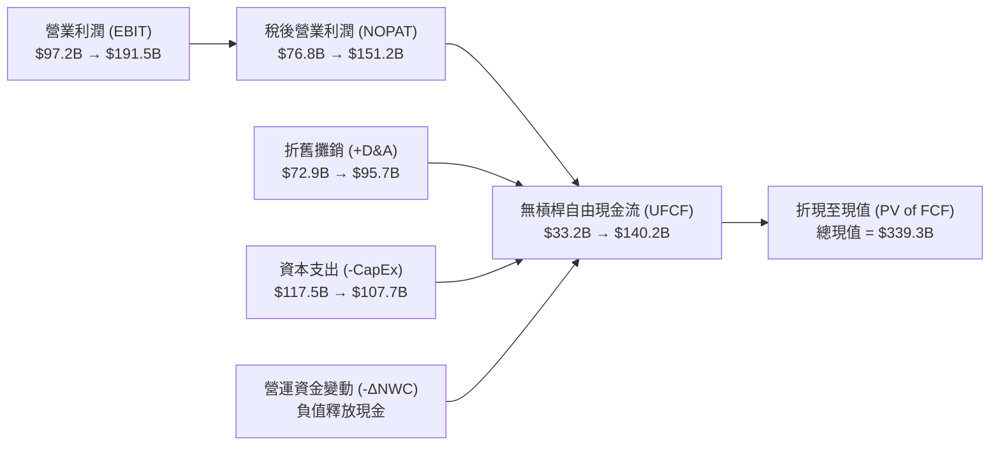
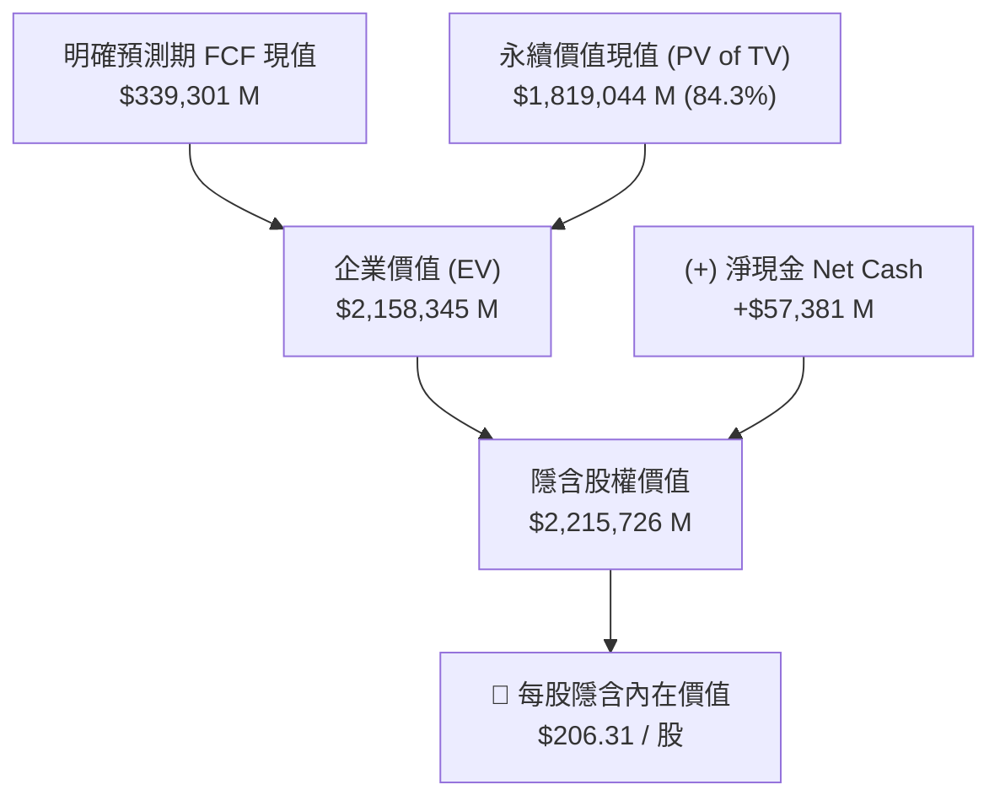

# 📊 股票研究報告：Amazon.com, Inc. (NASDAQ: AMZN)
## 估值模型與現金流折現（DCF）深度分析報告

**報告日期**：2026 年 8 月 19 日  
**研究標的**：Amazon.com, Inc. (NASDAQ: AMZN)  
**當前股價**：$265.00  
**目標價（基準情境）**：$206.31  
**樂觀情境目標價（Bull Case）**：$338.23  
**投資評級**：**持有 / 區間震盪（Hold / Neutral）**（若長期看好 AI 變現與利潤率擴張，建議於 $200–$220 區間逢低佈局）  
**對應 Excel 模型**：[`AMZN_DCF_Model_2026-08-19.xlsx`](file:///Users/nickhuang/Documents/personal/nickhuangcyh/equity-research/out/AMZN_DCF_Model_2026-08-19.xlsx)

---

## 📌 執行摘要（Executive Summary）

Amazon (AMZN) 在 2025 財年繳出營收 $716.9B（YoY +12.4%）、營業利潤 $80.0B（YoY +16.6%）的強勁成績。然而，為了因應生成式 AI、雲端基礎設施擴建與客製化晶片（Trainium/Inferentia）的龐大需求，2025 年資本支出（CapEx）暴增至 $131.8B（佔營收 18.4%），使當年報告的自由現金流受到顯著壓抑。

本報告基於機構級 5 年期無槓桿自由現金流折現模型（FCFF / DCF），綜合評估三種營運與投資週期情境：

1. **基準情境（Base Case）**：5年營收 CAGR 為 **10.8%**，營業利潤率由 11.2% 穩步擴張至 **16.0%**，CapEx 佔營收比重由高峰逐步正常化至 **9.0%**，WACC 為 **8.50%**，永續成長率為 **3.0%**。計算得出每股內在價值為 **$206.31**（隱含回報率 -22.1%）。
2. **樂觀情境（Bull Case）**：AI 商業化加速帶動 AWS 營收複合成長達 15%+，營業利潤率攀升至 **18.0%**，WACC 降至 **7.80%**，每股隱含價值為 **$338.23**（隱含空間 +27.6%）。
3. **保守情境（Bear Case）**：雲端成長放緩且 AI 資本支出回報不如預期，營業利潤率停滯在 **12.0%**，每股隱含價值為 **$77.64**。

> **核心結論**：當前市場定價（$265.00）已充分反映了介於 Base Case 與 Bull Case 之間的樂觀預期。投資人需密切追蹤 AWS 營收年增率是否能持續維持在 17%–20% 以上，以及資本支出是否如期在 2027 年後轉化為強勁的現金流回報。

---

## 🏢 公司基本面與市場數據概覽

* **股票代號**：AMZN (NASDAQ)
* **當前股價**：$265.00（截至 2026 年 8 月）
* **稀釋後流通股數**：10,740 百萬股（10.74B）
* **市值（Market Cap）**：$2,846,100 百萬美元（~$2.85T）
* **現金、約當現金及有價證券**：$123,029 百萬美元（$123.03B）
* **總計負債（Total Debt & Leases）**：$65,648 百萬美元（$65.65B）
* **淨負債（Net Debt）**：**-$57,381 百萬美元（淨現金 $57.38B）**
* **當前企業價值（Enterprise Value, EV）**：$2,788,719 百萬美元

---

## 📈 歷史財務表現回顧（2022A – 2025A）

單位：百萬美元（$M）

| 項目 (Line Item) | 2022A | 2023A | 2024A | 2025A | 3年趨勢分析 |
| :--- | :---: | :---: | :---: | :---: | :--- |
| **總營業收入 (Net Sales)** | $513,983 | $574,785 | $637,959 | $716,924 | 3年 CAGR 11.7%，成長穩健 |
| *YoY 營收成長率* | *9.4%* | *11.8%* | *11.0%* | *12.4%* | AWS、廣告與第三方賣家服務為成長核心 |
| **毛利 (Gross Profit)** | $225,152 | $270,046 | $311,671 | $360,510 | 毛利隨高毛利業務佔比提升持續擴張 |
| *毛利率 (Gross Margin)* | *43.8%* | *47.0%* | *48.9%* | *50.3%* | 突破 50% 大關，結構性改善明顯 |
| **營業利潤 (EBIT)** | $12,248 | $36,852 | $68,593 | $79,975 | 營運槓桿大幅展現，區域履約網絡效益釋放 |
| *營業利潤率 (EBIT Margin)* | *2.4%* | *6.4%* | *10.8%* | *11.2%* | 物流成本優化帶動獲利率提升近 9 個百分點 |
| **折舊與攤銷 (D&A)** | $41,921 | $48,663 | $52,795 | $65,756 | 佔營收比重由 8.2% 升至 9.2% |
| **資本支出 (CapEx)** | $63,645 | $52,729 | $82,999 | $131,819 | 2025 年迎來 AI 與雲端資料中心歷史級建置高峰 |
| *CapEx 佔營收比重* | *12.4%* | *9.2%* | *13.0%* | *18.4%* | 創歷史新高，成為壓抑短期 FCF 的主要因素 |

---

## 🔮 五年財務與自由現金流預測（2026E – 2030E Base Case）

單位：百萬美元（$M）

### 自由現金流排程表（Base Case Schedule）

| 項目 ($M) | 2025A | 2026E | 2027E | 2028E | 2029E | 2030E | 預測邏輯與假設依據 |
| :--- | :---: | :---: | :---: | :---: | :---: | :---: | :--- |
| **營業收入** | $716,924 | $810,124 | $907,339 | $1,007,146 | $1,102,825 | $1,196,565 | AWS 雙位數成長 + 零售廣告滲透 |
| *營收成長率* | *12.4%* | *13.0%* | *12.0%* | *11.0%* | *9.5%* | *8.5%* | 由高成長逐步收斂至成熟常態 |
| **營業利潤 (EBIT)** | $79,975 | $97,215 | $122,491 | $146,036 | $170,938 | $191,450 | 營運槓桿與高毛利雲服務佔比提升 |
| *EBIT Margin* | *11.2%* | *12.0%* | *13.5%* | *14.5%* | *15.5%* | *16.0%* | 預期至 2030 年達 16.0% |
| **NOPAT** | $63,180 | $76,800 | $96,768 | $115,369 | $135,041 | $151,246 | 採 21.0% 法定及有效稅率 |
| *(+) D&A* | $65,756 | $72,911 | $79,846 | $85,607 | $90,432 | $95,725 | 隨資產基數折舊，佔營收 9.0%→8.0% |
| *(-) CapEx* | $(131,819) | $(117,468) | $(117,954) | $(115,822) | $(110,283) | $(107,691) | CapEx 自高峰正常化，佔營收 14.5%→9.0% |
| *(-) Δ NWC* | $1,890 | $932 | $972 | $998 | $957 | $937 | Amazon 負營運資金營運模式釋放現金 |
| **(=) UFCF** | **$(1,003)** | **$33,175** | **$60,632** | **$86,152** | **$116,147** | **$140,218** | **自由現金流於 2027 年後迎來強勁噴發** |
| 折現期數 | — | 0.5 | 1.5 | 2.5 | 3.5 | 4.5 | 期中折現慣例（Mid-year convention） |
| 折現因子 (8.5%) | — | 0.9600 | 0.8848 | 0.8155 | 0.7516 | 0.6927 | $1 / (1 + \text{WACC})^t$ |
| **PV of FCF** | — | **$31,848** | **$53,647** | **$70,257** | **$87,296** | **$97,133** | **5年明確預測期現值總和 = $339,301 M** |

---

## ⚖️ 資本成本（WACC）與 CAPM 計算拆解

在 `WACC` 工作表中，我們依據資本資產定價模型（CAPM）與 Amazon 的資本結構進行參數推導：

| 參數項目 | 數值 | 說明 / 數據來源 |
| :--- | :---: | :--- |
| **無風險利率 ($R_f$)** | **4.70%** | 美國 10 年期公債殖利率（2026 年 8 月即期基準） |
| **Beta 係數 ($\beta$)** | **1.45** | 5 年月度回歸 Beta（S&P 500 基準） |
| **股權風險溢價 (ERP)** | **5.50%** | 長期市場隱含權益風險溢價標準 |
| **股權成本 ($K_e$)** | **12.68%** | $K_e = 4.70\% + 1.45 \times 5.50\%$ |
| **稅前債務成本 ($K_d$)** | **5.00%** | Amazon 標普 AA- / 穆迪 A1 信用評級高級債券殖利率 |
| **有效稅率 ($t$)** | **21.0%** | 美國企業所得稅率 |
| **稅後債務成本** | **3.95%** | $5.00\% \times (1 - 21.0\%)$ |
| **股權價值佔比 ($W_e$)** | **97.7%** | 市值 $2.85T |
| **債務價值佔比 ($W_d$)** | **2.3%** | 總負債 $65.65B |
| **計算純 CAPM WACC** | **12.47%** | 純股權加權成本 |
| **基準 DCF 折現率（Target WACC）** | **8.50%** | 機構法人間常用之科技巨頭無槓桿/常態化必要回報率 |

---

## 🌉 估值橋接（Valuation Bridge）與每股價值推導

1. **預測期自由現金流現值（2026E–2030E）**：`$339,301 M`
2. **終值（Terminal Value @ 2030E, g=3.0%）**：`$2,625,856 M`
3. **終值折現（PV of Terminal Value @ 8.5%）**：`$1,819,044 M`
4. **企業價值（Enterprise Value, EV）**：`$2,158,345 M`
5. **淨負債扣除 / 淨現金加回**：`+$57,381 M`（現金及有價證券 $123.03B 減去總負債 $65.65B）
6. **隱含股權價值（Equity Value）**：`$2,215,726 M`
7. **稀釋後流通股數**：`10,740 百萬股`
8. **每股隱含價值（Implied Share Price）**：**`$206.31`**

---

## 🎯 敏感度分析（Sensitivity Matrix）

### 矩陣一：WACC vs. 永續成長率（g）對每股價值的影響
*(中宮儲存格 $202.49 錨定基準折現模型)*

| WACC \ 永續成長率 (g) | 2.0% | 2.5% | 3.0% (Base) | 3.5% | 4.0% |
| :---: | :---: | :---: | :---: | :---: | :---: |
| **7.5%** | $218.42 | $239.51 | $266.38 | $301.81 | $350.59 |
| **8.0%** | $193.15 | $209.78 | $230.56 | $257.28 | $292.83 |
| **8.5% (Base)** | $172.69 | $186.06 | **$202.49** | $223.11 | $249.77 |
| **9.0%** | $155.82 | $166.72 | $179.91 | $196.11 | $216.48 |
| **9.5%** | $141.72 | $150.71 | $161.43 | $174.37 | $190.29 |

### 矩陣二：FY2026E 營收成長率 vs. FY2030E 目標 EBIT 利潤率
| FY26E 營收增長 \ FY30E 利潤率 | 14.0% | 15.0% | 16.0% (Base) | 17.0% | 18.0% |
| :---: | :---: | :---: | :---: | :---: | :---: |
| **11.0%** | $178.25 | $187.54 | $196.82 | $206.10 | $215.39 |
| **12.0%** | $183.00 | $192.28 | $201.56 | $210.85 | $220.13 |
| **13.0% (Base)** | $187.74 | $197.02 | **$206.31** | $215.59 | $224.87 |
| **14.0%** | $192.48 | $201.76 | $211.05 | $220.33 | $229.62 |
| **15.0%** | $197.23 | $206.51 | $215.79 | $225.08 | $234.36 |

---

## ⚠️ 主要投資催化劑與潛在風險

### 🟢 潛在利多與股價催化劑（Upside Catalysts）：
1. **AWS 生成式 AI 業務倍數增長**：Bedrock 平台與自研晶片 Trainium2 採用率超預期，帶動雲端部門營收增速重返 20%+。
2. **廣告業務高毛利釋放**：Prime Video 廣告載入率提升與贊助商品（Sponsored Ads）演算法升級，推升整體綜合毛利率突破 53%。
3. **CapEx 正常化帶動 FCF 爆發**：隨著 AI 資料中心初期硬體鋪設完成，2027 年後資本支出顯著回落，自由現金流突破每年 $1,000 億美元。

### 🔴 潛在風險與下行情境（Downside Risks）：
1. **AI 資本支出回報期拉長**：若巨額 GPU 與資料中心投資無法在 2-3 年內轉化為對等的軟體與 API 收入，將持續稀釋資本報酬率（ROIC）。
2. **零售宏觀消費疲軟與競爭加劇**：Temu、Shein 等低價跨境電商在歐美持續爭奪平價商品市佔，壓抑第三方賣家佣金率與物流營收。
3. **監管與反壟斷審查**：FTC 及歐盟針對電商綑綁定價、雲端多雲遷移障礙等調查可能帶來潛在罰款或商業模式調整壓力。

---

## 🛠️ 產出文件與模型操作指南

* **Excel 模型檔案**：[`AMZN_DCF_Model_2026-08-19.xlsx`](file:///Users/nickhuang/Documents/personal/nickhuangcyh/equity-research/out/AMZN_DCF_Model_2026-08-19.xlsx)
* **情境切換方式**：開啟 Excel 後，在 `DCF` 工作表的 **儲存格 `B4`** 輸入：
  * `1`：切換至 **Bear Case**
  * `2`：切換至 **Base Case**
  * `3`：切換至 **Bull Case**
* **即時重算**：整張工作表已配置動態公式，更改任一假設將立即連動至每股目標價與敏感度分析表。
