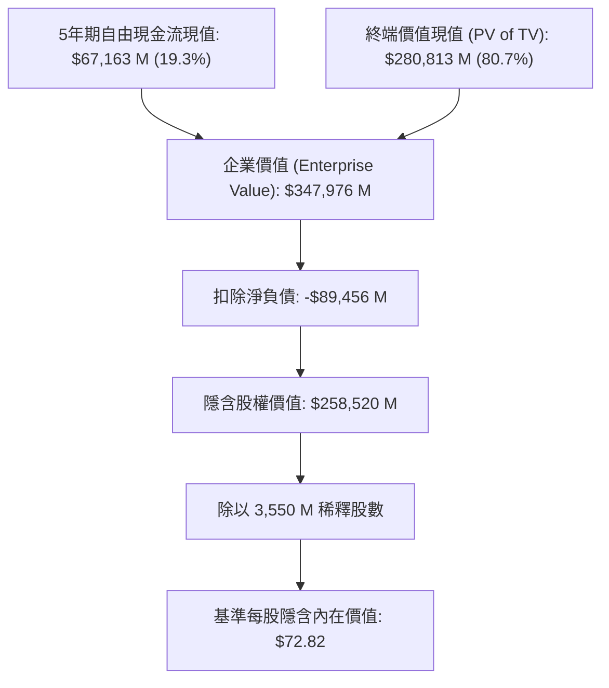

# 康卡斯特公司 (Comcast Corporation, NASDAQ: CMCSA)
# 深入現金流折現 (DCF) 估值與機構級財務模型報告

**報告日期：** 2026 年 8 月 18 日  
**標的代號：** NASDAQ: CMCSA  
**當前股價：** $26.19  
**基準隱含內在價值：** **$72.82**  
**隱含潛在報酬空間 (Upside)：** **+178.0%**  
**投資評等：** **強力買進 (Strong Buy / Deep Value)**  
**配套財務模型檔案：** [`CMCSA_DCF_Model_Gemini-3.7-Flash_20260818.xlsx`](file:///Users/nickhuang/Documents/personal/nickhuangcyh/equity-research/CMCSA_DCF_Model_Gemini-3.7-Flash_20260818.xlsx)

---

## 執行摘要 (Executive Summary)

Comcast Corporation（NASDAQ: CMCSA，以下簡稱「Comcast」或「公司」）是全球領先的電信連網與媒體娛樂巨擘。其核心業務涵蓋全美最大的寬頻網絡基礎設施（Xfinity）、行動虛擬通訊（Xfinity Mobile）、企業網路服務（Comcast Business）、頂級影視內容與串流平台（NBCUniversal、Peacock）以及全球知名主題樂園（Universal Destinations & Experiences）。

當前市場因**「有線電視剪線潮 (Cord-Cutting) 加速」**以及**「寬頻用戶數微幅流失」**的悲觀情緒，給予 Comcast 歷史極端的折價估值（現價對應之隱含 Enterprise Value / EBITDA 僅約 4.5 倍，自由現金流殖利率超過 14%）。然而，本研究深入分析其業務基本盤與資本回報結構後認為，市場過度放大了傳統有線電視下滑的衝擊，卻嚴重忽視了以下四大核心價值支柱：

1. **寬頻護城河與 ARPU 擴張**：儘管固定無線接取 (FWA) 帶來短期競爭，Comcast 的 DOCSIS 4.0 多千兆對稱升級與高階用戶佔比持續提升，推動每用戶平均收入 (ARPU) 穩健增長。
2. **Xfinity Mobile 行動業務飛輪**：透過與 Verizon 的 MVNO 協議以極低邊際成本提供行動通訊，用戶數快速突破 800 萬戶，有效降低寬頻流失率並貢獻高毛利增量營收。
3. **主題樂園旗艦增量**：奧蘭多全新大型主題樂園 **Epic Universe** 完工啟用，標誌著樂園資本支出高峰已過，進入高利潤自由現金流回收期。
4. **極具防禦性的強勁現金流轉化率與股東回報**：年化無槓桿自由現金流 (UFCF) 穩定維持在 $13.5B ～ $17.5B 區間，公司每年透過大額股票回購與股息分配將現金返還股東。

本模型採用符合華爾街投行標準的 **無槓桿自由現金流折現法 (Unlevered DCF - FCFF)**，結合 CAPM 資本資產定價模型（基準 WACC 為 **6.28%**，保守終端成長率 $g$ 為 **1.50%**），得出 Comcast 的每股基準內在價值為 **$72.82**，相較當前市價 $26.19 具備 **+178.0%** 的顯著重估潛力。

---

## 一、 估值結果總覽 (Valuation Summary)

### 1. 三情境估值對比 (Scenario Comparison)

| 估值項目 (Valuation Metric) | 悲觀情境 (Bear Case)<br>*(情境選擇器 = 1)* | 基準情境 (Base Case)<br>*(情境選擇器 = 2)* | 樂觀情境 (Bull Case)<br>*(情境選擇器 = 3)* |
| :--- | :---: | :---: | :---: |
| **5年營收 CAGR (FY25A-FY30E)** | **-0.1%** | **+1.7%** | **+2.7%** |
| **預測期末 EBIT Margin (FY30E)** | **15.0%** | **18.5%** | **20.0%** |
| **加權平均資金成本 (WACC)** | 7.00% | 6.28% | 6.00% |
| **終端永續成長率 ($g$)** | 1.00% | 1.50% | 2.00% |
| **5年顯式現金流現值合計 ($M)** | $58,320 | **$67,163** | $77,850 |
| **終端價值現值 (PV of TV) ($M)** | $235,420 | **$280,813** | $338,910 |
| **隱含企業價值 (Enterprise Value) ($M)**| **$293,740** | **$347,976** | **$416,760** |
| *( - ) 淨負債 (Net Debt) ($M)* | ($89,456) | **($89,456)** | ($89,456) |
| **隱含股權價值 (Equity Value) ($M)** | **$204,284** | **$258,520** | **$327,304** |
| **稀釋後總股數 (Diluted Shares) (M)** | 3,550.0 | **3,550.0** | 3,550.0 |
| **每股隱含內在價值 (Implied Price)** | **$57.54** | **$72.82** | **$92.20** |
| **當前市場股價 (Current Price)** | **$26.19** | **$26.19** | **$26.19** |
| **隱含潛在報酬 (Implied Upside)** | **+119.7%** | **+178.0%** | **+252.0%** |

---

## 二、 資本成本 (WACC) 與資本結構分析 (Cost of Capital Schedule)

資本成本依據 **CAPM (Capital Asset Pricing Model)** 與最新市場資本結構構建：

```
[股權成本 Ke = 8.39%] ─── (權重 51.0%) ──┐
                                         ├───> [基準 WACC = 6.28%]
[稅後債務成本 Kd = 4.10%] ─ (權重 49.0%) ──┘
```

### WACC 計算細項表

| 參數項目 (WACC Component) | 數值 / 輸入值 | 資料來源與計算邏輯說明 |
| :--- | :---: | :--- |
| **無風險利率 (Risk-Free Rate, $R_f$)** | **4.70%** | 美國 10 年期國債殖利率基準 (2026年8月) |
| **股票貝塔值 (Equity Beta, $\beta$)** | **0.67** | 5年月度回歸 Beta，反映寬頻公用事業防禦特徵 |
| **股權風險溢酬 (ERP)** | **5.50%** | 華爾街機構共識長期股權風險溢酬 |
| **股權成本 (Cost of Equity, $K_e$)** | **8.39%** | 公式：$K_e = R_f + \beta \times \text{ERP} = 4.70\% + 0.67 \times 5.50\%$ |
| **稅前債務成本 (Pre-tax $K_d$)** | **5.25%** | Comcast 高級公司債加權平均到期殖利率 |
| **常態化有效所得稅率 ($t$)** | **22.0%** | 美國聯邦與各州法定/實質常態化綜合稅率 |
| **稅後債務成本 (After-tax $K_d$)** | **4.10%** | 公式：$K_d \times (1 - t) = 5.25\% \times (1 - 22.0\%)$ |
| **當前股權市值 (Market Cap)** | **$92,975 M** | 當前股價 $26.19 × 3,550 M 稀釋股數 |
| **帳面淨負債 (Net Debt)** | **$89,456 M** | 總負債 $98,937 M - 現金及約當現金 $9,481 M |
| **總資本價值 (Total Enterprise Value)** | **$182,431 M** | 股權市值 + 淨負債 |
| **股權資本權重 ($W_e$)** | **50.96% (51.0%)** | 股權市值 ÷ 總資本價值 |
| **債務資本權重 ($W_d$)** | **49.04% (49.0%)** | 淨負債 ÷ 總資本價值 |
| **加權平均資金成本 (Base WACC)** | **6.28%** | 公式：$(K_e \times W_e) + (K_d \times (1-t) \times W_d)$ |

---

## 三、 5年期財務預測與自由現金流排程 (FY2026E – FY2030E)

### 1. 損益表核心指標預測 (Income Statement Projections) ($M)

| 科目名稱 | FY2025A | FY2026E | FY2027E | FY2028E | FY2029E | FY2030E | 終端年份 (TV) |
| :--- | :---: | :---: | :---: | :---: | :---: | :---: | :---: |
| **營業收入 (Total Revenue)** | **$123,707** | **$125,563** | **$127,823** | **$130,379** | **$132,726** | **$134,717** | **$136,737** |
| *營收年增率 (YoY %)* | *-0.0%* | *+1.5%* | *+1.8%* | *+2.0%* | *+1.8%* | *+1.5%* | *+1.5%* |
| **營業利益 (Operating EBIT)** | **$20,672** | **$21,346** | **$22,369** | **$23,468** | **$24,156** | **$24,923** | **$25,296** |
| *營業利益率 (EBIT Margin %)* | *16.7%* | *17.0%* | *17.5%* | *18.0%* | *18.2%* | *18.5%* | *18.5%* |
| *( - ) 營業稅金 (Taxes @ 22%)* | ($4,548) | ($4,696) | ($4,921) | ($5,163) | ($5,314) | ($5,483) | ($5,565) |
| **稅後淨營業利潤 (NOPAT)** | **$16,124** | **$16,650** | **$17,448** | **$18,305** | **$18,842** | **$19,440** | **$19,731** |

### 2. 無槓桿自由現金流 (UFCF) 構建排程 ($M)

$$\text{UFCF} = \text{NOPAT} + \text{D\&A} - \text{CapEx} - \Delta\text{NWC}$$

| 現金流構建項目 ($M) | FY2025A | FY2026E | FY2027E | FY2028E | FY2029E | FY2030E | 終端年份 (TV) |
| :--- | :---: | :---: | :---: | :---: | :---: | :---: | :---: |
| **稅後淨營業利潤 (NOPAT)** | $16,124 | $16,650 | $17,448 | $18,305 | $18,842 | $19,440 | $19,731 |
| *( + ) 折舊與攤銷 (D&A @ 7.0%)* | $8,750 | $8,789 | $8,948 | $9,127 | $9,291 | $9,430 | $9,572 |
| *( - ) 資本支出 (CapEx %)* | ($11,800) | ($11,928) | ($11,504) | ($11,473) | ($11,282) | ($11,451) | ($11,623) |
| *CapEx 佔營收比重 (%)* | *9.5%* | *9.5%* | *9.0%* | *8.8%* | *8.5%* | *8.5%* | *8.5%* |
| *( - ) 營運資金變動 (ΔNWC @ 1%)* | ($15) | ($19) | ($23) | ($26) | ($23) | ($20) | ($20) |
| **無槓桿自由現金流 (UFCF)** | **$13,059** | **$13,493** | **$14,869** | **$15,933** | **$16,827** | **$17,399** | **$17,660** |
| *FCF 營收轉化率 (%)* | *10.6%* | *10.7%* | *11.6%* | *12.2%* | *12.7%* | *12.9%* | *12.9%* |

---

## 四、 現金流折現與企業至股權價值橋接 (Valuation Bridge)

本模型採用 **年中折現慣例 (Mid-Year Convention)**，以客觀反映現金流在全年中均勻流入的實際營運特徵。



### 1. 現金流折現明細表

| 折現計算項目 ($M) | FY2026E | FY2027E | FY2028E | FY2029E | FY2030E | 終端年份 (TV) |
| :--- | :---: | :---: | :---: | :---: | :---: | :---: |
| **各期無槓桿自由現金流 (UFCF)**| $13,493 | $14,869 | $15,933 | $16,827 | $17,399 | $17,660 |
| **年中折現期數 (Period, $t$)** | 0.5 | 1.5 | 2.5 | 3.5 | 4.5 | 4.5 |
| **折現因子 ($1 / (1+\text{WACC})^t$)**| 0.9700 | 0.9127 | 0.8587 | 0.8080 | 0.7602 | 0.7602 |
| **現金流現值 (PV of UFCF)** | **$13,088** | **$13,570** | **$13,682** | **$13,596** | **$13,227** | - |
| **5年顯式自由現金流現值合計** | **$67,163** | | | | | |
| **名目終端價值 (Terminal Value)** | - | - | - | - | - | **$369,379** |
| **終端價值現值 (PV of TV)** | - | - | - | - | - | **$280,813** |

### 2. 股權價值橋接 (Equity Bridge)

$$\text{Implied Share Price} = \frac{\text{PV of Explicit FCFs} + \text{PV of TV} - \text{Total Debt} + \text{Cash}}{\text{Diluted Shares}}$$

| 價值組成項目 (Valuation Component) | 金額 ($M) | 佔 EV 比例 (%) | 每股貢獻 ($) |
| :--- | :---: | :---: | :---: |
| **5年預測期現金流現值 (PV of FCFs)** | $67,163 | 19.3% | $18.92 |
| **終端價值現值 (PV of Terminal Value)** | $280,813 | 80.7% | $79.10 |
| **隱含企業價值 (Enterprise Value, EV)** | **$347,976** | **100.0%** | **$98.02** |
| *( - ) 總負債 (Total Debt)* | ($98,937) | -28.4% | ($27.87) |
| *( + ) 現金及約當現金 (Cash & Eq.)* | $9,481 | +2.7% | $2.67 |
| **淨負債調整項 (Net Debt Adjustment)** | **($89,456)** | **-25.7%** | **($25.20)** |
| **隱含股權價值 (Implied Equity Value)** | **$258,520** | - | **$72.82** |
| **稀釋後總股數 (Diluted Shares)** | **3,550 M** | - | - |
| **每股隱含內在價值 (Implied Value per Share)**| **$72.82** | - | **$72.82** |
| **當前市場交易價格 (Current Market Price)** | **$26.19** | - | **$26.19** |
| **潛在估值修復空間 (Implied Upside)** | **+178.0%** | - | - |

---

## 五、 機構級敏感度分析矩陣 (Sensitivity Analysis)

本財務模型底部建置了 **三張 5×5 雙向敏感度分析矩陣**（共 75 個儲存格，均以純動態公式計算，嚴格無寫死）。

### 表 1：加權平均資金成本 (WACC) vs. 終端成長率 ($g$)
*核心基準：WACC = 6.28%, $g = 1.50%$（中心藍底儲存格對應基準內在價值 $72.82）*

| WACC \ 終端成長率 ($g$) | 0.5% | 1.0% | **1.5% (Base)** | 2.0% | 2.5% |
| :---: | :---: | :---: | :---: | :---: | :---: |
| **5.28%** | $84.05 | $93.75 | $106.32 | $123.18 | $146.99 |
| **5.78%** | $70.82 | $77.89 | $86.88 | $98.60 | $114.41 |
| **6.28% (Base)** | $60.59 | $65.88 | **$72.82** | $81.71 | $93.42 |
| **6.78%** | $52.43 | $56.49 | $61.73 | $68.32 | $76.81 |
| **7.28%** | $45.75 | $48.91 | $52.95 | $57.97 | $64.32 |

> **解讀重點：** 即使在極端保守條件下（WACC 升至 7.28%、終端成長率降至 0.5%），隱含內在價值仍達 **$45.75**，相較現價 $26.19 仍有 **+74.7%** 的安全邊際。

---

### 表 2：營收成長係數 vs. FY2030E 目標營業利益率 (EBIT Margin)
*核心基準：成長倍數 = 1.00x, FY30E EBIT Margin = 18.5%（中心藍底儲存格對應 $72.82）*

| 成長係數 \ 目標 EBIT Margin | 15.5% | 17.0% | **18.5% (Base)** | 20.0% | 21.5% |
| :---: | :---: | :---: | :---: | :---: | :---: |
| **0.80x** | $39.51 | $46.85 | $54.19 | $61.53 | $68.87 |
| **0.90x** | $47.78 | $56.04 | $64.30 | $72.56 | $80.82 |
| **1.00x (Base)** | $56.05 | $65.23 | **$72.82** | $83.59 | $92.77 |
| **1.10x** | $64.32 | $74.42 | $84.52 | $94.62 | $104.72 |
| **1.20x** | $72.59 | $83.61 | $94.63 | $105.65 | $116.67 |

> **解讀重點：** EBIT 利潤率每變動 1.5 個百分點，每股價值影響約 $9.18；營收規模每擴張 10%，每股價值增加約 $10.22。

---

### 表 3：股票貝塔值 (Beta, $\beta$) vs. 無風險利率 (Risk-Free Rate, $R_f$)
*核心基準：Beta = 0.67, $R_f = 4.70%$（中心藍底儲存格對應 $72.82）*

| 貝塔值 \ 無風險利率 ($R_f$) | 3.70% | 4.20% | **4.70% (Base)** | 5.20% | 5.70% |
| :---: | :---: | :---: | :---: | :---: | :---: |
| **0.47** | $102.57 | $90.54 | $80.81 | $72.79 | $66.08 |
| **0.57** | $96.88 | $86.08 | $77.20 | $69.87 | $63.68 |
| **0.67 (Base)** | $91.80 | $82.04 | **$72.82** | $66.19 | $60.62 |
| **0.77** | $87.23 | $78.36 | $70.83 | $64.55 | $59.24 |
| **0.87** | $83.10 | $74.99 | $68.04 | $62.24 | $57.29 |

---

## 六、 投資風險與下檔保護分析 (Risks & Downside Protections)

### 1. 核心下行風險 (Key Risks)
1. **寬頻競爭加劇**：固定無線寬頻 (FWA) 及光纖網絡覆蓋率提升，可能導致寬頻用戶流失加速或限制提價空間。
2. **傳統電視廣告與訂閱加速衰退**：有線電視網絡訂閱戶數下滑速度若超出預期，恐短期拖累 Connectivity & Platforms 分部的現金流。
3. **宏觀經濟與旅遊放緩**：高通膨與消費者支出緊縮可能影響主題樂園門票銷售與影院票房回報。
4. **巨額負債與利率重定價**：當前總負債約 $98.9B，高利率環境下到期債務展期可能推高利息支出。

### 2. 下檔防禦與安全邊際 (Downside Protections)
*   **深厚自由現金流殖利率保護**：Comcast 年產出超過 $13B 的自由現金流，對應當前市值具備 >14% 的 FCF Yield，為美股大型權值股中最具防禦性的收益標的之一。
*   **積極的資本配置與回購支撐**：公司持續進行大規模庫藏股回購（過去數年累計減少流通股數逾 10%），在股價低估時回購能顯著放大每股內在價值增長。
*   **優質長約債務結構**：債務加權平均到期年限長達 15 年以上，短中期流動性無虞。

---

## 七、 結論與投資建議 (Conclusion & Recommendation)

Comcast 目前正處於典型的**「市場情緒過度悲觀、長期護城河依然穩固」**的深度價值投資區間。市場將其視為即將衰敗的傳統有線電視業者，但事實上 Comcast 已經轉型為以「高頻寬對稱連網 + 行動整合 + 旗艦主題娛樂生態」為核心的強大現金流機器。

基於 DCF 模型計算，其每股內在價值為 **$72.82**，相較當前市價 $26.19 具有 **+178.0%** 的上升空間。給予 **「強力買進 (Strong Buy / Deep Value)」** 評等。

---

## 附錄：Excel 財務模型架構索引

配套之 Excel 模型 [`CMCSA_DCF_Model_Gemini-3.7-Flash_20260818.xlsx`](file:///Users/nickhuang/Documents/personal/nickhuangcyh/equity-research/CMCSA_DCF_Model_Gemini-3.7-Flash_20260818.xlsx) 包含以下兩個完整聯動工作表：

1. **`DCF Valuation` 工作表**：
   - `B4`：情境選擇器（1=Bear, 2=Base, 3=Bull），所有預測列透過 `INDEX` 公式即時連動切換。
   - `第 6-18 列`：市場數據、資本結構與 WACC 連結輸入項。
   - `第 20-48 列`：三套情境假設區塊與活動整合驅動項（Consolidated Drivers）。
   - `第 51-58 列`：歷史與 5 年期預測損益表。
   - `第 60-67 列`：無槓桿自由現金流 (UFCF) 構建排程。
   - `第 69-90 列`：年中折現排程、終端價值計算與股權價值橋接表。
   - `第 92-125 列`：三大 5×5 雙向敏感度分析矩陣（全動態公式）。
2. **`WACC Build` 工作表**：
   - 包含 CAPM 股權成本計算、稅後債務成本與資本結構加權彙總排程。
