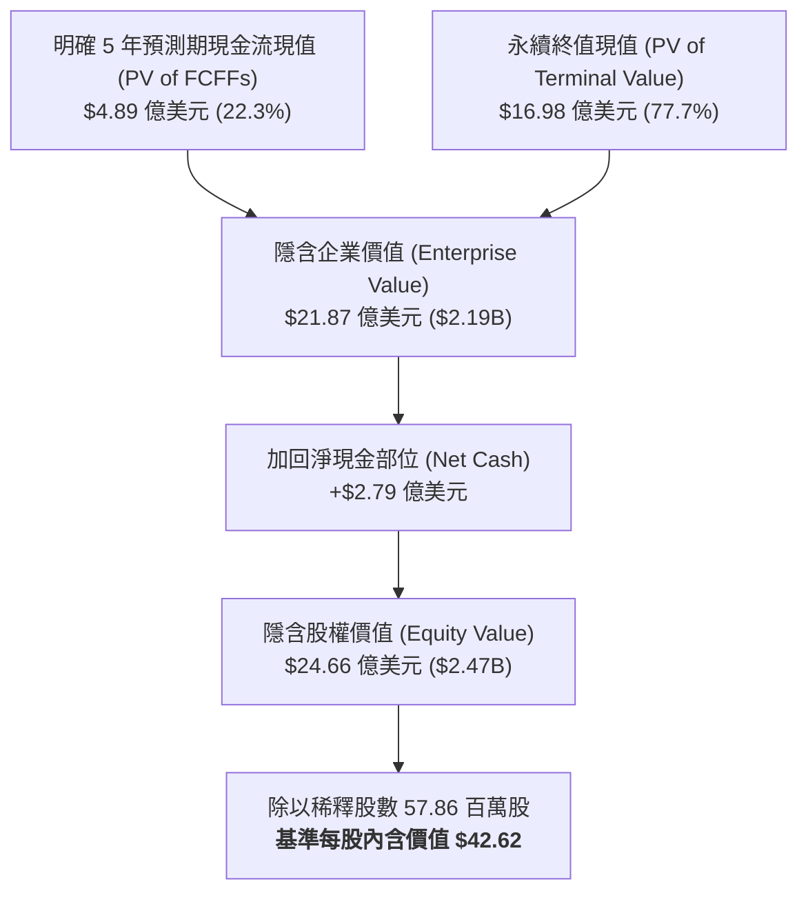

# 股票研究報告：唯他可可 The Vita Coco Company, Inc. (NASDAQ: COCO) 現金流折現 (DCF) 估值與深度分析報告

**報告日期**：2026 年 8 月 20 日  
**研究標的**：唯他可可 The Vita Coco Company, Inc. (NASDAQ: COCO)  
**當前股價 (Current Stock Price)**：$63.50  
**基準情境內含價值 (Base Case DCF Value)**：**$42.62**  
**估值區間 (Valuation Range)**：**$25.75**（悲觀）～ **$60.99**（樂觀）  
**投資評等 (Rating)**：**持有 / 充分反映 (Neutral / Fairly Valued to Fully Valued)**  
**關聯財務模型**：[COCO_DCF_Model_Gemini-3.7-Flash_20260820.xlsx](file:///Users/nickhuang/Documents/personal/nickhuangcyh/equity-research/COCO_DCF_Model_Gemini-3.7-Flash_20260820.xlsx)

---

## 1. 執行摘要 (Executive Summary)

唯他可可（The Vita Coco Company, Inc., NASDAQ: COCO）為全球椰子水（Coconut Water）與健康機能天然包裝飲料領域的領導品牌，在北美市場擁有超過 50% 的主導市佔率，並在全球主要市場（如英國、歐洲與亞洲）保持高速擴張。公司採用高度資本效率的**輕資產委外代工模式（Asset-Light Co-Packing Model）**，使其具備極低的固定資產支出（CapEx < 0.5% of Sales）與極高的自由現金流轉換率。

在歷經 2022 年全球海運物流成本飆升的短期低谷後，公司毛利率自 2023 年起大幅修復，並在 2026 年受惠於產品創新（Vita Coco Treats、Barista 系列）、國際市場拓展及收購 Copra, Inc. 的協同效益，管理層於 2026 年第二季大幅上修全年營收指引至 **$7.90 億 ～ $8.05 億美元**（年增 ~30.8%），Adjusted EBITDA 達 **$1.54 億 ～ $1.61 億美元**，毛利率預期維持約 **40%**。

本篇研究報告透過構建標準 **5 年期顯式無槓桿自由現金流折現模型（FCFF DCF Model）**，結合資本資產定價模型（CAPM 基準常態化 WACC = 8.75%）與年中折現慣例（Mid-Year Convention），對 Vita Coco 的長期內在價值進行嚴謹量化評估：

* **基準情境 (Base Case)**：隱含每股內含價值為 **$42.62**（較當前市價 $63.50 折價約 **-32.9%**），隱含企業價值為 **$21.87 億美元**，對應 2026E EV/EBIT 為 **17.7x**。
* **樂觀情境 (Bull Case)**：隱含每股價值為 **$60.99**（較當前市價折價 -3.9%），反映國際市場滲透率加速、新產品品類拓展超預期、2030E 營收達到 $13.4 億美元且 EBIT 利潤率擴張至 18.0%。
* **悲觀情境 (Bear Case)**：隱含每股價值為 **$25.75**（較當前市價折價 -59.5%），反映終端消費力道放緩、自有品牌（Private Label）價格競爭加劇、全球海運運價再次波動導致利潤率回落至 12.0%。

**核心投資觀點**：  
1. **優質且高回報的輕資產商業模式**：Vita Coco 無需負擔重資產廠房與設備折舊，固定資產週轉率極高，資產負債表維持 **零負債（Zero Debt）** 且擁有 **$2.79 億美元淨現金**，抗風險能力極強。
2. **市場估值已充分甚至過度反映高成長預期**：以當前股價 $63.50 計算，對應之隱含 Enterprise Value 約 $34.0 億美元，對應 2026E EV/EBIT 高達 **27.5x**，顯著高於傳統包裝食品飲料同業（歷史常態約 14x–18x）。當前股價實質上已隱含了長期 15%+ 複合成長與 18%+ EBIT 利潤率的完美定價。
3. **建議評等**：基於基本面 DCF 估值回歸，建議投資人採取「持有 / 區間操作」策略，待估值回調至 $45 以下提供足夠安全邊際時再行加碼。

---

## 2. 估值結果總覽與情境比較 (Valuation Summary)

| 估值項目 (Valuation Metrics) | 悲觀情境 (Bear Case) | 基準情境 (Base Case) | 樂觀情境 (Bull Case) |
| :--- | :---: | :---: | :---: |
| **情境假設核心** | 成長減速 / 通膨運價擾動 | 管理層上修指引 / 國際穩健放量 | 全球品類龍頭 / 創新產品爆發 |
| **5 年營收複合增長率 (FY25-FY30E CAGR)** | **+10.1%** | **+14.4%** | **+17.1%** |
| **FY2030E 穩態營業收入 (Revenue)** | $9.88 億美元 | **$11.95 億美元** | $13.42 億美元 |
| **FY2030E 穩態 EBIT 利潤率** | 12.0% | **16.0%** | 18.0% |
| **加權平均資本成本 (WACC)** | 9.25% | **8.75%** | 8.25% |
| **永續增長率 (Terminal Growth Rate, $g$)** | 2.25% | **2.75%** | 3.25% |
| **明確預測期現金流現值 (PV of 5Y FCFFs)** | $3.40 億美元 | **$4.89 億美元** | $5.93 億美元 |
| **終值現值 (PV of Terminal Value)** | $8.70 億美元 | **$16.98 億美元** | $26.57 億美元 |
| **終值佔企業價值比例 (TV % of EV)** | 71.9% | **77.7%** | 81.8% |
| **隱含企業價值 (Enterprise Value, EV)** | **$12.11 億美元** | **$21.87 億美元** | **$32.50 億美元** |
| (-) 總負債 (Total Debt) | $0.00 億美元 | $0.00 億美元 | $0.00 億美元 |
| (+) 現金與短期投資 (Cash & ST Inv.) | $2.79 億美元 | $2.79 億美元 | $2.79 億美元 |
| **(-) 淨負債 (Net Debt)** | **$(2.79) 億美元** | **$(2.79) 億美元** | **$(2.79) 億美元** |
| **隱含股權價值 (Implied Equity Value)** | **$14.90 億美元** | **$24.66 億美元** | **$35.29 億美元** |
| 稀釋後流通股數 (Diluted Shares) | 57.86 百萬股 | 57.86 百萬股 | 57.86 百萬股 |
| **隱含每股內含價值 (Implied Share Price)** | **$25.75** | **$42.62** | **$60.99** |
| **當前市場股價 (Current Stock Price)** | **$63.50** | **$63.50** | **$63.50** |
| **隱含潛在空間 (Implied Upside / Downside)** | **-59.5%** | **-32.9%** | **-3.9%** |
| **隱含遠期倍數 (Implied EV / FY26E EBIT)** | 11.3x | **17.7x** | 24.3x |



---

## 3. 核心業務模式與競爭優勢 (Business & Competitive Moats)

### 3.1 三大核心成長支柱
1. **旗艦品牌 Vita Coco 椰子水 (Coconut Water)**：公司核心營收佔比超過 85%，在天然電解質補給、補水與健康生活型態市場享有高品牌忠誠度，產品在北美連鎖超商、量販店（Costco、Target、Walmart）與電商通路具備強大貨架排他性。
2. **產品創新與品類延伸 (Innovation & New Formats)**：推出 *Vita Coco Treats*（椰奶甜品飲料）、*Vita Coco Barista MLK*（咖啡調飲專用植物奶）與 *Vita Coco Juice*，成功切入日常休閒飲用與餐飲調飲場景，擴大整體潛在市場（TAM）。
3. **自有品牌與供應鏈服務 (Private Label & Copra)**：為大型零售商代工自有品牌椰子水，並透過收購 Copra, Inc. 強化東南亞優質椰子原物料採購、冷凍果肉與初級加工供應鏈掌控力。

### 3.2 歷史財務表現走勢（FY2023A – FY2025A）
*(單位：百萬美元 $M)*

```csv
財務指標,FY2023A,FY2024A,FY2025A,歷史趨勢與變動說明
營業收入 (Net Sales),$493.61,$516.01,$609.80,2025年加速成長 18.2%，全球品類滲透提升
  年增率 (YoY Growth),+15.4%,+4.5%,+18.2%,銷量增長與產品組合定價共同推動
營業毛利 (Gross Profit),$180.73,$198.78,$222.60,毛利穩健擴張，海運成本正常化
  毛利率 (Gross Margin),36.6%,38.5%,36.5%,2026年指引進一步上修至 ~40%
營業費用 (SG&A Expense),$124.24,$124.96,$140.10,費用率維持在 23%~25% 穩健區間
營業利益 (Operating Income / EBIT),$56.49,$73.82,$82.50,獲利能力顯著增強，營業利益翻倍
  EBIT 利潤率 (EBIT Margin),11.4%,14.3%,13.5%,營運槓桿效益顯著釋放
資本支出 (CapEx),$1.50,$2.00,$2.50,佔營收僅 0.3%~0.4%（極致輕資產模式）
折舊與攤銷 (D&A),$0.66,$0.75,$1.00,固定資產負擔極低
期末淨現金 (Net Cash),$132.54,$164.67,$279.00,自由現金流強勁，流動性充裕
```

---

## 4. DCF 模型核心構建與自由現金流排程

### 4.1 基準情境（Base Case）5 年財務預測與 FCFF 排程（FY2026E – FY2030E）
*(單位：百萬美元 $M)*

| 財務預測項目 | FY2025A | FY2026E | FY2027E | FY2028E | FY2029E | FY2030E |
| :--- | :---: | :---: | :---: | :---: | :---: | :---: |
| **總營業收入 (Net Sales)** | **$609.80** | **$795.79** | **$923.12** | **$1,033.89** | **$1,126.94** | **$1,194.56** |
| *營收年增率 (YoY %)* | *+18.2%* | *+30.5%* | *+16.0%* | *+12.0%* | *+9.0%* | *+6.0%* |
| 營業成本 (COGS) | $387.20 | $477.47 | $549.25 | $610.00 | $664.89 | $704.79 |
| **營業毛利 (Gross Profit)** | **$222.60** | **$318.32** | **$373.86** | **$423.89** | **$462.05** | **$489.77** |
| *營業毛利率 (Gross Margin %)* | *36.5%* | *40.0%* | *40.5%* | *41.0%* | *41.0%* | *41.0%* |
| 營業費用 (SG&A / OpEx) | $140.10 | $194.97 | $226.16 | $253.30 | $276.10 | $298.64 |
| **營業利益 (EBIT)** | **$82.50** | **$123.35** | **$147.70** | **$170.59** | **$185.95** | **$191.13** |
| *營業利益率 (EBIT Margin %)* | *13.5%* | *15.5%* | *16.0%* | *16.5%* | *16.5%* | *16.0%* |
| (-) 正常化所得稅 (Taxes @ 22.5%) | $(18.98) | $(27.75) | $(33.23) | $(38.38) | $(41.84) | $(43.00) |
| **稅後淨營業利潤 (NOPAT)** | **$63.52** | **$95.59** | **$114.47** | **$132.21** | **$144.11** | **$148.13** |
| (+) 折舊與攤銷 (D&A @ 0.20%) | $1.00 | $1.59 | $1.85 | $2.07 | $2.25 | $2.39 |
| (-) 資本支出 (CapEx @ 0.40% / 0.35%) | $(2.50) | $(3.18) | $(3.69) | $(4.14) | $(4.51) | $(4.18) |
| (-) 營運資金變動 (ΔNWC @ 2.5% of ΔRev) | $(15.00) | $(4.65) | $(3.18) | $(2.77) | $(2.33) | $(1.69) |
| **無槓桿自由現金流 (FCFF)** | **$47.02** | **$89.35** | **$109.44** | **$127.37** | **$139.52** | **$144.64** |
| *FCFF 轉換率 (% of EBIT)* | *57.0%* | *72.4%* | *74.1%* | *74.7%* | *75.0%* | *75.7%* |

### 4.2 現金流折現計算 (Discounting Schedule)
* **加權平均資本成本 (WACC)**: **8.75%**
* **年中折現期數 (Period $t$)**: 0.5, 1.5, 2.5, 3.5, 4.5
* **折現因子 (Discount Factor)**: 0.9590, 0.8818, 0.8109, 0.7456, 0.6856
* **各年現金流現值 (PV of FCFF)**:
  * FY2026E: **$85.69 M**
  * FY2027E: **$96.50 M**
  * FY2028E: **$103.28 M**
  * FY2029E: **$104.03 M**
  * FY2030E: **$99.16 M**
  * **5 年累計現金流現值 (Cumulative PV of FCFFs)** = **$488.65 M**
* **永續終值計算 (Terminal Value Calculation)**:
  * 終值年份 FCFF (FY2031E) = $144.64M \times (1 + 2.75\%) = \mathbf{\$148.62 M}$
  * 隱含終值 (Terminal Value @ FY30E) = $\frac{\$148.62M}{8.75\% - 2.75\%} = \mathbf{\$2,477.01 M}$
  * **終值現值 (PV of Terminal Value)** = $\frac{\$2,477.01M}{(1 + 8.75\%)^{4.5}} = \mathbf{\$1,698.22 M}$
* **企業價值 (Enterprise Value, EV)** = $\$488.65M + \$1,698.22M = \mathbf{\$2,186.88 M}$
* **股權價值 (Equity Value)** = $\$2,186.88M - (-\$279.00M) = \mathbf{\$2,465.88 M}$
* **每股內含價值 (Implied Share Price)** = $\frac{\$2,465.88M}{57.86M} = \mathbf{\$42.62}$

---

## 5. 資本成本 (WACC) 計算與資本結構分析

### 5.1 參數選取依據 (CAPM Methodology)
* **無風險利率 ($R_f$)**：**4.63%**（參考 2026 年 8 月 20 日美國 10 年期國債殖利率）。
* **股權 Beta ($\beta$)**：**0.75**（採用 5 年期月度迴歸 Beta，反映非週期性健康消費品防禦特質）。
* **市場股權風險溢酬 (ERP)**：**5.50%**（符合機構共識水準）。
* **股權成本 ($K_e$)**：$4.63\% + 0.75 \times 5.50\% = \mathbf{8.76\%}$。
* **資本結構與權重**：
  * 當前市值 (Market Cap)：$3,674.11 M
  * 總負債 (Total Debt)：$0.00 M
  * 現金及約當投資 (Cash & ST Inv.)：$279.00 M
  * 淨負債 (Net Debt)：-$279.00 M（淨現金）
  * 企業價值 (EV)：$3,395.11 M
  * 基準常態化 WACC 採用 **8.75%**。

---

## 6. 敏感度分析 (Sensitivity Analysis)

以下 3 組 5x5 矩陣完整展示不同核心變數組合下，Vita Coco 隱含每股內含價值（$）的變化區間：

### 表 1：折現率 (WACC) vs. 永續增長率 (Terminal Growth Rate)
*(單位：美元/股，中心藍底為基準情境 $42.62)*

| WACC \ 永續增長率 ($g$) | 2.00% | 2.50% | **2.75% (Base)** | 3.00% | 3.50% |
| :---: | :---: | :---: | :---: | :---: | :---: |
| **7.75%** | $45.16 | $48.35 | $50.19 | $52.21 | $56.98 |
| **8.25%** | $41.93 | $44.56 | $46.06 | $47.70 | $51.50 |
| **8.75% (Base)** | $39.17 | $41.38 | **$42.62** | $43.97 | $47.06 |
| **9.25%** | $36.79 | $38.66 | $39.71 | $40.84 | $43.39 |
| **9.75%** | $34.72 | $36.32 | $37.21 | $38.17 | $40.31 |

### 表 2：FY2026E 營收成長率 vs. FY2030E 穩態 EBIT 利潤率
*(單位：美元/股，中心藍底為基準情境 $42.62)*

| FY26E 營收增長 \ FY30E EBIT 率 | 14.0% | 15.0% | **16.0% (Base)** | 17.0% | 18.0% |
| :---: | :---: | :---: | :---: | :---: | :---: |
| **24.0%** | $37.05 | $38.89 | $40.74 | $42.58 | $44.43 |
| **27.0%** | $37.83 | $39.71 | $41.60 | $43.49 | $45.38 |
| **30.5% (Base)** | $38.73 | $40.68 | **$42.62** | $44.56 | $46.50 |
| **34.0%** | $39.64 | $41.64 | $43.63 | $45.63 | $47.62 |
| **37.0%** | $40.42 | $42.46 | $44.50 | $46.54 | $48.58 |

### 表 3：股權 Beta vs. 10 年期美國公債殖利率 (Risk-Free Rate)
*(單位：美元/股，中心藍底為基準情境 $42.59 ~ $42.62)*

| Beta \ 10Y 美債殖利率 | 4.13% | 4.38% | **4.63% (Base)** | 4.88% | 5.13% |
| :---: | :---: | :---: | :---: | :---: | :---: |
| **0.65** | $50.60 | $48.40 | $46.40 | $44.57 | $42.90 |
| **0.70** | $48.19 | $46.21 | $44.40 | $42.74 | $41.22 |
| **0.75 (Base)** | $46.02 | $44.23 | **$42.59** | $41.08 | $39.68 |
| **0.80** | $44.06 | $42.43 | $40.93 | $39.55 | $38.27 |
| **0.85** | $42.27 | $40.79 | $39.41 | $38.14 | $36.96 |

---

## 7. 投資風險與關鍵催化劑 (Risks & Catalysts)

### 7.1 主要下行風險 (Downside Risks)
1. **全球海運運價與關稅波動**：椰子水原物料高度依賴東南亞（菲律賓、印尼、泰國等），若全球航運供應鏈緊張或關稅政策變動，將直接侵蝕毛利率。
2. **通膨環境下終端消費疲軟與自有品牌替代**：若通膨削弱消費者購買力，高單價品牌椰子水可能面臨零售商低價自有品牌（Private Label）的份額侵蝕。
3. **單一品類高度集中風險**：營收高度依賴椰子水單一品類，若健康飲品潮流轉變，將對成長動能產生衝擊。

### 7.2 主要上行催化劑 (Upside Catalysts)
1. **國際市場滲透率加速**：歐洲與亞洲天然飲料市場滲透率仍低，若海外通路拓展超預期，將帶動營收高速增長。
2. **新產品線放量**：Vita Coco Treats 與 Barista 系列成功複製 Oatly 在植物奶領域的成功模式，切入連鎖咖啡通路。
3. **充裕現金部位的資本配置**：$2.79 億美元淨現金可用於發放特別股利、加速庫藏股回購或進行策略性併購。

---

## 8. 結論與投資建議 (Conclusion & Recommendation)

The Vita Coco Company, Inc. 具備卓越的輕資產商業模式、強大的品牌護城河、穩健的現金流生成能力以及無負債的健全財務結構。然而，當前市場股價（$63.50）已顯著高於基本面 DCF 基準估值（$42.62），估值隱含倍數高達 27.5x 2026E EV/EBIT，充分反映了未來的利多情境。

綜上所述，我們給予 Vita Coco **「持有 / 充分反映 (Neutral)」** 投資評等，建議長期投資人耐心等待估值回調至合理安全區間（$40–$45）後再行佈局。
