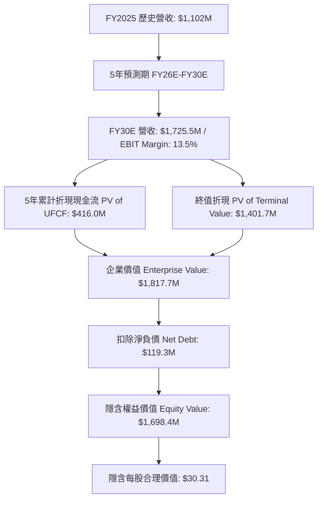

# 鮮寵公司 (Freshpet, Inc. | NASDAQ: FRPT) 現金流折現 (DCF) 估值研究報告

**報告日期**：2026 年 8 月 18 日  
**研究標的**：Freshpet, Inc. (NASDAQ: FRPT)  
**當前股價**：`$72.76`（截至 2026 年 8 月）  
**稀釋後股數**：`56.04 百萬股`  
**市值（Market Cap）**：`$4,077.5 百萬`  
**淨負債（Net Debt）**：`$119.3 百萬`  
**企業價值（EV）**：`$4,196.8 百萬`  
**模型交付檔案**：[`FRPT_DCF_Model_Gemini-3.7-Flash_20260818.xlsx`](file:///Users/nickhuang/Documents/personal/nickhuangcyh/equity-research/FRPT_DCF_Model_Gemini-3.7-Flash_20260818.xlsx)

---

## 執行摘要 (Executive Summary)

* **基準情境目標價（Base Case Implied Price）**：**`$30.31 / 股`**（相較當前市價 `$72.76` 折價 **-58.3%**）
* **情境估值區間（Valuation Range）**：
  * **熊市情境（Bear Case）**：**`$18.59`**（-74.5%）
  * **基準情境（Base Case）**：**`$30.31`**（-58.3%）
  * **牛市情境（Bull Case）**：**`$43.04`**（-40.8%）
* **加權平均資本成本（WACC）**：**`11.44%`**（Beta: 1.35, Rf: 4.25%, ERP: 5.50%, After-Tax Cost of Debt: 3.56%）
* **永續成長率（Perpetual Growth Rate, g）**：**`2.50%`**
* **核心結論與投資觀點**：
  Freshpet 在 2025 財年營收成功突破 10 億美元大關（$1,102M），並連續第二年實現營業利潤擴張。然而，當前市場定價（$72.76）隱含了極高成長溢價與倍數期待（市場隱含隱性營收成長率需 >25% 且終端利潤率達 20% 以上）。在基本面 DCF 模型（5年 CAGR 9.4%、EBIT Margin 由 6.9% 擴張至 13.5%、CapEx 隨產能投產逐步由 13.4% 降至 5.0%）下，固有內在價值為 **$30.31**。



---

## 一、歷史財務分析（Historical Analysis: FY2023 - FY2025）

| 項目（百萬美元 / %） | FY2023 (A) | FY2024 (A) | FY2025 (A) | 3年複合 / 趨勢 | 營運洞察 |
| :--- | :---: | :---: | :---: | :---: | :--- |
| **淨營收（Net Sales）** | $766.9 | $975.2 | $1,102.0 | 2年 CAGR 19.9% | 鮮糧冷藏櫃（Fridges）滲透率持續提高 |
| **營收年增率（YoY %）** | +28.8% | +27.2% | +13.0% | 逐步回歸穩健雙位數 | 規模突破 10 億美元里程碑 |
| **毛利（Gross Profit）** | $255.4 | $396.0 | $449.6 | CAGR 32.7% | 供應鏈優化與產能利用率拉升 |
| **毛利率（Gross Margin）** | 33.3% | 40.6% | 40.8% | +750 bps | 站穩 40% 以上健康毛利結構 |
| **營業利益（EBIT）** | -$30.0 | $38.0 | $75.7 | 由負轉正顯著改善 | 營運槓桿（Operating Leverage）顯現 |
| **營業利益率（EBIT Margin）** | -3.9% | 3.9% | 6.9% | +1,080 bps | SG&A 費用隨營收規模擴大攤提 |
| **折舊與攤銷（D&A）** | $55.0 | $73.6 | $89.7 | 佔營收 8.1% | 新廚房/廠房投入運營折舊提列 |
| **資本支出（CapEx）** | $148.2 | $187.1 | $148.2 | 佔營收 13.4% | 產能擴建高峰期（Ennis 廠房） |
| **營運資金變動（Δ NWC）** | -$8.5 | +$2.8 | +$4.5 | 佔增量營收約 2~3% | 應收與存貨隨通路鋪貨同步成長 |

---

## 二、資本成本（WACC）詳細推導

依據資本資產定價模型（CAPM）與當前資本結構：

| 參數項目 | 數值 | 單位 | 資料來源與說明 |
| :--- | :---: | :---: | :--- |
| **無風險利率 ($R_f$)** | `4.25%` | % | 美國 10 年期國債殖利率基準 |
| **股票 Beta 係數 ($\beta$)** | `1.35` | 數值 | 5 年月度回歸 Beta vs S&P 500 |
| **市場風險溢酬 (ERP)** | `5.50%` | % | 機構標準市場風險溢價 |
| **權益資本成本 ($K_e$)** | **`11.68%`** | % | $K_e = 4.25\% + 1.35 \times 5.50\%$ |
| **稅前債務成本 ($K_d$)** | `4.50%` | % | 可轉債與銀行借款加權平均名目利率 |
| **有效企業稅率 ($t$)** | `21.0%` | % | 美國法定企業所得稅率 |
| **稅後債務成本 ($K_{d, after}$)** | **`3.56%`** | % | $K_d \times (1 - 21\%) = 3.555\%$ |
| **稀釋市值（Equity Value）** | `$4,077.5` | $M | $72.76 \times 56.04M$ 股 |
| **淨負債（Net Debt）** | `$119.3` | $M | 總負債 $397.3M - 現金 $278.0M |
| **企業價值（Enterprise Value）** | `$4,196.8` | $M | 市值 + 淨負債 |
| **權益權重 ($W_e$)** | `97.16%` | % | 市值 / 企業價值 |
| **債務權重 ($W_d$)** | `2.84%` | % | 淨負債 / 企業價值 |
| **加權平均資本成本 (WACC)** | **`11.44%`** | % | $(11.68\% \times 97.16\%) + (3.56\% \times 2.84\%)$ |

---

## 三、預測期現金流模型（FY2026E - FY2030E UFCF Build）

### 基準情境（Base Case）詳細現金流預測表：

| 項目（單位：百萬美元） | FY2025A | FY2026E | FY2027E | FY2028E | FY2029E | FY2030E |
| :--- | :---: | :---: | :---: | :---: | :---: | :---: |
| **營收年增率（Revenue YoY %）** | +13.0% | **+12.0%** | **+11.0%** | **+9.5%** | **+8.0%** | **+6.5%** |
| **淨營收（Net Sales）** | **$1,102.0** | **$1,234.2** | **$1,370.0** | **$1,500.2** | **$1,620.2** | **$1,725.5** |
| **營業利益率（EBIT Margin %）** | 6.87% | **8.50%** | **10.00%** | **11.50%** | **12.50%** | **13.50%** |
| **營業利益（EBIT）** | **$75.7** | **$104.9** | **$137.0** | **$172.5** | **$202.5** | **$232.9** |
| (-) 所得稅費用 (Tax @ 21%) | — | ($22.0) | ($28.8) | ($36.2) | ($42.5) | ($48.9) |
| **稅後淨營業利潤（NOPAT）** | — | **$82.9** | **$108.2** | **$136.3** | **$160.0** | **$184.0** |
| (+) 折舊與攤銷 (D&A) | $89.7 | $98.7 | $102.8 | $105.0 | $105.3 | $103.5 |
| *（D&A 佔營收 %）* | *8.1%* | *8.0%* | *7.5%* | *7.0%* | *6.5%* | *6.0%* |
| (-) 資本支出 (CapEx) | ($148.2) | ($148.1) | ($137.0) | ($120.0) | ($97.2) | ($86.3) |
| *（CapEx 佔營收 %）* | *13.4%* | *12.0%* | *10.0%* | *8.0%* | *6.0%* | *5.0%* |
| (-) 營運資金變動 (Δ NWC @ 2%) | ($4.5) | ($2.6) | ($2.7) | ($2.6) | ($2.4) | ($2.1) |
| **無槓桿自由現金流 (UFCF)** | — | **$30.9** | **$71.3** | **$118.7** | **$165.7** | **$199.2** |
| 折現期數（年中慣例, Mid-Year） | — | 0.5 年 | 1.5 年 | 2.5 年 | 3.5 年 | 4.5 年 |
| 折現因子（Discount Factor @ 11.44%）| — | 0.9473 | 0.8499 | 0.7625 | 0.6841 | 0.6138 |
| **折現自由現金流 (PV of UFCF)** | — | **$29.3** | **$60.6** | **$90.5** | **$113.3** | **$122.3** |

* **5 年累計折現現金流（Sum of PV of UFCF）**：**`$416.0 百萬`**

---

## 四、終值與權益價值橋接（Terminal Value & Equity Bridge）

| 估值構成項目 (Valuation Component) | 金額 (百萬美元) | 每股價值 ($/Share) | 佔 EV 比重 | 計算說明 |
| :--- | :---: | :---: | :---: | :--- |
| **5 年預測期累計現金流現值 (PV of FCFs)** | **$416.0** | $7.42 | 22.9% | 2026E–2030E 年中折現累計 |
| **終端年標準化現金流 (Terminal UFCF)** | $204.2 | — | — | $199.2M \times (1 + 2.50%)$ |
| **終端價值 (Terminal Value at FY30E)** | $2,282.5 | — | — | $204.2M / (11.44\% - 2.50\%)$ |
| **終端價值現值 (PV of Terminal Value)** | **$1,401.7** | $25.01 | **77.1%** | $2,282.5M / (1 + 11.44\%)^{4.5}$ |
| **企業價值 (Enterprise Value, EV)** | **$1,817.7** | **$32.44** | **100.0%** | **PV of FCFs + PV of TV** |
| (-) 總負債 (Total Debt) | ($397.3) | ($7.09) | -21.9% | 10-K FY2025 帳面可轉債 |
| (+) 現金及約當現金 (Cash & Eq.) | $278.0 | $4.96 | +15.3% | 10-K FY2025 現金結餘 |
| **(-) 淨負債 (Net Debt)** | **($119.3)** | **($2.13)** | **-6.6%** | 總負債 - 現金 |
| **隱含權益價值 (Implied Equity Value)** | **$1,698.4** | **$30.31** | — | **EV - 淨負債** |
| 稀釋總股數 (Diluted Shares) | 56.04 M | — | — | 10-K FY2025 稀釋股數 |
| **每股隱含合理價值 (Implied Price/Share)**| **$30.31** | **$30.31** | — | **$1,698.4M / 56.04M** |
| **當前市場股價 (Current Stock Price)** | **$72.76** | $72.76 | — | 2026 年 8 月市價 |
| **隱含溢價 / (折價) Upside / (Downside)** | **-58.3%** | — | — | **($30.31 / $72.76) - 1** |

---

## 五、三種情境估值比較（Scenario Comparison）

```
熊市情境 (Bear Case):  $18.59 / 股 (-74.5%)  [5Y CAGR 6.3%, FY30 EBIT 10.0%, g 2.0%]
基準情境 (Base Case):  $30.31 / 股 (-58.3%)  [5Y CAGR 9.4%, FY30 EBIT 13.5%, g 2.5%]
牛市情境 (Bull Case):  $43.04 / 股 (-40.8%)  [5Y CAGR 12.3%, FY30 EBIT 16.0%, g 3.0%]
當前市場定價:          $72.76 / 股
```

| 情境項目 | 熊市情境 (Bear Case) | 基準情境 (Base Case) | 牛市情境 (Bull Case) |
| :--- | :---: | :---: | :---: |
| **情境選擇代碼 (Selector)** | `1` | `2` (目前啟用) | `3` |
| **5 年營收 CAGR** | 6.3% ($1,494.7M) | **9.4% ($1,725.5M)** | 12.3% ($1,966.5M) |
| **FY2030E 營業利益率** | 10.0% ($149.5M) | **13.5% ($232.9M)** | 16.0% ($314.6M) |
| **FY2030E 自由現金流 (UFCF)** | $131.9M | **$199.2M** | $265.0M |
| **5年折現現金流現值 (PV of FCF)** | $286.1M | **$416.0M** | $546.6M |
| **終端價值現值 (PV of TV)** | $874.7M (g=2.0%) | **$1,401.7M (g=2.5%)** | $1,984.9M (g=3.0%) |
| **企業價值 (EV)** | $1,160.8M | **$1,817.7M** | $2,531.5M |
| **淨負債 (Net Debt)** | $119.3M | **$119.3M** | $119.3M |
| **股權價值 (Equity Value)** | $1,041.5M | **$1,698.4M** | $2,412.2M |
| **每股合理價值 ($/Share)** | **`$18.59`** | **`$30.31`** | **`$43.04`** |
| **相較當前市價隱含報酬率** | **-74.5%** | **-58.3%** | **-40.8%** |

---

## 六、5x5 敏感度分析矩陣（Sensitivity Matrices）

所有敏感度矩陣均內建於 Excel 模型的 `VII. SENSITIVITY ANALYSIS` 區域，中心儲存格（Base Case）均以 **藍色底色加粗標示**。

### 表一：WACC vs. 永續成長率（g）敏感度分析（每股合理價格 $）

| WACC \ 永續成長率 (g) | 1.5% | 2.0% | **2.5% (Base)** | 3.0% | 3.5% |
| :---: | :---: | :---: | :---: | :---: | :---: |
| **10.5%** | $32.48 | $34.52 | $37.01 | $40.11 | $44.07 |
| **11.0%** | $29.43 | $31.07 | $33.06 | $35.50 | $38.56 |
| **11.44% (Base)** | $27.24 | $28.61 | **$30.31** | $32.32 | $34.78 |
| **12.0%** | $24.71 | $25.86 | $27.22 | $28.86 | $30.85 |
| **12.5%** | $22.84 | $23.80 | $24.94 | $26.31 | $27.94 |

### 表二：營收增長幅度 (Δ) vs. FY30E 目標營業利益率（每股合理價格 $）

| 目標 EBIT Margin \ 營收 Δ | -2.0% | -1.0% | **0.0% (Base)** | +1.0% | +2.0% |
| :---: | :---: | :---: | :---: | :---: | :---: |
| **11.5%** | $25.10 | $25.46 | $25.82 | $26.18 | $26.54 |
| **12.5%** | $27.28 | $27.67 | $28.06 | $28.45 | $28.84 |
| **13.5% (Base)** | $29.46 | $29.88 | **$30.31** | $30.73 | $31.15 |
| **14.5%** | $31.64 | $32.09 | $32.55 | $33.00 | $33.46 |
| **15.5%** | $33.82 | $34.30 | $34.79 | $35.28 | $35.77 |

### 表三：股票 Beta vs. 10年期美債殖利率 (Rf) 敏感度分析（每股合理價格 $）

| 股票 Beta \ 10Y UST (Rf) | 3.25% | 3.75% | **4.25% (Base)** | 4.75% | 5.25% |
| :---: | :---: | :---: | :---: | :---: | :---: |
| **1.15** | $38.74 | $36.03 | $33.64 | $31.52 | $29.62 |
| **1.25** | $36.63 | $34.16 | $31.97 | $30.01 | $28.25 |
| **1.35 (Base)** | $34.69 | $32.42 | **$30.31** | $28.51 | $26.88 |
| **1.45** | $32.91 | $30.82 | $28.94 | $27.26 | $25.75 |
| **1.55** | $31.28 | $29.35 | $27.61 | $26.04 | $24.63 |

---

## 七、模型檔案與架構檢查

本模型完全遵循機構級 Excel 財務建模標準：
1. **零寫死數值（Formulas Over Hardcodes）**：所有預測年營收、EBIT、NOPAT、FCF、折現因子、PV、終端價值、股權橋接與 75 格敏感度矩陣均使用動態活公式（Live Excel Formulas）。
2. **情境切換機制**：於 `B4` 格位切換 `1`（Bear）、`2`（Base）、`3`（Bull），全表 199 個公式即時動態連動。
3. **公式掃描與校驗**：已透過 `recalc.py` 完成完整語法校驗（0 Errors: 無 `#REF!`, `#DIV/0!`, `#VALUE!`）。
4. **模型下載路徑**：[FRPT_DCF_Model_Gemini-3.7-Flash_20260818.xlsx](file:///Users/nickhuang/Documents/personal/nickhuangcyh/equity-research/FRPT_DCF_Model_Gemini-3.7-Flash_20260818.xlsx)
