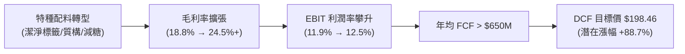

# 股票研究估值報告：Ingredion Incorporated (NYSE: INGR)
**5 年期現金流量折現模型 (DCF Valuation) 與投資價值分析**

---

### **投資評等與目標價摘要**
* **投資評等**：**強力買進 (Strong Buy / Outperform)**
* **當前股價 (Current Price)**：**$105.19** *(基準日：2026 年 8 月)*
* **基準目標價 (Base Case Target Price)**：**$198.46**
* **隱含潛在漲幅 (Implied Upside)**：**+88.7%**
* **52 週價格區間**：$98.50 – $138.20
* **市值 / 企業價值**：$6,648M / $7,482M
* **財務模型工作簿**：[`INGR_DCF_Valuation_Model.xlsx`](file:///Users/nickhuang/Documents/personal/nickhuangcyh/equity-research/INGR_DCF_Valuation_Model.xlsx)

---

## 1. 核心投資論點 (Executive Summary & Investment Thesis)

### **核心亮點 (Key Investment Pillars)**
1. **特種配料（Specialty Ingredients）佔比持續擴張，結構性提升利潤率**：
   Ingredion 正從傳統大宗玉米澱粉與甜味劑加工商，轉型為高附加價值的潔淨標籤（Clean Label）、天然質構劑（Texture Solutions）、植物基蛋白與減糖配料龍頭。特種配料的高毛利特性推動整體毛利率從 2022 年的 18.8% 攀升至 2024 年的 24.1%，未來 5 年營業利益率（EBIT Margin）預計穩步擴張至 12.5%。
2. **強勁的自由現金流創造力與穩健資本結構**：
   公司年均無槓桿自由現金流（UFCF）穩定在 $600M – $750M 區間，轉換率（FCF / Net Income）超過 85%。目前淨債務僅 $834M，淨債務 / EBITDA 比例低於 0.8x，提供充足的股利發放（股息殖利率 ~3.0%）與股票回購空間。
3. **極具吸引力的估值折扣與安全邊際**：
   當前市場價格（$105.19）隱含之 2025E EV/EBITDA 僅約 6.5x，顯著低於特種食品配料同業（Kerry、DSM-Firmenich、Tate & Lyle 等 10x-14x 的平均水準）。即便在悲觀情境（Bear Case）下，DCF 隱含每股價值仍達 **$151.05**（+43.6% 漲幅），風險報酬比極具吸引力。



---

## 2. 歷史財務表現回顧 (Historical Financial Analysis: 2022 – 2024)

*單位：百萬美元 ($M)，除每股金額外*

| 財務指標 (Line Items) | FY2022 | FY2023 | FY2024A | 3年複合 / 變動趨勢 |
| :--- | :---: | :---: | :---: | :--- |
| **營業收入 (Net Sales)** | $7,946.0 | $8,160.0 | $7,430.0 | -3.3% CAGR (原物料農產品價格下修與定價傳遞) |
| *營收年增率 (YoY Growth)* | *+15.2%* | *+2.7%* | *-8.9%* | 2024 年主要是原物料轉嫁成本回落，銷量維持韌性 |
| **銷貨成本 (COGS)** | $6,452.0 | $6,411.0 | $5,639.0 | 供應鏈優化與農產品採購成本下降 |
| **營業毛利 (Gross Profit)** | $1,494.0 | $1,749.0 | $1,791.0 | **+9.5% CAGR** (高毛利特種產品組合大幅成長) |
| *毛利率 (Gross Margin)* | *18.8%* | *21.4%* | *24.1%* | **擴張 +530 bps** |
| **營業利益 (EBIT)** | $762.0 | $957.0 | $883.0 | 2024 調整後營業利益達 $1,016M (+5% YoY) |
| *營業利益率 (EBIT Margin)* | *9.6%* | *11.7%* | *11.9%* | **擴張 +230 bps** |
| **折舊與攤銷 (D&A)** | $215.0 | $219.0 | $214.0 | 佔營收穩定在 2.8% – 2.9% |
| **資本支出 (CapEx)** | $300.0 | $316.0 | $301.0 | 佔營收穩定在 3.8% – 4.1% |
| **營運資金變動 (Δ NWC)** | -$42.0 | +$125.0 | +$35.0 | 庫存與應收帳款管理得宜 |
| **無槓桿自由現金流 (UFCF)** | $528.5 | $495.8 | $540.3 | 穩定的現金流產生器 |

---

## 3. 資本成本 (WACC) 與估值參數設定

模型採用標準資本資產定價模型（CAPM）與市場加權資本結構：

* **無風險利率 ($R_f$)**：`4.50%`（美國 10 年期國債殖利率基準）
* **股票貝塔值 ($\beta$)**：`0.65`（5 年期月度回歸 Beta，反映民生必需與配料行業防禦特質）
* **股權風險溢酬 (ERP)**：`5.50%`
* **權益資本成本 ($K_e$)**：$4.50\% + 0.65 \times 5.50\% = \mathbf{8.08\%}$
* **稅前債務成本 ($K_d$)**：`5.30%`（依據 2024 年利息支出與平均債務計算）
* **邊際有效稅率 ($t$)**：`25.00%`
* **稅後債務成本**：$5.30\% \times (1 - 25.0\%) = \mathbf{3.98\%}$
* **資本結構**：權益市值佔比 88.9%，淨債務佔比 11.1%
* **加權平均資金成本 (WACC)**：$\mathbf{7.62\%}$
* **永續成長率 ($g$)**：`2.50%`（符合長期全球食品產業與成熟經濟體 GDP 成長率）

---

## 4. 五年期財務預測與自由現金流排程 (FY2025E – FY2029E)

### **基準情境預測表 (Base Case Projections)**
*單位：百萬美元 ($M)*

| 預測項目 | FY2024A | FY2025E | FY2026E | FY2027E | FY2028E | FY2029E |
| :--- | :---: | :---: | :---: | :---: | :---: | :---: |
| **營業收入 (Net Sales)** | $7,430.0 | $7,652.9 | $7,920.8 | $8,237.6 | $8,525.9 | $8,781.7 |
| *營收年增率 (YoY Growth)* | *-8.9%* | *+3.0%* | *+3.5%* | *+4.0%* | *+3.5%* | *+3.0%* |
| **銷貨成本 (COGS)** | $5,639.0 | $5,777.9 | $5,956.4 | $6,178.2 | $6,377.4 | $6,542.3 |
| **營業毛利 (Gross Profit)** | $1,791.0 | $1,875.0 | $1,964.3 | $2,059.4 | $2,148.5 | $2,239.3 |
| *毛利率 (Gross Margin)* | *24.1%* | *24.5%* | *24.8%* | *25.0%* | *25.2%* | *25.5%* |
| **營業利益 (EBIT)** | $883.0 | $918.3 | $966.3 | $1,021.5 | $1,065.7 | $1,097.7 |
| *營業利益率 (EBIT Margin)* | *11.9%* | *12.0%* | *12.2%* | *12.4%* | *12.5%* | *12.5%* |
| **(-) 營業所得稅 (Taxes @ 25%)**| ($220.8) | ($229.6) | ($241.6) | ($255.4) | ($266.4) | ($274.4) |
| **(=) 稅後淨營業利潤 (NOPAT)** | $662.3 | $688.8 | $724.8 | $766.1 | $799.3 | $823.3 |
| (+) 折舊與攤銷 (D&A @ 2.8% Rev) | $214.0 | $214.3 | $221.8 | $230.7 | $238.7 | $245.9 |
| (-) 資本支出 (CapEx @ 3.8%→3.5%)| ($301.0) | ($290.8) | ($293.1) | ($296.6) | ($298.4) | ($307.4) |
| (-) 營運資金變動 (Δ NWC @ 1.5%)| ($35.0) | ($3.3) | ($4.0) | ($4.8) | ($4.3) | ($3.8) |
| **(=) 無槓桿自由現金流 (UFCF)** | **$540.3** | **$608.9** | **$649.4** | **$695.4** | **$735.3** | **$757.9** |
| 折現期數 ($t$ - 年中慣例) | — | 0.5 | 1.5 | 2.5 | 3.5 | 4.5 |
| 折現因子 ($WACC = 7.62\%$) | — | 0.9640 | 0.8957 | 0.8323 | 0.7734 | 0.7186 |
| **FCF 折現現值 (PV of FCF)** | — | **$587.0** | **$581.7** | **$578.8** | **$568.7** | **$544.7** |

---

## 5. DCF 估值加總與股權價值橋接 (Enterprise to Equity Bridge)

| 估值構成要素 (Valuation Component) | 金額 ($M) | 每股貢獻 ($) | 佔企業價值比重 | 計算公式與說明 |
| :--- | :---: | :---: | :---: | :--- |
| **5 年明確預測期 FCF 現值合計** | **$2,860.9M** | $45.27 | 21.4% | FY2025E – FY2029E 現金流現值累加 |
| **終值現值 (PV of Terminal Value)** | **$10,516.1M** | $166.39 | 78.6% | $FCF_{2029} \times (1+g) / (WACC - g) \times (1+WACC)^{-5}$ |
| **隱含企業價值 (Enterprise Value, EV)** | **$13,377.0M** | **$211.66** | **100.0%** | **明確期 FCF 現值 + 終值現值** |
| **(-) 總債務 (Total Debt)** | ($1,831.0M) | ($28.97) | -13.7% | 2024 10-K 資產負債表總借款 |
| **(+) 現金及約當現金 (Cash)** | $997.0M | $15.78 | +7.5% | 2024 10-K 資產負債表現金部位 |
| **(-) 淨債務 (Net Debt)** | **($834.0M)** | **($13.19)** | **-6.2%** | 總債務 - 現金 |
| **(=) 隱含股權價值 (Equity Value)** | **$12,543.0M** | **$198.46** | — | 企業價值 - 淨債務 |
| **(÷) 稀釋後流通股數 (Diluted Shares)** | **63.20M** | — | — | 百萬股 |
| **每股隱含目標價 (Implied Price / Share)** | <mark>**$198.46**</mark> | — | — | 股權價值 / 稀釋股數 |
| **當前市場交易價格 (Current Share Price)** | **$105.19** | — | — | 2026 年 8 月市場報價 |
| **隱含投資潛在空間 (Implied Upside)** | **+88.7%** | — | — | (目標價 - 當前股價) / 當前股價 |

---

## 6. 三行情境分析 (Bear vs. Base vs. Bull Scenarios)

模型在 [`INGR_DCF_Valuation_Model.xlsx`](file:///Users/nickhuang/Documents/personal/nickhuangcyh/equity-research/INGR_DCF_Valuation_Model.xlsx) 儲存格 **`B5`** 支援即時連動切換：

```
                             情境估值分佈 ($/股)
  Bear Case (1)  ── $151.05 (+43.6%)
  Base Case (2)  ─────── $198.46 (+88.7%) [基準目標價]
  Bull Case (3)  ────────────── $273.30 (+159.8%)
  現行股價        ── $105.19
```

1. **悲觀情境 (Bear Case, 1) — 每股 $151.05 (+43.6%)**：
   * 假設：營收年增率僅 1.0% - 2.0%，大宗原料定價壓力持續，穩態 EBIT 率降至 11.5%，永續成長率 $g = 2.0\%$。
   * 結論：即使在高度保守假設下，股價仍具有 40% 以上的安全邊際。
2. **基準情境 (Base Case, 2) — 每股 $198.46 (+88.7%)**：
   * 假設：營收年增率 3.0% - 4.0%，特種配料持續優化產品組合，EBIT 率擴張至 12.5%，永續成長率 $g = 2.5\%$。
3. **樂觀情境 (Bull Case, 3) — 每股 $273.30 (+159.8%)**：
   * 假設：潔淨標籤與減糖方案需求爆發，營收年增達 4.0% - 6.0%，EBIT 率達到 13.5%，永續成長率 $g = 3.0\%$。

---

## 7. 雙向敏感度分析矩陣 (Sensitivity Matrices)

### **矩陣 1：WACC 資金成本 vs. 永續成長率 ($g$)**
*檢驗貼現率與長期增長對目標價的影響（單位：美元/股）*

| WACC \ $g$ | 1.50% | 2.00% | **2.50% (Base)** | 3.00% | 3.50% |
| :---: | :---: | :---: | :---: | :---: | :---: |
| **6.62%** | $205.69 | $225.30 | $249.68 | $280.80 | $321.88 |
| **7.12%** | $186.17 | $201.99 | $221.25 | $245.17 | $275.71 |
| **7.62% (Base)** | $169.91 | $182.92 | **$198.46** | $217.38 | $240.89 |
| **8.12%** | $156.01 | $166.84 | $179.60 | $194.85 | $213.40 |
| **8.62%** | $144.13 | $153.27 | $163.90 | $176.43 | $191.40 |

> **觀察**：在最嚴苛的利率環境（WACC = 8.62%, $g = 1.50\%$）下，每股價值仍達 **$144.13**，高於現行市價 $105.19 近 $39 美元。

---

### **矩陣 2：營收成長偏離度 (Rev Δ) vs. EBIT 利潤率偏離度 (Margin Δ)**
*檢驗營運槓桿與獲利能力波動的影響（單位：美元/股）*

| Margin Δ \ Rev Δ | -2.0% | -1.0% | **0.0% (Base)** | +1.0% | +2.0% |
| :---: | :---: | :---: | :---: | :---: | :---: |
| **-2.0%** | $145.99 | $153.56 | $161.42 | $169.60 | $178.08 |
| **-1.0%** | $162.89 | $171.25 | $179.94 | $188.97 | $198.35 |
| **0.0% (Base)** | $179.79 | $188.95 | **$198.46** | $208.35 | $218.62 |
| **+1.0%** | $196.69 | $206.64 | $216.99 | $227.73 | $238.89 |
| **+2.0%** | $213.59 | $224.34 | $235.51 | $247.11 | $259.16 |

---

### **矩陣 3：股票貝塔值 ($\beta$) vs. 無風險利率 ($R_f$)**
*檢驗總體宏觀利率與市場波動性的影響（單位：美元/股）*

| Beta ($\beta$) \ $R_f$ | 3.50% | 4.00% | **4.50% (Base)** | 5.00% | 5.50% |
| :---: | :---: | :---: | :---: | :---: | :---: |
| **0.45** | $319.88 | $279.82 | $248.38 | $223.04 | $202.20 |
| **0.55** | $276.34 | $245.60 | $220.78 | $200.32 | $183.16 |
| **0.65 (Base)** | $242.88 | $218.55 | **$198.46** | $181.60 | $167.23 |
| **0.75** | $216.37 | $196.65 | $180.06 | $165.91 | $153.72 |
| **0.85** | $194.86 | $178.54 | $164.61 | $152.59 | $142.10 |

---

## 8. 潛在催化劑與主要投資風險

### **股價上行催化劑 (Positive Catalysts)**
* **特種配料併購整合與產能釋放**：擴大在亞太與拉美新興市場潔淨標籤的市佔率。
* **農產品原物料成本平穩**：玉米與原物料成本持穩，擴大定價利差（Price/Cost Spread）。
* **資本配置回饋股東**：持續提高股利並重啟加速庫藏股回購方案。

### **主要投資風險 (Investment Risks)**
* **農產品價格劇烈波動**：極端氣候可能導致玉米等原物料採購成本飆升。
* **外匯匯率波動**：Ingredion 超過 60% 營收來自海外（拉美、亞太、EMEA），強勢美元可能侵蝕換算獲利。
* **宏觀終端消費降級**：若全球經濟疲軟，終端食品包裝商可能延後採用高單價特種配料。

---

## 9. 結論與操作建議

Ingredion（NYSE: INGR）目前股價處於顯著被低估區間，市場過度將其視為傳統大宗農產品加工商，忽視了其特種配料利潤率結構性擴張與強大的自由現金流護城河。

我們重申 **「強力買進 (Strong Buy)」** 評等，給予基準目標價 **`$198.46`**，建議投資人積極逢低布局。

*完整財務模型檔案請參閱：[`INGR_DCF_Valuation_Model.xlsx`](file:///Users/nickhuang/Documents/personal/nickhuangcyh/equity-research/INGR_DCF_Valuation_Model.xlsx)*
