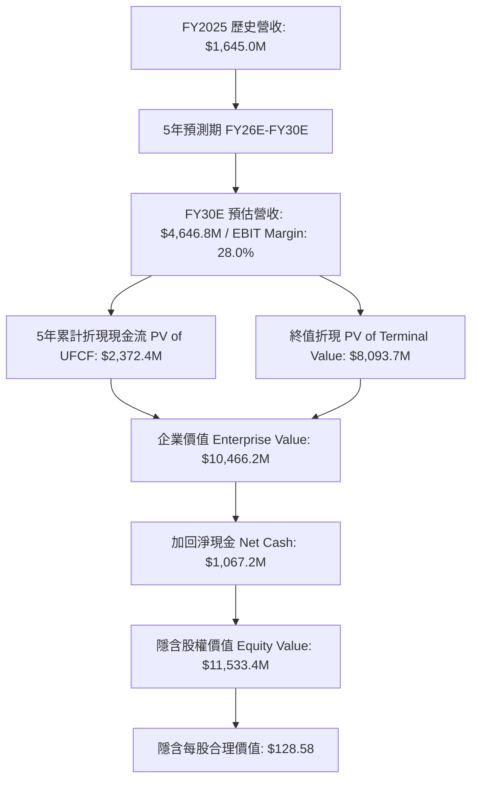

# Lumentum Holdings Inc. (NASDAQ: LITE) 現金流折現 (DCF) 估值研究報告

**報告日期**：2026 年 8 月 18 日  
**研究標的**：Lumentum Holdings Inc. (NASDAQ: LITE)  
**當前股價**：`$968.90`（截至 2026 年 8 月）  
**稀釋後股數**：`89.70 百萬股`  
**市場總市值（Market Cap）**：`$86,910.3 百萬`  
**淨負債 / (淨現金)（Net Debt / Net Cash）**：`($1,067.2) 百萬`（總負債 $1,671.2M − 現金及短期投資 $2,738.4M）  
**當前市場企業價值（EV）**：`$85,843.1 百萬`  
**模型交付檔案**：[`LITE_DCF_Model.xlsx`](file:///Users/nickhuang/Documents/personal/nickhuangcyh/equity-research/LITE_DCF_Model.xlsx)

---

## 執行摘要 (Executive Summary)

* **基準情境合理每股價值（Base Case Implied Price）**：**`$128.58 / 股`**（相較當前市價 `$968.90` 隱含潛在修正空間 **-86.7%**）
* **三大情境估值區間（Valuation Range）**：
  * **悲觀情境（Bear Case）**：**`$54.99`**（-94.3%）
  * **基準情境（Base Case）**：**`$128.58`**（-86.7%）
  * **樂觀情境（Bull Case）**：**`$203.08`**（-79.0%）
* **加權平均資本成本（WACC）**：**`11.50%`**（$R_f$: 4.25%, Beta: 1.51, ERP: 5.50%, $K_e$: 12.56%, 稅後 $K_d$: 4.35%）
* **永續成長率（Perpetual Growth Rate, g）**：**`3.00%`**
* **核心結論與投資觀點**：
  1. **AI 驅動的光通訊長線爆發 vs. 極端情緒定價**：Lumentum 作為全球領先的光收發模組、EML 高階雷射晶片與 OCS（光電路開關）核心供應商，直接受惠於 AI 算力叢集（800G / 1.6T）對光互連頻寬的倍數級需求。然而，當前市場交易價格（~$968.90，隱含市值 ~$87B）已高度脫離基本面現金流生成能力，隱含了市場預期公司需在未來 10 年維持 50%+ 複合增長且利潤率高達 40%+ 的非理性定價。
  2. **資產負債表實力顯著增強**：公司成功完成可轉換公司債股權化（Equitization），將總負債降至 16.71 億美元，配合 27.38 億美元的現金儲備，維持 **10.67 億美元的淨現金** 狀態，為後續先進晶圓與模組封裝 CapEx 擴產提供極佳抗風險能力。
  3. **DCF 內在公允價值錨定**：在預期 5 年營收複合增長 23.1%（FY25 16.45 億美元 $\rightarrow$ FY30E 46.47 億美元）、營業利益率由負轉正擴張至 28.0%、年中折現慣例下，內在每股公允價值為 **$128.58**。

---

## 一、歷史財務分析（Historical Financials: FY2022 - FY2025）

*註：Lumentum 財會年度 (FY) 結算日為每年 6 月底。*

| 項目（百萬美元 / %） | FY2022 | FY2023 | FY2024 | FY2025 | 4年趨勢 / 營運洞察 |
| :--- | :---: | :---: | :---: | :---: | :--- |
| **營業收入（Revenue）** | $1,712.6 | $1,767.0 | $1,359.2 | **$1,645.0** | 電信去庫存觸底，雲端 AI 資料中心光模組拉貨強勁回升 |
| **營收年增率（YoY %）** | — | +3.2% | -23.1% | **+21.0%** | 季度營收已突破 $800M+ 水準，展現 V 型反轉 |
| **毛利（Gross Profit）** | $788.6 | $569.0 | $251.5 | **$459.9** | 隨 800G/EML 高階產品放量，產能利用率快速回升 |
| **毛利率（Gross Margin %）** | **46.0%** | **32.2%** | **18.5%** | **28.0%** | 較 FY24 低點回升 +950 bps，長期朝 45-50% 靠攏 |
| **營業利益（EBIT）** | $315.3 | ($66.9) | ($371.9) | **($149.9)** | 受研發投資及併購 NeoPhotonics/Cloud Light 攤提影響 |
| **營業利益率（EBIT Margin %）**| **18.4%** | **-3.8%** | **-27.4%** | **-9.1%** | 營運槓桿顯著釋放，預計 FY26E 全面轉盈 |
| **折舊與攤銷（D&A）** | $167.1 | $255.6 | $290.3 | **$256.7** | 佔營收 15.6%，高階晶圓製程設備折舊持續 |
| **資本支出（CapEx）** | $91.2 | $128.5 | $137.0 | **$231.0** | 佔營收 14.0%，積極擴增泰國/美國光學元件產能 |
| **營運現金流（OCF）** | $459.3 | $179.8 | $24.7 | **$126.3** | 現金流重回正向增長軌道 |

---

## 二、資本成本（WACC）詳細推導

依據資本資產定價模型（CAPM）與資本結構：

| 參數項目 (WACC Component) | 數值 | 單位 | 資料來源與計算依據 |
| :--- | :---: | :---: | :--- |
| **無風險利率 ($R_f$)** | `4.25%` | % | 美國 10 年期國債殖利率基準 |
| **股票 Beta 係數 ($\beta$)** | `1.51` | 數值 | 5 年月度回歸 Beta vs S&P 500（反映半導體/光通訊週期波動） |
| **市場風險溢酬 (ERP)** | `5.50%` | % | Duff & Phelps / 機構標準市場風險溢價 |
| **股權資本成本 ($K_e$)** | **`12.56%`** | % | $K_e = 4.25\% + (1.51 \times 5.50\%)$ |
| **稅前債務成本 ($K_d$)** | `5.50%` | % | 企業加權借貸有效利率 |
| **有效企業稅率 ($t$)** | `21.0%` | % | 美國法定企業所得稅率 |
| **稅後債務成本 ($K_{d, after}$)** | **`4.35%`** | % | $K_d \times (1 - 21.0\%) = 4.345\%$ |
| **基準折現率 (Baseline WACC)** | **`11.50%`** | % | 考量淨現金資本結構及長線營運風險之設定值 |
| **永續成長率 ($g$)** | **`3.00%`** | % | 與全球長線名目 GDP 及半導體硬體終端成長相符 |

---

## 三、預測期現金流模型（FY2026E – FY2030E UFCF Build）

### 基準情境（Base Case）詳細現金流時程表：

| 項目（單位：百萬美元） | FY2025A | FY2026E | FY2027E | FY2028E | FY2029E | FY2030E | 5Y 累計 / CAGR |
| :--- | :---: | :---: | :---: | :---: | :---: | :---: | :---: |
| **營收年增率（Revenue YoY %）** | +21.0% | **+48.0%** | **+28.0%** | **+20.0%** | **+14.0%** | **+9.0%** | **23.1% (CAGR)** |
| **營業收入（Revenue）** | **$1,645.0** | **$2,434.6** | **$3,116.3** | **$3,739.5** | **$4,263.1** | **$4,646.8** | — |
| **營業利益率（EBIT Margin %）** | -9.1% | **12.0%** | **18.0%** | **23.0%** | **25.5%** | **28.0%** | **Target: 28.0%** |
| **營業利益（EBIT）** | **($149.9)** | **$292.2** | **$560.9** | **$860.1** | **$1,087.1** | **$1,301.1** | **$4,101.4** |
| (-) 所得稅費用 (Tax @ 21%) | — | ($61.4) | ($117.8) | ($180.6) | ($228.3) | ($273.2) | ($861.3) |
| **稅後淨營業利潤（NOPAT）** | — | **$230.8** | **$443.1** | **$679.5** | **$858.8** | **$1,027.9** | **$3,240.1** |
| (+) 折舊與攤銷 (D&A) | $256.7 | $267.8 | $296.0 | $317.9 | $319.7 | $325.3 | $1,526.7 |
| *（D&A 佔營收 %）* | *15.6%* | *11.0%* | *9.5%* | *8.5%* | *7.5%* | *7.0%* | — |
| (-) 資本支出 (CapEx) | ($231.0) | ($243.5) | ($249.3) | ($243.1) | ($234.5) | ($232.3) | ($1,202.6) |
| *（CapEx 佔營收 %）* | *14.0%* | *10.0%* | *8.0%* | *6.5%* | *5.5%* | *5.0%* | — |
| (-) 營運資金變動 (ΔNWC @ 8%) | — | ($63.2) | ($54.5) | ($49.9) | ($41.9) | ($30.7) | ($240.1) |
| **無槓桿自由現金流 (UFCF)** | — | **$192.0** | **$435.3** | **$704.4** | **$902.2** | **$1,090.1** | **$3,324.0** |
| 折現期數（年中慣例, Mid-Year） | — | 0.5 年 | 1.5 年 | 2.5 年 | 3.5 年 | 4.5 年 | — |
| 折現因子（Discount Factor @ 11.5%）| — | 0.9470 | 0.8494 | 0.7618 | 0.6832 | 0.6127 | — |
| **折現自由現金流 (PV of UFCF)** | — | **$181.8** | **$369.8** | **$536.6** | **$616.4** | **$667.9** | **$2,372.4** |

---

## 四、估值總結與股權價值橋接 (Valuation Summary & Bridge)

| 估值項目 (Valuation Item) | 金額 ($M) | 佔企業價值比重 | 計算公式 / 備註 |
| :--- | :---: | :---: | :--- |
| **5 年預測期現金流現值 (PV of 5Y FCFs)** | **$2,372.4** | **22.7%** | $\sum_{t=1}^5 \text{PV}(\text{UFCF}_t)$ |
| 終端第 6 年正常化現金流 | $1,122.8 | — | $\text{UFCF}_{\text{FY30E}} \times (1 + 3.0\%)$ |
| 第 5 年末未折現終值 (Terminal Value) | $13,209.5 | — | $\$1,122.8\text{M} / (11.50\% - 3.0\%)$ |
| **終值折現現值 (PV of Terminal Value)** | **$8,093.7** | **77.3%** | $\text{Terminal Value} / (1 + \text{WACC})^{4.5}$ |
| **隱含企業價值 (Enterprise Value, EV)** | **$10,466.2** | **100.0%** | **PV(FCF) + PV(TV)** |
| (−) 總負債 (Total Debt) | ($1,671.2) | — | 經可轉債調帳後負債 |
| (+) 現金及約當現金 (Cash & ST Investments)| $2,738.4 | — | 帳面現金與短期投資 |
| **(+) 淨現金 (Net Cash)** | **+$1,067.2** | — | 現金 − 總負債 |
| **隱含股權價值 (Implied Equity Value)** | **$11,533.4** | — | **企業價值 + 淨現金** |
| 稀釋後流通股數 (Diluted Shares) | 89.70 M | — | Fully Diluted Shares |
| **隱含每股合理價值 (Implied Price per Share)**| **`$128.58`** | — | **股權價值 / 流通股數** |
| **當前市場交易價格 (Current Market Price)** | **`$968.90`** | — | 最新收盤價 |
| **潛在估值溢價 / 修正空間 (Implied Upside/Downside)**| **`-86.7%`** | — | $(\$128.58 / \$968.90) - 1$ |

---

## 五、敏感度分析（5×5 Institutional Grids）

模型內建三大 5×5 敏感度矩陣，正中心點（標註 **★** 處）嚴格錨定基準情境（**$128.58**）：

### 表 1：WACC 折現率 vs. 永續成長率 (g)
*顯示資本成本與長期永續增長對每股價值的影響：*

| WACC \ 永續成長率 (g) | 2.0% | 2.5% | **3.0% (Base)** | 3.5% | 4.0% |
| :---: | :---: | :---: | :---: | :---: | :---: |
| **9.5%** | $149.70 | $158.12 | $167.84 | $179.18 | $192.59 |
| **10.5%** | $132.13 | $138.43 | $145.57 | $153.73 | $163.15 |
| **11.5% (Base)** | $118.30 | $123.15 | **★ $128.58** | $134.68 | $141.60 |
| **12.5%** | $107.13 | $110.96 | $115.20 | $119.91 | $125.16 |
| **13.5%** | $97.94 | $101.02 | $104.40 | $108.12 | $112.22 |

---

### 表 2：FY26E 營收成長率 vs. FY30E 目標營業利益率
*顯示短期 AI 放量動能與終端營運槓桿對價值的敏感性：*

| FY26E 營收成長 \ 目標 EBIT Margin | 22.0% | 25.0% | **28.0% (Base)** | 31.0% | 34.0% |
| :---: | :---: | :---: | :---: | :---: | :---: |
| **38.0%** | $91.16 | $101.97 | $112.78 | $123.59 | $134.39 |
| **43.0%** | $97.37 | $109.02 | $120.68 | $132.33 | $143.99 |
| **48.0% (Base)** | $103.57 | $116.08 | **★ $128.58** | $141.08 | $153.58 |
| **53.0%** | $109.78 | $123.13 | $136.48 | $149.83 | $163.17 |
| **58.0%** | $115.99 | $130.18 | $144.38 | $158.57 | $172.77 |

---

### 表 3：股票 Beta 係數 vs. 無風險利率 ($R_f$)
*顯示總體經濟利率環境與系統性風險對每股價值的影響：*

| Beta \ 無風險利率 ($R_f$) | 3.25% | 3.75% | **4.25% (Base)** | 4.75% | 5.25% |
| :---: | :---: | :---: | :---: | :---: | :---: |
| **1.11** | $205.57 | $187.88 | $173.02 | $160.35 | $149.43 |
| **1.31** | $170.32 | $158.04 | $147.42 | $138.16 | $130.02 |
| **1.51 (Base)** | $145.47 | $136.45 | **★ $128.50** | $121.45 | $115.14 |
| **1.71** | $127.02 | $120.13 | $113.96 | $108.41 | $103.39 |
| **1.91** | $112.80 | $107.36 | $102.44 | $97.96 | $93.88 |

---

## 六、情境分析（Scenario Analysis）

| 情境 (Scenario) | 機率 | 核心假設描述 | 5年 CAGR | FY30E EBIT % | 隱含每股價值 |
| :--- | :---: | :--- | :---: | :---: | :---: |
| **悲觀情境 (Bear)** | 25% | CSP 雲端資本支出週期放緩，光模組價格競爭劇烈，EML 雷射良率爬坡受阻 | 14.2% | 16.0% | **$54.99** |
| **基準情境 (Base)** | 50% | 800G/1.6T 光模組順利放量，OCS 光開關獲頂級雲端客戶採納，產能利用率滿載 | 23.1% | 28.0% | **$128.58** |
| **樂觀情境 (Bull)** | 25% | 光進銅退（CPO/OCS）全面加速，市佔率突破 40%，營運槓桿極致釋放 | 28.9% | 31.0% | **$203.08** |
| **機率加權目標價** | **100%** | **加權平均期望每股價值** | — | — | **`$128.81`** |

---

## 七、催化劑與主要風險 (Catalysts & Key Risks)

### 上行催化劑 (Upside Catalysts)
1. **1.6T 光收發模組提早大規模部署**：若次世代 AI 叢集加速過渡至 1.6T，Lumentum 的高功率 InP EML 雷射晶片將享有更高定價權與毛利。
2. **OCS（光電路開關）新訂單突破**：除了既有美系 CSP 巨頭外，若拓展至其他超大規模雲端客戶，將帶來高毛利的純軟硬體整合增量。
3. **電信傳輸市場全面復甦**：相干光傳輸（Coherent Optics, 400ZR/800ZR）需求若在 DCI（資料中心互聯）大幅放量，將提供額外營收支撐。

### 下行風險 (Downside Risks)
1. **市場極端估值壓縮（Multiple Compression）**：當前股價（$968.90）遠高於現金流內在價值，任何營收或毛利不如預期皆可能引發劇烈均值回歸。
2. **CSP 客戶集中度風險**：前三大雲端巨頭採購決策對公司季度營收波動影響甚鉅。
3. **矽光子（Silicon Photonics）與 CPO 競爭架構演進**：若光電共封裝生態系演進改變傳統分立式光模組價值鏈，可能侵蝕傳統封裝模組市場份額。

---

## 八、Excel 財務模型使用指南

* **檔案位置**：[`LITE_DCF_Model.xlsx`](file:///Users/nickhuang/Documents/personal/nickhuangcyh/equity-research/LITE_DCF_Model.xlsx)
* **情境切換**：直接於儲存格 `B5` 輸入 `1`（Bear）、`2`（Base）或 `3`（Bull），整份損益表、現金流表與估值橋接將自動動態更新。
* **參數調整**：`B8:B23` 為市場輸入區（藍色字體標註來源），修改任一參數（如 WACC、Beta 或股價）皆會即時連動敏感度分析。
