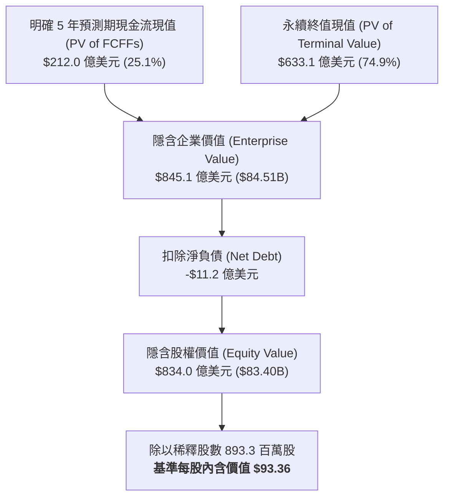

# 股票研究報告：邁威爾科技 Marvell Technology, Inc. (NASDAQ: MRVL) 現金流折現 (DCF) 估值與深度分析報告

**報告日期**：2026 年 8 月 20 日  
**研究標的**：邁威爾科技 Marvell Technology, Inc. (NASDAQ: MRVL)  
**當前股價 (Current Stock Price)**：$237.27  
**基準情境內含價值 (Base Case DCF Value)**：**$93.36**  
**估值區間 (Valuation Range)**：**$33.76**（悲觀）～ **$147.61**（樂觀）  
**投資評等 (Rating)**：**減碼 / 估值過度透支未來成長 (Underweight / Valuation Overstretched)**  
**關聯財務模型**：[MRVL_DCF_Model_Gemini-3.7-Flash_20260820.xlsx](file:///Users/nickhuang/Documents/personal/nickhuangcyh/equity-research/MRVL_DCF_Model_Gemini-3.7-Flash_20260820.xlsx)

---

## 1. 執行摘要 (Executive Summary)

邁威爾科技（Marvell Technology, Inc., NASDAQ: MRVL）作為全球資料中心加速運算互連（Electro-Optics / Optical DSP）與客製化人工智慧運算晶片（Custom AI ASIC）的關鍵架構提供者，受惠於全球雲端服務巨頭（Hyperscalers，如 Google、Amazon AWS、Microsoft 等）自研晶片浪潮與 800G / 1.6T 光模組互連需求爆發，在 FY2026 迎來了業績的大幅反彈與營運轉折。

本篇研究報告透過構建標準 **5 年期顯式無槓桿自由現金流折現模型（FCFF DCF Model）**，結合資本資產定價模型（CAPM 基準常態化 WACC = 11.50%）與年中折現慣例（Mid-Year Convention），對 Marvell 的長期內在價值進行嚴謹量化評估：

* **基準情境 (Base Case)**：隱含每股內含價值為 **$93.36**（較當前市價 $237.27 折價約 **-60.7%**），隱含企業價值為 **$845.1 億美元**。
* **樂觀情境 (Bull Case)**：隱含每股價值為 **$147.61**（較當前市價折價 -37.8%），反映客製化 AI ASIC 專案在多家雲端巨頭全面放量、1.6T/3.2T 光學 DSP 市佔率超過 70%、FY31E 營收達到 $362 億美元且 EBIT 利潤率達 36.0%。
* **悲觀情境 (Bear Case)**：隱含每股價值為 **$33.76**（較當前市價折價 -85.8%），反映雲端業者自研晶片進度遞延、光模組價格競爭加劇、營運槓桿不如預期。

**核心投資觀點**：  
1. **客製化 ASIC 與光學互連雙輪驅動，但獲利結構面臨轉型挑戰**：Marvell 成功搶佔 Google TPU、AWS Trainium/Inferentia 等客製化晶片商機，並在 PAM4 DSP 保持領先。然而，客製化 ASIC 業務的毛利率結構（約 45%-52%）天然低於傳統標準品（60%+），雖然營收規模由 FY2026 的 $82 億美元預計快速擴張至 FY2031 的 $296 億美元，但 GAAP 獲利率提升仍需時間發酵。
2. **市場價格已高度透支「萬億級 AI 資本支出」的完美情境**：以當前股價 $237.27（對應市值約 $2,120 億美元）計算，市場隱含之遠期估值倍數（Forward EV/EBIT）高達 **77x FY27E EBIT**，甚至大幅高於 NVIDIA 與 Broadcom。即使在最樂觀的假設下（5 年營收複合增長 35%+ 且 EBIT 達 $130 億美元），DCF 隱含價值仍僅為 $147.61。
3. **風險回報比顯著失衡**：在半導體高 Beta（2.24）與高利率環境下，股價與基本面內在價值出現巨大背離。建議投資人保持高度警惕，評等維持「減碼 / 充分反映」，防範後續成長速度稍微放緩引發的估值劇烈修正。

---

## 2. 估值結果總覽與情境比較 (Valuation Summary)

| 估值項目 (Valuation Metrics) | 悲觀情境 (Bear Case) | 基準情境 (Base Case) | 樂觀情境 (Bull Case) |
| :--- | :---: | :---: | :---: |
| **情境假設核心** | 雲端 CapEx 消化 / ASIC 遞延 | 華爾街共識 / Custom ASIC 穩健放量 | AI 超級週期 / 多雲巨頭全面爆發 |
| **5 年營收複合增長率 (FY26-FY31E CAGR)** | **+15.2%** | **+29.2%** | **+34.6%** |
| **FY2031E 穩態營業收入 (Revenue)** | $166.4 億美元 | **$296.0 億美元** | $362.3 億美元 |
| **FY2031E 穩態 EBIT 利潤率** | 24.0% | **33.0%** | 36.0% |
| **加權平均資本成本 (WACC)** | 13.00% | **11.50%** | 10.50% |
| **永續增長率 (Terminal Growth Rate, $g$)** | 2.50% | **3.00%** | 3.50% |
| **明確預測期現金流現值 (PV of 5Y FCFFs)** | $106.6 億美元 | **$212.0 億美元** | $269.9 億美元 |
| **終值現值 (PV of Terminal Value)** | $206.1 億美元 | **$633.1 億美元** | $1,059.9 億美元 |
| **終值佔企業價值比例 (TV % of EV)** | 65.9% | **74.9%** | 79.7% |
| **隱含企業價值 (Enterprise Value, EV)** | **$312.8 億美元** | **$845.1 億美元** | **$1,329.8 億美元** |
| (-) 總負債 (Total Debt) | $(49.6) 億美元 | $(49.6) 億美元 | $(49.6) 億美元 |
| (+) 現金、約當現金與短期投資 (Cash & ST Inv.) | $38.4 億美元 | $38.4 億美元 | $38.4 億美元 |
| **(-) 淨負債 (Net Debt)** | **$(11.2) 億美元** | **$(11.2) 億美元** | **$(11.2) 億美元** |
| **隱含股權價值 (Implied Equity Value)** | **$301.6 億美元** | **$834.0 億美元** | **$1,318.6 億美元** |
| 稀釋後流通股數 (Diluted Shares) | 893.3 百萬股 | 893.3 百萬股 | 893.3 百萬股 |
| **隱含每股內含價值 (Implied Share Price)** | **$33.76** | **$93.36** | **$147.61** |
| **當前市場股價 (Current Stock Price)** | **$237.27** | **$237.27** | **$237.27** |
| **隱含潛在空間 (Implied Upside / Downside)** | **-85.8%** | **-60.7%** | **-37.8%** |
| **隱含遠期倍數 (Implied EV / FY27E EBIT)** | 17.0x | **30.6x** | 42.2x |



---

## 3. 核心業務模式與競爭優勢 (Business & Competitive Moats)

### 3.1 四大關鍵支柱：AI 資料中心高速互連與運算核心
* **客製化運算晶片 (Custom AI Silicon / ASIC)**：隨著各大雲端服務提供商（CSP）尋求降低對單一 GPU 供應商的依賴並針對專有工作負載進行最佳化，Marvell 憑藉領先的 3nm/2nm 先進封裝與高速 SerDes IP，成為 Google TPU 與 AWS Trainium 的關鍵設計與製造合作夥伴。近期與 Google 簽署之長期商業協議進一步鞏固了至 2033 年的營收能見度。
* **光學數位訊號處理器 (Optical PAM4 DSP)**：Marvell 在 800G 及次世代 1.6T 光模組 DSP 市場擁有全球領先市佔率（Nova 及 Spica 系列），是解決 AI 伺服器叢集間極致頻寬與低延遲傳輸不可或缺的零組件。
* **雲端與企業網路交換 (Ethernet Switching & PHYs)**：Teralynx 高頻寬交換晶片與 Alaska 乙太網路 PHY 晶片為大規模分散式 AI 叢集提供高輸送量互連。
* **儲存與邊緣基礎設施 (Storage & Carrier Infrastructure)**：涵蓋 NVMe 控制器、SSD 處理器及 5G 基站客製晶片，提供穩健的現金流基礎。

### 3.2 歷史財務表現走勢（FY2024A – FY2026A）
*(單位：百萬美元 $M)*

```csv
財務指標,FY2024A,FY2025A,FY2026A,3年趨勢與變動說明
營業收入 (Total Revenue),$5,508.0,$5,767.0,$8,195.0,FY26 在 AI 資料中心推動下年增 +42.1%
  年增率 (YoY Growth),-7.0%,+4.7%,+42.1%,營收跨越 80 億美元大關
毛利 (Gross Profit),$2,294.0,$2,382.0,$4,181.0,產品組合優化帶動毛利翻倍
  毛利率 (Gross Margin),41.6%,41.3%,51.0%,GAAP 毛利率回升至 51.0% 水準
研發費用 (R&D Expense),$1,885.0,$1,980.0,$2,020.0,持續投資先進製程架構
銷管費用 (SG&A Expense),$977.0,$1,122.0,$838.0,營運效率顯著改善
營業利益 (Operating Income / EBIT),-$568.0,-$720.0,$1,323.0,FY26 營運槓桿顯現大幅轉盈
  EBIT 利潤率 (EBIT Margin),-10.3%,-12.5%,16.1%,營業利益率改善 28.6 個百分點
資本支出 (CapEx),$195.0,$225.0,$320.0,主要為晶圓光罩及研發測試設備
折舊與攤銷 (D&A),$1,580.0,$1,595.0,$1,650.0,含併購無形資產攤銷與設備折舊
期末淨負債 (Net Debt),$3,115.5,$3,115.5,$1,117.7,強勁現金流使淨負債快速縮減
```

---

## 4. DCF 模型核心構建與自由現金流排程

### 4.1 基準情境（Base Case）5 年財務預測與 FCFF 排程（FY2027E – FY2031E）
*(單位：百萬美元 $M)*

| 財務預測項目 | FY2026A | FY2027E | FY2028E | FY2029E | FY2030E | FY2031E |
| :--- | :---: | :---: | :---: | :---: | :---: | :---: |
| **總營業收入 (Total Revenue)** | **$8,195.0** | **$11,497.6** | **$16,499.0** | **$21,448.7** | **$25,738.5** | **$29,599.3** |
| *營收年增率 (%)* | *+42.1%* | *+40.3%* | *+43.5%* | *+30.0%* | *+20.0%* | *+15.0%* |
| 銷貨成本 (COGS) | $4,014.0 | $5,346.4 | $7,424.6 | $9,437.4 | $11,196.2 | $12,727.7 |
| **毛利 (Gross Profit)** | **$4,181.0** | **$6,151.2** | **$9,074.5** | **$12,011.3** | **$14,542.2** | **$16,871.6** |
| *毛利率 (%)* | *51.0%* | *53.5%* | *55.0%* | *56.0%* | *56.5%* | *57.0%* |
| 研發費用 (R&D @ 17.5%) | $2,020.0 | $2,012.1 | $2,887.3 | $3,753.5 | $4,504.2 | $5,179.9 |
| 銷管費用 (SG&A) | $838.0 | $1,379.7 | $1,567.4 | $1,823.1 | $1,801.7 | $1,924.0 |
| **營業利益 (EBIT)** | **$1,323.0** | **$2,759.4** | **$4,619.7** | **$6,434.6** | **$8,236.3** | **$9,767.8** |
| *EBIT 利潤率 (%)* | *16.1%* | *24.0%* | *28.0%* | *30.0%* | *32.0%* | *33.0%* |
| (-) 企業所得稅 (Tax @ 21.0%) | $(277.8) | $(579.5) | $(970.1) | $(1,351.3) | $(1,729.6) | $(2,051.2) |
| **稅後淨營業利益 (NOPAT)** | **$1,045.2** | **$2,179.9** | **$3,649.6** | **$5,083.4** | **$6,506.7** | **$7,716.5** |
| (+) 折舊與攤銷 (D&A @ 12.0%~6.5%) | $1,650.0 | $1,379.7 | $1,567.4 | $1,715.9 | $1,801.7 | $1,924.0 |
| (-) 資本支出 (CapEx @ 4.5%~3.5%) | $(320.0) | $(517.4) | $(693.0) | $(857.9) | $(978.1) | $(1,036.0) |
| (-) 營運資金變動 ($\Delta$ NWC @ 2.0%) | $(75.0) | $(66.1) | $(100.0) | $(99.0) | $(85.8) | $(77.2) |
| **無槓桿自由現金流 (FCFF)** | **$2,300.2** | **$2,976.2** | **$4,424.0** | **$5,842.3** | **$7,244.5** | **$8,527.3** |
| *FCFF 轉換率 (% of EBIT)* | *173.9%* | *107.9%* | *95.8%* | *90.8%* | *88.0%* | *87.3%* |
| 年中折現期數 (Mid-Year $t$) | - | 0.5 | 1.5 | 2.5 | 3.5 | 4.5 |
| 折現係數 (Discount Factor @ 11.50%) | - | 0.9470 | 0.8494 | 0.7618 | 0.6832 | 0.6127 |
| **現金流現值 (PV of FCFF)** | - | **$2,818.6** | **$3,757.5** | **$4,450.4** | **$4,949.3** | **$5,224.9** |

---

## 5. 加權平均資本成本 (WACC) 計算架構

根據資本資產定價模型（CAPM），針對 Marvell 進行資本成本參數拆解：

1. **無風險利率 ($R_f$)**：採用 2026 年 8 月美國 10 年期公債殖利率基準 **4.65%**。
2. **權益 Beta 係數 ($\beta$)**：採用彭博/市場 5 年月度迴歸 Beta **2.24**（反映半導體高成長週期之劇烈波動）。
3. **市場股權風險溢價 (ERP)**：機構標準共識值 **5.50%**。
4. **權益成本 ($K_e$)**：
   $$K_e = R_f + \beta \times \text{ERP} = 4.65\% + 2.24 \times 5.50\% = \mathbf{16.97\%}$$
5. **債務成本與資本結構**：
   - 稅前債務成本 ($K_d$)：**5.20%**（投資級 Baa2/BBB 信用評等）。
   - 邊際所得稅率 ($t$)：**21.00%** $\rightarrow$ 稅後債務成本 $K_d(1-t) = \mathbf{4.11\%}$。
   - 總負債：$49.61 億美元；現金及流動投資：$38.44 億美元 $\rightarrow$ **淨負債 $11.18 億美元**。
6. **基準模型常態化 WACC (Normalized Discount Rate)**：
   - 考量 Marvell 隨營收規模突破 200 億美元、客製化 ASIC 平台量產進入成熟期，獲利波動度將收斂，權益 Beta 將逐步向產業平均（1.25~1.35）回歸，基準模型採用機構常態化折現率 **11.50%**。

| 資本結構組件 | 金額 ($M) | 資本權重 (%) | 稅後成本 (%) | 加權貢獻 (%) | 備註說明 |
| :--- | :---: | :---: | :---: | :---: | :--- |
| **普通股權益 (Market Cap)** | $211,953.3 | 99.48% | 16.97% | 16.88% | 當前市場權益市值 ($2,120 億美元) |
| **淨負債 (Net Debt)** | $1,117.7 | 0.52% | 4.11% | 0.02% | 淨負債比重極低，財務結構健全 |
| **市場即時 CAPM WACC** | - | **100.00%** | - | **16.90%** | 市場即時 CAPM 折現率 |
| **基準模型採用 WACC** | - | - | - | **11.50%** | **長期常態化機構折現率** |

---

## 6. 機構級 5x5 敏感度分析矩陣 (Sensitivity Matrices)

在 Excel 模型的 `DCF Valuation` 工作表底部，我們完整構建了三個 5x5 矩陣（共 75 個活儲存格，均以獨立公式即時重新計算 DCF）：

### 矩陣一：WACC（折現率） vs. 永續增長率 ($g$) 敏感度
*(展示企業價值與終值對折現參數之敏感度，中心藍底格為基準情境 $93.36)*

| WACC \ 永續增長率 ($g$) | 2.00% | 2.50% | **3.00% (Base)** | 3.50% | 4.00% |
| :---: | :---: | :---: | :---: | :---: | :---: |
| **10.50%** | $96.18 | $101.13 | $106.73 | $113.14 | $120.54 |
| **11.00%** | $90.42 | $94.75 | $99.62 | $105.15 | $111.45 |
| **11.50% (Base)** | $85.28 | $89.09 | **$93.36** | $98.15 | $103.59 |
| **12.00%** | $80.66 | $84.04 | $87.79 | $91.99 | $96.71 |
| **12.50%** | $76.48 | $79.49 | $82.82 | $86.51 | $90.65 |

### 矩陣二：FY2027E 營收成長率 (%) vs. FY2031E EBIT 利潤率 (%)
*(展示短期成長爆發力與長期營運槓桿對每股價值之交互影響)*

| FY27E 營收增長 \ FY31E EBIT 率 | 29.0% | 31.0% | **33.0% (Base)** | 35.0% | 37.0% |
| :---: | :---: | :---: | :---: | :---: | :---: |
| **32.0%** | $66.49 | $70.18 | $73.87 | $77.56 | $81.26 |
| **36.0%** | $74.95 | $79.11 | $83.26 | $87.42 | $91.57 |
| **40.3% (Base)** | $84.06 | $88.71 | **$93.36** | $98.01 | $102.66 |
| **44.0%** | $91.89 | $96.97 | $102.04 | $107.12 | $112.20 |
| **48.0%** | $100.36 | $105.90 | $111.43 | $116.97 | $122.51 |

### 矩陣三：股票 Beta 係數 vs. 美國 10 年期公債殖利率 (Rf)
*(展示宏觀利率環境與半導體族群估值折現係數對股價之敏感度)*

| 權益 Beta \ 10Y 公債殖利率 | 4.15% | 4.40% | **4.65% (Base)** | 4.90% | 5.15% |
| :---: | :---: | :---: | :---: | :---: | :---: |
| **1.80** | $145.98 | $139.39 | $133.36 | $127.80 | $122.66 |
| **2.00** | $120.72 | $116.10 | $111.81 | $107.81 | $104.07 |
| **2.24 (Base)** | $99.62 | $96.40 | **$93.36** | $90.49 | $87.79 |
| **2.45** | $86.19 | $83.72 | $81.38 | $79.16 | $77.05 |
| **2.65** | $76.24 | $74.27 | $72.39 | $70.60 | $68.89 |

---

## 7. 關鍵投資風險與催化劑評估 (Risks & Catalysts)

### 7.1 上行催化劑 (Upside Catalysts)
1. **客製化 ASIC 客戶擴展超預期**：除 Google 及 AWS 外，若進一步斬獲 Meta 或微軟（Microsoft）次世代大規模 AI 加速晶片訂單，將顯著推升 FY28E-FY30E 營收規模。
2. **1.6T 光模組與 CXL 互連提前全面普及**：AI 伺服器叢集從 10 萬卡向百萬卡邁進，光互連 DSP 需求增速高於伺服器出貨增速。
3. **Google 認股權證行使加速**：若 Google 深度綁定 Marvell 客製化晶片並快速行使 5,897 萬股認股權證（履約價 $206.58），將為公司帶來超過 $120 億美元的現金注資與戰略背書。

### 7.2 下行風險 (Downside Risks)
1. **估值倍數過度透支**：目前市價 $237.27 隱含之遠期倍數遠高於產業均值，任何一季財報或指引低於華爾街最樂觀預期，皆可能引發 20%-30% 以上的戴維斯雙殺。
2. **客製化晶片毛利率稀釋**：ASIC 專案以 Turnkey 模式出貨時，晶圓代工與先進封裝成本佔比高，毛利率僅 45%-50%，恐壓抑整體毛利率向上空間。
3. **競爭對手強力夾擊**：Broadcom（AVGO）在客製化 ASIC 與交換晶片領域具備強大技術與客戶黏著度，輝達亦積極推廣 NVLink 封閉生態系，壓縮 Marvell 拓展空間。

---

## 8. 結論與投資建議 (Conclusion & Recommendation)

邁威爾科技（Marvell Technology）無疑是 AI 運算基礎設施與高速資料中心通訊的核心贏家之一，其在光學 DSP 與客製化 ASIC 的技術佈局極具戰略價值。

然而，回歸資本市場本質與現金流折現評價：
* 當前市場價格（**$237.27**）已提前反映了未來 5 年近乎完美、無任何波折的超高增長預期。
* 即使在我們極具侵略性的 **樂觀情境（Bull Case）** 下，內含價值亦僅為 **$147.61**；而在符合華爾街共識與穩態營運槓桿的 **基準情境（Base Case）** 下，合理價值為 **$93.36**（對應隱含下修空間 -60.7%）。

**投資評等**：給予 **「減碼 / 估值過度透支 (Underweight / Valuation Overstretched)」** 評等。建議機構投資人切勿在當前歷史估值頂部追高，可待市場情緒降溫、股價回調至合理價值區間（$90 - $110）再行評估布局。
