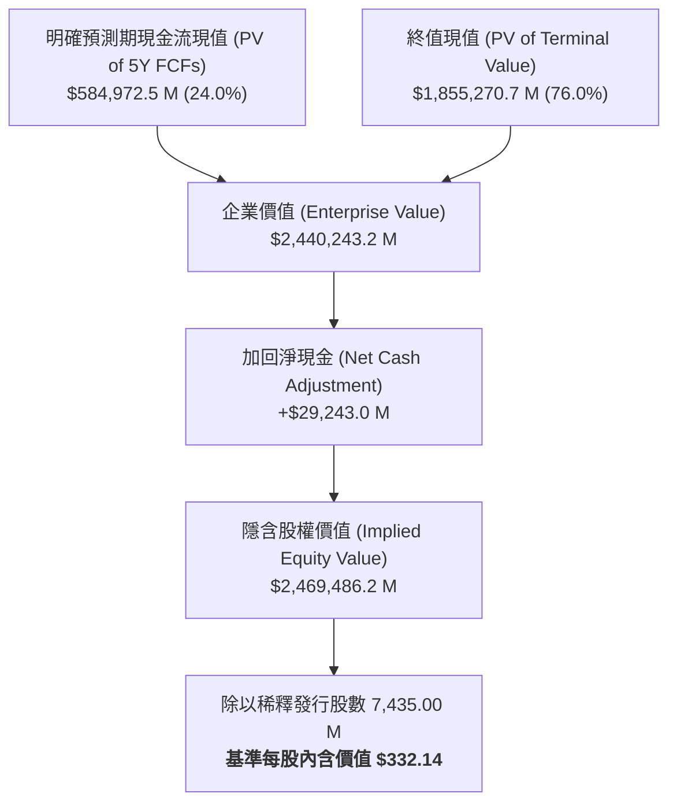
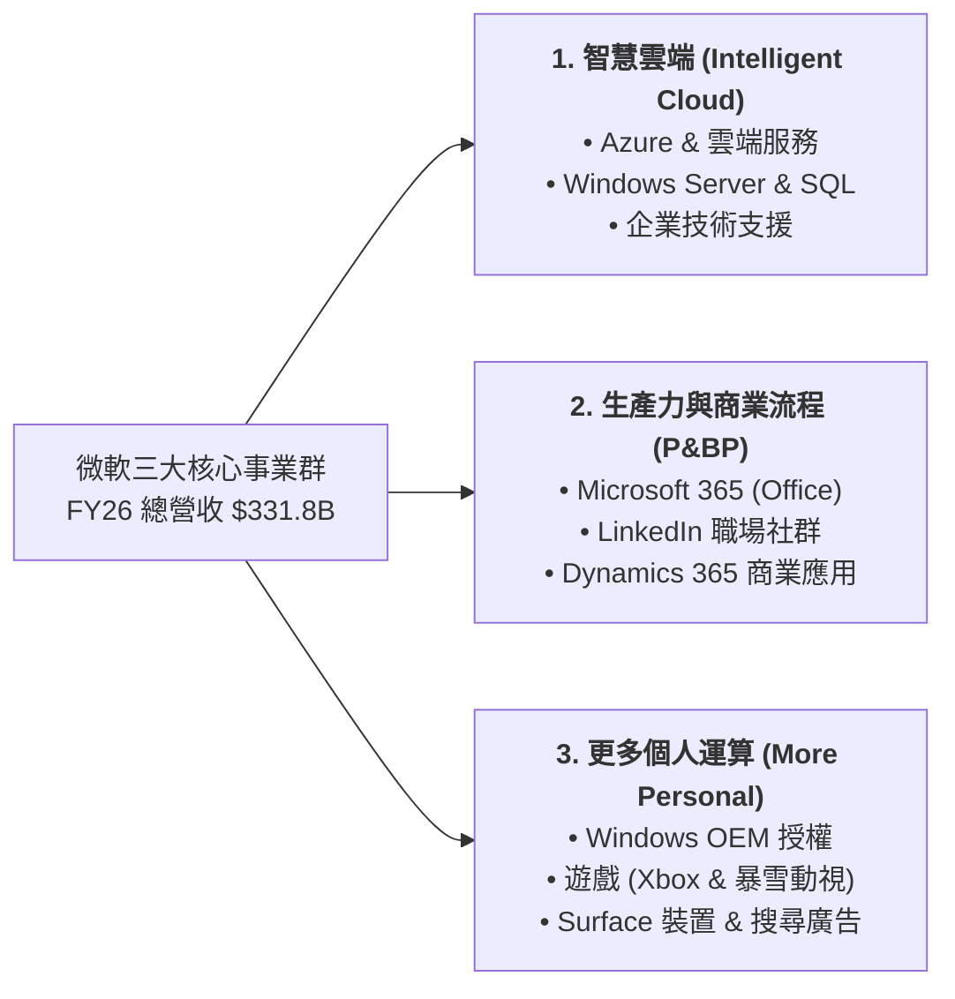
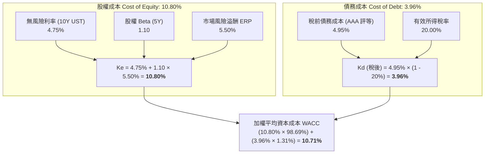

# 股票研究報告：微軟公司 (Microsoft Corporation, NASDAQ: MSFT) 現金流折現 (DCF) 估值與深度分析報告

**報告日期**：2026 年 8 月 19 日  
**研究標的**：微軟公司 (Microsoft Corporation, NASDAQ: MSFT)  
**當前股價 (Current Price)**：$481.59  
**基準內含價值 (Base Case DCF Value)**：$332.14  
**估值區間 (Valuation Range)**：$214.73（保守）～ $467.83（樂觀）  
**投資評等 (Rating)**：中立 / 估值溢價觀察 (Hold / Fully Valued)  
**關聯財務模型**：[MSFT_DCF_Model_Gemini-3.7-Flash_20260819.xlsx](file:///Users/nickhuang/Documents/personal/nickhuangcyh/equity-research/MSFT_DCF_Model_Gemini-3.7-Flash_20260819.xlsx)

---

## 1. 執行摘要 (Executive Summary)

微軟公司（NASDAQ: MSFT）作為全球雲端運算、企業級軟體與人工智慧（Enterprise AI）的超級龍頭，在剛結束的 2026 財年（截至 2026 年 6 月 30 日）繳出歷史性的營運成績單：**全年度總營收達 3,318 億美元（年增 17.8%），營業利益達 1,552 億美元（年增 20.8%）**。其中，Azure 雲端運算年度營收正式突破千億美元大關，且微軟 365 Copilot 商業付費席次已突破 3,000 萬席，展現出無可匹敵的 AI 軟硬整合商業化飛輪。

然而，從現金流折現模型（DCF）與資本配置的角度審視，微軟當前亦面臨歷史上最大規模的**「AI 算力基礎設施資本支出週期（CapEx Supercycle）」**。2026 財年微軟資本支出高達 **1,159 億美元（佔營收比重高達 34.9%）**，短期內大幅壓抑了無槓桿自由現金流（UFCF）的釋放速度。

本研究透過構建 5 年期無槓桿自由現金流折現模型（FY2027E–FY2031E），採用 CAPM 加權平均資本成本（WACC = 10.71%）、年中折現慣例（Mid-Year Convention）及永續成長率（$g = 3.00\%$），對微軟進行深度內在價值評估：

* **基準情境 (Base Case)**：隱含每股內含價值為 **$332.14**（較當前市價 $481.59 折價 31.0%）。
* **樂觀情境 (Bull Case)**：隱含每股內含價值為 **$467.83**（AI 普及超級週期、Copilot 滲透超預期、EBIT 利潤率攀升至 52.5%）。
* **保守情境 (Bear Case)**：隱含每股內含價值為 **$214.73**（企業 IT 支出放緩、雲端運算價格戰加劇、高額算力折舊侵蝕利潤）。



**核心研究結論與投資建議**：  
微軟無疑是全球科技產業中護城河最深、資產負債表最強健（全美僅有的兩家標普 **AAA 最高信用評等** 企業之一）的領袖企業。然而，當前市場價格（$481.59，對應市值約 3.58 兆美元）已反映了極高的樂觀情緒，隱含市場要求其在未來 10 年維持 15%+ 的複合高成長，且預期 AI 資本支出能在極短時間內產生超額現金回報。考量當前美國 10 年期國債殖利率維持在 4.75% 之高檔水準，長期折現率對高估值科技股帶來壓制，**建議投資人採「中立觀望（Hold）」評等**，耐心等待市場情緒回調或資本支出回報拐點確認後，於更具安全邊際的價位介入。

---

## 2. 估值結果總覽與三大情境比較 (Valuation Summary Matrix)

| 估值項目 (Valuation Metrics) | 保守情境 (Bear Case) | 基準情境 (Base Case) | 樂觀情境 (Bull Case) |
| :--- | :---: | :---: | :---: |
| **情境核心假設** | 算力投資消化期 / 雲端放緩 | AI 雲端規模化 / 軟體穩健變現 | AI 超級週期 / Copilot 爆發 |
| **5 年營收複合成長率 (CAGR)** | **+8.6%** | **+11.5%** | **+14.1%** |
| **FY2031E 營收規模 ($M)** | $501,016.9 | $571,358.4 | $640,977.7 |
| **FY2031E 穩態 EBIT 利潤率** | **43.5%** | **50.0%** | **52.5%** |
| **FY2031E CapEx 佔營收比** | **15.0%** | **13.5%** | **12.0%** |
| **加權平均資本成本 (WACC)** | **11.50%** | **10.71%** | **10.00%** |
| **永續成長率 (Terminal $g$)** | **2.50%** | **3.00%** | **3.50%** |
| **明確預測期現值 (PV of 5Y FCFs)** | $441,204.2 M | **$584,972.5 M** | $697,004.0 M |
| *現值佔比 (%)* | *28.2%* | *24.0%* | *20.2%* |
| **終值現值 (PV of Terminal Value)** | $1,126,073.2 M | **$1,855,270.7 M** | $2,752,044.1 M |
| *終值佔比 (%)* | *71.8%* | *76.0%* | *79.8%* |
| **企業價值 (Enterprise Value, EV)** | **$1,567,277.4 M** | **$2,440,243.2 M** | **$3,449,048.1 M** |
| (-) 總負債 (Total Debt) | $(47,600.0) M | $(47,600.0) M | $(47,600.0) M |
| (+) 現金與短期投資 (Cash & ST Inv) | $76,843.0 M | $76,843.0 M | $76,843.0 M |
| **(+) 淨現金調整項 (Net Cash Position)** | **+$29,243.0 M** | **+$29,243.0 M** | **+$29,243.0 M** |
| **隱含股權價值 (Implied Equity Value)** | **$1,596,520.4 M** | **$2,469,486.2 M** | **$3,478,291.1 M** |
| 稀釋發行股數 (Diluted Shares, M) | 7,435.00 M | 7,435.00 M | 7,435.00 M |
| **隱含每股內含價值 (Implied Share Price)** | **$214.73** | **$332.14** | **$467.83** |
| **當前市場股價 (Current Market Price)** | **$481.59** | **$481.59** | **$481.59** |
| **潛在空間 (Implied Upside / Downside)** | **-55.4%** | **-31.0%** | **-2.9%** |
| 隱含退出倍數 (EV / FY31E EBITDA) | 5.6x | 6.9x | 8.4x |

---

## 3. 業務板塊與核心競爭優勢分析 (Business Drivers & AI Moat)

微軟的業務架構主要劃分為三大核心事業群：



### 3.1 智慧雲端事業群 (Intelligent Cloud)
* **Azure 千億里程碑**：在 2026 財年，Azure 營收年增率維持在 30%～40% 之高水準，全年營收正式超越 1,000 億美元。
* **AI 基礎設施龍頭**：Azure 作為 OpenAI 獨家雲端合作夥伴及各大企業部署大型語言模型（LLM）的首選平台，帶動雲端工作負載持續向微軟生態系集中。
* **自研晶片架構 (Maia & Cobalt)**：為降低對輝達（NVIDIA）GPU 的過度依賴並提升算力毛利，微軟於自建資料中心中加速導入自研 Maia AI 加速晶片與 Cobalt CPU，長期將顯著優化雲端毛利率。

### 3.2 生產力與商業流程事業群 (Productivity & Business Processes)
* **Copilot 商業變現起飛**：微軟 365 Copilot（每使用者每月 30 美元附加定價）付費席次在 2026 財年突破 3,000 萬席，帶動 ARPU（每用戶平均收入）結構性躍升。
* **企業黏著度無可撼動**：Teams、Office 365、SharePoint 與 Exchange 構建了全球企業日常營運的數位神經網絡，轉換成本極高。
* **LinkedIn 與 Dynamics 365 協同**：LinkedIn 營收穩定增長，Dynamics 365 持續在 ERP/CRM 市場中瓜分傳統軟體大廠市佔。

### 3.3 資本支出超級週期：機遇與現金流壓力的兩面刃
* **FY26 資本支出 $1,159 億美元**：微軟在資料中心購地、電力合約、光纖網路及高階伺服器上的激進投資，鞏固了其 AI 時代的基礎設施壁壘。
* **自由現金流的短期壓縮**：歷史上微軟的 CapEx 佔營收比重約在 10%～15% 區間，但在 FY25（25.7%）與 FY26（34.9%）激增。這意味著短期內每賺進 1 美元營收，就有將近 0.35 美元必須投入資本支出，壓低了近期的自由現金流轉化率。

---

## 4. 歷史財務表現深度剖析 (FY2022A – FY2026A)

依據微軟歷年向美國證券交易委員會（SEC）提交之 Form 10-K 財務報表，過去 5 年微軟展現出頂級的成長質量與營運槓桿：

*(單位：百萬美元 $M，財年截至 6 月 30 日)*

| 損益與現金流項目 | FY2022A | FY2023A | FY2024A | FY2025A | FY2026A | 5年複合成長 (CAGR) |
| :--- | :---: | :---: | :---: | :---: | :---: | :---: |
| **總營收 (Total Revenue)** | **$198,270** | **$211,915** | **$245,120** | **$281,724** | **$331,839** | **+13.7%** |
| *營收年增率 (YoY)* | *+18.0%* | *+6.9%* | *+15.7%* | *+14.9%* | *+17.8%* | *-* |
| **營業成本 (Cost of Revenue)** | $62,650 | $65,863 | $74,110 | $87,831 | $106,374 | +14.2% |
| **毛利 (Gross Profit)** | **$135,620** | **$146,052** | **$171,010** | **$193,893** | **$225,465** | **+13.5%** |
| *毛利率 (Gross Margin %)* | *68.4%* | *68.9%* | *69.8%* | *68.8%* | *68.0%* | *-* |
| 研發費用 (R&D) | $24,512 | $27,195 | $29,510 | $32,488 | $37,830 | +11.5% |
| 銷售與行銷費用 (S&M) | $21,825 | $22,759 | $24,260 | $25,654 | $27,870 | +6.3% |
| 管理與一般費用 (G&A) | $5,414 | $7,575 | $7,807 | $7,256 | $4,528 | -4.4% |
| **營業利益 (EBIT)** | **$83,383** | **$88,523** | **$109,433** | **$128,495** | **$155,237** | **+16.8%** |
| *營業利益率 (EBIT Margin %)* | *42.1%* | *41.8%* | *44.6%* | *45.6%* | *46.8%* | *+470 bps* |
| (-) 所得稅費用 (Tax Provision) | $10,978 | $16,950 | $21,080 | $25,700 | $31,047 | +29.7% |
| **稅後淨營業利益 (NOPAT)** | **$72,405** | **$71,573** | **$88,353** | **$102,795** | **$124,190** | **+14.4%** |
| (+) 折舊與攤銷 (D&A) | $14,460 | $13,861 | $22,287 | $34,153 | $38,534 | +27.8% |
| (-) 資本支出 (CapEx) | $(23,886) | $(28,107) | $(44,480) | $(72,500) | $(115,900) | +48.5% |
| (-) 營運資金變動 (Δ NWC) | $(1,800) | $(2,000) | $(3,500) | $(4,000) | $(5,000) | - |
| **無槓桿自由現金流 (UFCF)** | **$61,179** | **$55,327** | **$62,660** | **$60,448** | **$41,824** | *-9.1% (CapEx壓抑)* |

---

## 5. DCF 模型預測與自由現金流排程 (FY2027E – FY2031E)

### 5.1 基準情境 (Base Case) 財務預測邏輯
1. **營收預測**：FY27E (+14.5%) 延續 Azure 與 Copilot 增長動能，隨後隨規模擴大逐步常態化至 FY31E (+8.5%)，5 年營收 CAGR 為 11.5%，FY31E 總營收達 5,714 億美元。
2. **獲利能力與營業槓桿**：隨自研晶片落地與 AI 算力利用率提升，毛利率由 68.5% 微升至 70.2%；銷售與管理費用率受惠於規模效應持續收縮，帶動 EBIT 利潤率由 47.0% 擴張至 50.0%。
3. **資本支出正常化曲線**：CapEx 佔營收比重從 FY26 歷史頂點的 34.9% 逐年下降（FY27E: 28.0% $\rightarrow$ FY28E: 23.0% $\rightarrow$ FY29E: 19.0% $\rightarrow$ FY30E: 16.0% $\rightarrow$ FY31E: 13.5%）。
4. **現金流釋放**：隨著前期投資的資料中心進入高效運轉期，UFCF 由 FY27E 的 $85.4B 快速成長至 FY31E 的 $2,195 億美元（FCF 利潤率達 38.4%）。

*(單位：百萬美元 $M)*

| 財務預測排程項目 | FY2026A | FY2027E | FY2028E | FY2029E | FY2030E | FY2031E |
| :--- | :---: | :---: | :---: | :---: | :---: | :---: |
| **總營收 (Total Revenue)** | **$331,839.0** | **$379,955.7** | **$429,349.9** | **$478,725.1** | **$526,597.6** | **$571,358.4** |
| *營收年增率 (%)* | *+17.8%* | *+14.5%* | *+13.0%* | *+11.5%* | *+10.0%* | *+8.5%* |
| **毛利 (Gross Profit)** | $225,465.0 | $260,269.6 | $296,251.4 | $332,713.9 | $368,618.3 | $401,093.6 |
| *毛利率 (%)* | *68.0%* | *68.5%* | *69.0%* | *69.5%* | *70.0%* | *70.2%* |
| 研發費用 (R&D @ 11.2%~10.2%) | $37,830.0 | $42,555.0 | $47,228.5 | $51,702.3 | $55,292.8 | $58,278.6 |
| 銷售與行銷 (S&M @ 8.2%~7.0%) | $27,870.0 | $31,156.4 | $33,489.3 | $35,904.4 | $37,915.0 | $39,995.1 |
| 一般與管理 (G&A) | $4,528.0 | $7,979.0 | $10,304.4 | $12,446.8 | $15,797.9 | $17,140.7 |
| **營業利益 (EBIT)** | **$155,237.0** | **$178,579.2** | **$205,229.2** | **$232,660.4** | **$259,612.6** | **$285,679.2** |
| *EBIT 營業利益率 (%)* | *46.8%* | *47.0%* | *47.8%* | *48.6%* | *49.3%* | *50.0%* |
| (-) 所得稅 (@ 20.0% 有效稅率) | $(31,047.0) | $(35,715.8) | $(41,045.8) | $(46,532.1) | $(51,922.5) | $(57,135.8) |
| **稅後淨營業利益 (NOPAT)** | **$124,190.0** | **$142,863.3** | **$164,183.4** | **$186,128.3** | **$207,690.1** | **$228,543.4** |
| (+) 折舊與攤銷 (D&A @ 13.0%~12.0%) | $38,534.0 | $49,394.2 | $60,109.0 | $64,627.9 | $68,457.7 | $68,563.0 |
| (-) 資本支出 (CapEx @ 28.0%~13.5%) | $(115,900.0) | $(106,387.6) | $(98,750.5) | $(90,957.8) | $(84,255.6) | $(77,133.4) |
| (-) 營運資金變動 (Δ NWC @ 1.0% ΔRev) | $(5,000.0) | $(481.2) | $(493.9) | $(493.8) | $(478.7) | $(447.6) |
| **無槓桿自由現金流 (UFCF)** | **$41,824.0** | **$85,388.8** | **$125,048.0** | **$159,304.7** | **$191,413.5** | **$219,525.4** |
| *FCF 轉化率 (% of Revenue)* | *12.6%* | *22.5%* | *29.1%* | *33.3%* | *36.3%* | *38.4%* |

---

## 6. 加權平均資本成本 (WACC) 與資本結構解析

微軟擁有全球科技業最頂級的資產負債表結構，是少數被標普與穆迪評定為 **AAA / Aaa 最高信用等級** 的非金融機構。



### 6.1 CAPM 參數與計算細節
1. **無風險利率 ($R_f$)**：`4.75%`（基準為 2026 年 8 月 19 日之美國 10 年期國債殖利率）。
2. **股權貝他值 ($\beta$)**：`1.10`（5 年月度相對於 S&P 500 指數之迴歸值，反映微軟相對穩健但具高成長科技股屬性）。
3. **市場風險溢酬 ($ERP$)**：`5.50%`（機構標準預期值）。
4. **股權資本成本 ($K_e$)**：
   $$K_e = R_f + \beta \times ERP = 4.75\% + 1.10 \times 5.50\% = \mathbf{10.80\%}$$
5. **稅前債務成本 ($K_d$)**：`4.95%`（微軟 AAA 信用評等利差僅約 20 bps）。
6. **稅後債務成本 ($K_{d, after}$)**：
   $$K_{d, after} = 4.95\% \times (1 - 20.0\%) = \mathbf{3.96\%}$$

### 6.2 資本結構權重與淨現金
* **普通股市值 (Market Cap)**：$481.59 \times 7,435.00 \text{ M} = \$3,580,622 \text{ M}$（權重 98.69%）
* **總負債 (Total Debt)**：$\$47,600 \text{ M}$（權重 1.31%）
* **加權平均資本成本 (WACC)**：
   $$\text{WACC} = (10.80\% \times 98.688\%) + (3.96\% \times 1.312\%) = \mathbf{10.71\%}$$
* **資產負債表安全墊**：現金及短期投資高達 $\$76,843 \text{ M}$，扣除總負債後處於 **淨現金頭寸（Net Cash）$\$29,243 \text{ M}$**，提供極佳的抗風險能力。

---

## 7. 現金流折現與股權價值橋接 (Valuation Bridge)

採用年中折現慣例（Mid-Year Convention，折現期間為 0.5、1.5、2.5、3.5、4.5 年）：

*(單位：百萬美元 $M)*

### 7.1 明確預測期自由現金流現值 (PV of 5-Year FCFs)
* **FY2027E**：$\$85,388.8 \text{ M} \times \frac{1}{(1 + 10.71\%)^{0.5}} (0.9504) = \$81,154.5 \text{ M}$
* **FY2028E**：$\$125,048.0 \text{ M} \times \frac{1}{(1 + 10.71\%)^{1.5}} (0.8585) = \$107,351.4 \text{ M}$
* **FY2029E**：$\$159,304.7 \text{ M} \times \frac{1}{(1 + 10.71\%)^{2.5}} (0.7754) = \$123,526.4 \text{ M}$
* **FY2030E**：$\$191,413.5 \text{ M} \times \frac{1}{(1 + 10.71\%)^{3.5}} (0.7004) = \$134,064.6 \text{ M}$
* **FY2031E**：$\$219,525.4 \text{ M} \times \frac{1}{(1 + 10.71\%)^{4.5}} (0.6326) = \$138,875.7 \text{ M}$
* **5 年現金流現值合計 (Cumulative PV of FCFs)**：**$\$584,972.5 \text{ M}$**（佔企業價值 24.0%）

### 7.2 終值現值計算 (Terminal Value)
* **終值基準現金流 (Terminal FCF)**：$\$219,525.4 \text{ M} \times (1 + 3.00\%) = \$226,111.1 \text{ M}$
* **名目終值 (Nominal Terminal Value)**：
  $$\text{TV} = \frac{\$226,111.1 \text{ M}}{10.71\% - 3.00\%} = \$2,932,599.6 \text{ M}$$
* **終值現值 (PV of Terminal Value)**：
  $$\text{PV of TV} = \frac{\$2,932,599.6 \text{ M}}{(1 + 10.71\%)^{4.5}} = \mathbf{\$1,855,270.7 \text{ M}}\quad (\text{佔企業價值 } 76.0\%)$$

### 7.3 股權價值與每股價值橋接 (Equity Value Bridge)
```csv
估值橋接項目,金額 ($M),每股貢獻 ($),佔比 (%)
5 年明確現金流現值 (PV of 5Y FCFs),$584972.5,$78.68,23.7%
終值現值 (PV of Terminal Value),$1855270.7,$249.53,75.1%
企業價值 (Enterprise Value, EV),$2440243.2,$328.21,98.8%
(-) 總負債 (Total Debt),$(47600.0),$(6.40),-1.9%
(+) 現金與短期投資 (Cash & ST Investments),$76843.0,$10.34,3.1%
淨現金調整項 (Net Cash Position),+$29243.0,+$3.93,1.2%
隱含股權價值 (Implied Equity Value),$2469486.2,$332.14,100.0%
稀釋發行股數 (Diluted Shares Outstanding),7435.0 M,-,-
隱含每股內含價值 (Implied Share Price),$332.14,$332.14,-
當前市場股價 (Current Stock Price),$481.59,$481.59,-
隱含溢價 / (折價) 空間,-31.0%,-31.0%,-
```

---

## 8. 機構級敏感度分析矩陣 (Sensitivity Matrices)

DCF 模型底部已程式化構建三大 5×5 敏感度矩陣，所有單元格均由 Excel 原生重算公式驅動，提供立即可用的情境壓力測試：

### 表 1：WACC 加權資本成本 vs. 永續成長率 ($g$) 敏感度矩陣
*(單元格為隱含每股合理價值 $，中心深藍底色標示為基準情境 $332.14)*

| WACC \\ 永續成長率 ($g$) | 2.00% | 2.50% | 3.00% (基準) | 3.50% | 4.00% |
| :--- | :---: | :---: | :---: | :---: | :---: |
| **9.71% (-100 bps)** | $342.02 | $361.22 | $383.28 | $408.90 | $439.00 |
| **10.21% (-50 bps)** | $320.44 | $337.04 | $355.94 | $377.65 | $402.86 |
| **10.71% (基準 WACC)** | **$301.36** | **$315.82** | **$332.14** | **$350.76** | **$372.13** |
| **11.21% (+50 bps)** | $284.37 | $297.06 | $311.29 | $327.37 | $345.68 |
| **11.71% (+100 bps)** | $269.14 | $280.34 | $292.83 | $306.85 | $322.67 |

> **矩陣洞察**：  
> 當 WACC 下降 100 bps（例如聯準會啟動實質降息使 10 年期美債殖利率降至 3.75%），且永續成長率提升至 3.5% 時，每股估值可上升至 **$408.90**；反之，若利率維持在高檔且 WACC 升至 11.71%，估值將受壓至 **$292.83**。

---

### 表 2：營收成長規模乘數 vs. FY31E 目標 EBIT 利潤率
*(中心深藍底色標示為基準情境 $332.14)*

| 營收成長乘數 \\ 目標 EBIT 利潤率 | 46.0% (-400 bps) | 48.0% (-200 bps) | 50.0% (基準) | 52.0% (+200 bps) | 54.0% (+400 bps) |
| :--- | :---: | :---: | :---: | :---: | :---: |
| **80% (成長顯著放緩)** | $245.50 | $256.00 | $266.50 | $277.00 | $287.51 |
| **90% (小幅低於預期)** | $275.69 | $287.51 | $299.32 | $311.14 | $322.95 |
| **100% (基準預測)** | **$305.89** | **$319.01** | **$332.14** | **$345.27** | **$358.40** |
| **110% (小幅優於預期)** | $336.08 | $350.52 | $364.96 | $379.41 | $393.85 |
| **120% (AI 滲透加速)** | $366.28 | $382.03 | $397.79 | $413.54 | $429.29 |

> **矩陣洞察**：  
> EBIT 利潤率每提升 200 bps（如由 50% 提升至 52%），每股內含價值增加約 **$13.13**；若營收成長超出預期 20% 且利潤率達 54%，每股價值可擴張至 **$429.29**。

---

### 表 3：股權貝他值 ($\beta$) vs. 無風險利率 ($R_f$) 敏感度矩陣
*(中心深藍底色標示為基準情境 $332.14)*

| 股權 Beta \\ 無風險利率 ($R_f$) | 3.75% (-100 bps) | 4.25% (-50 bps) | 4.75% (基準) | 5.25% (+50 bps) | 5.75% (+100 bps) |
| :--- | :---: | :---: | :---: | :---: | :---: |
| **0.90 (防禦型大型股)** | $458.37 | $420.54 | $388.36 | $360.67 | $336.59 |
| **1.00 (大盤同步)** | $417.09 | $385.41 | $358.11 | $334.35 | $313.48 |
| **1.10 (基準 Beta)** | **$382.50** | **$355.59** | **$332.14** | **$311.54** | **$293.28** |
| **1.20 (波動性放大)** | $353.10 | $329.96 | $309.61 | $291.57 | $275.47 |
| **1.30 (高波動成長股)** | $327.81 | $307.71 | $289.88 | $273.96 | $259.65 |

> **矩陣洞察**：  
> 若總體經濟重返低利率環境（10 年期國債降至 3.75%），且市場將微軟視為低風險高防禦現金牛（Beta 降至 0.90），合理股價將直接躍升至 **$458.37**，極為接近當前市價。

---

## 9. 關鍵催化劑、風險因素與投資建議

### 9.1 未來 6～18 個月關鍵催化劑 (Catalyst Calendar)
1. **Copilot 滲透率與企業續約率**：觀察 Fortune 500 企業對於 Microsoft 365 Copilot 擴大部署的 ROI 評估與加購意願。
2. **自研 Maia 2.0 AI 加速晶片量產**：能否實質降低微軟對外部 GPU 的採購依賴，帶動毛利率回升。
3. **Azure AI 營收佔比擴張**：Azure AI 服務增長能否持續跑贏 AWS 與 Google Cloud，維持市佔第一梯隊地位。
4. **資本支出回落拐點（CapEx Inflection Point）**：市場高度關注管理層何時釋放「基礎設施建置高峰已過、自由現金流開始井噴」的訊號。

### 9.2 核心下行風險 (Key Downside Risks)
1. **AI 資本支出回報不如預期 (CapEx Overhang)**：若企業端對生成式 AI 的付費意願放緩，年逾千億美元的折舊費用將對利潤率造成沉重打擊。
2. **雲端運算與反壟斷監管審查**：美國聯邦貿易委員會（FTC）與歐盟對微軟在雲端授權綁定、OpenAI 合作關係的持續審查。
3. **長期高利率環境壓制估值倍數**：若美國通膨反覆導致國債殖利率居高不下，DCF 折現率將持續壓縮長天期現金流現值。

---

## 10. 結論與操作評等 (Investment Conclusion & Action Plan)

微軟是全球頂級的「AI + 企業軟體 + 雲端」三位一體平台，基本面無懈可擊，長期成長確定性極高。

然而，根據本模型的嚴謹估值結果：
* **基準每股價值 $332.14** 較當前市價 $481.59 存在約 31% 的溢價消化空間。
* 當前市場價格已隱含投資人預期微軟在未來 5 年進入「極端樂觀的 AI 超級週期（接近 Bull Case $467.83）」且完全無視高 CapEx 帶來的現金流折損。

**操作建議**：
* **現有持股者**：建議維持 **持有（Hold）**，持續追蹤每季 Azure 增速與 Copilot 席次增長。
* **新進投資人**：不建議於 $480 以上追高，建議於股價回調至 **$350～$380 區間（安全邊際 20% 以上）** 時再行分批逢低佈局。

---
*報告完成時間：2026-08-19*  
*模型檔案：`MSFT_DCF_Model_Gemini-3.7-Flash_20260819.xlsx` (已通過 recalc.py 零公式錯誤驗證)*
