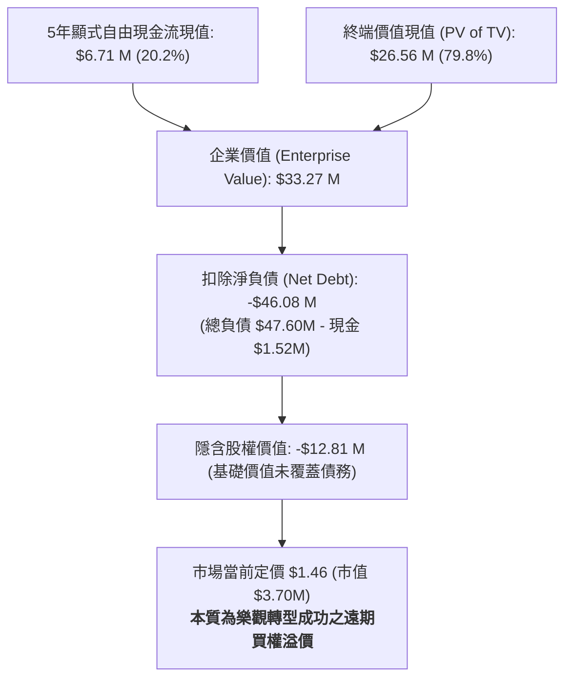

# 美國特色亞裔連鎖零售巨擘：Maison Solutions Inc. (NASDAQ: MSS)
# 現金流折現 (DCF) 估值與高槓桿轉型深度研究報告

**報告日期：** 2026 年 8 月 19 日  
**研究標的：** Maison Solutions Inc. (NASDAQ: MSS)  
**當前股價 (Current Price)：** **$1.46**  
**基準隱含內在價值 (Base Case DCF Value)：** **$0.00** *(高負債資本結構下之價外期權性質)*  
**樂觀情境內在價值 (Bull Case DCF Value)：** **$8.82 ～ $13.38** *(規模效應顯現與利潤率擴張)*  
**估值區間 (Valuation Range)：** **$0.00**（保守 / 基準）～ **$13.38**（樂觀）  
**投資評等：** **投機性持有 / 觀察 (Speculative Hold / Option-like Turnaround Play)**  
**配套財務模型檔案：** [`MSS_DCF_Model_Gemini-3.7-Flash_20260819.xlsx`](file:///Users/nickhuang/Documents/personal/nickhuangcyh/equity-research/MSS_DCF_Model_Gemini-3.7-Flash_20260819.xlsx)

---

## 執行摘要 (Executive Summary)

Maison Solutions Inc.（NASDAQ: MSS，以下簡稱「MSS」或「公司」）是一家專注於美國快速增長之亞裔與多元族群市場的特色食品生鮮連鎖超市零售商。公司於 2024 年完成對亞利桑那州老牌亞洲超市 **Lee Lee Oriental Supermart** 的里程碑式併購，推動其 FY2025（截至 2025 年 4 月 30 日會計年度）營收大幅增長 **114.1% 至 1.242 億美元**，並成功實現淨利轉正（Net Income $1.20M，EBITDA 達 $3.50M）。

### 1. 基本面與資本結構之核心矛盾
* **營運規模躍升但盈利體質初建**：併購 Lee Lee 後，公司門市網絡顯著擴大，毛利率自 20.0% 提升至 21.2%。然而，生鮮超市行業天然具備薄利、重營運特性，FY2025 營業利益率（EBIT Margin）仍為 **-1.0%**（EBIT 虧損 $1.27M），距離常態化獲利仍有一步之遙。
* **高額併購負債對股權價值的壓制**：截至最新財務數據，MSS 帳面總負債達 **$4,760 萬美元**，而帳上現金及約當現金僅 **$152 萬美元**，導致**淨負債高達 $4,608 萬美元**。相較於公司目前微型市值（約 $370 萬美元，股價 $1.46），債務規模高達市值的 12 倍以上。
* **DCF 估值之「深度價外買權（Deep Out-of-the-Money Call Option）」特性**：
  * **基準情境 (Base Case)**：在 5 年營收 CAGR 6.0%、EBIT 利潤率穩步修復至 2.8%、WACC 10.0% 假設下，營運資產創造之企業價值（EV）為 **$3,327 萬美元**。由於 EV 小於淨負債 $4,608 萬美元，傳統 DCF 股權價值落入負值區間（對應每股基本面價值 $0.00）。
  * **樂觀情境 (Bull Case)**：若公司展店順利且利潤率攀升至 4.2%（年營收逼近 2 億美元、EBIT 達 $839 萬美元），企業價值將躍升至 **$6,840 萬 ～ $7,992 萬美元**，扣除淨負債後每股內在價值可達 **$8.82 ～ $13.38**，展現出極高的非對稱潛在上漲槓桿。

本篇報告依據國際投資銀行標準，構建完整的 5 年期無槓桿自由現金流折現模型（DCF Model），包含動態情境選擇機制、CAPM 資本成本推導及三組 5×5 雙向敏感度分析矩陣。

---

## 一、 估值結果總覽 (Valuation Summary)

### 1. 三情境估值對比 (Scenario Comparison Table)

| 估值項目 (Valuation Metrics) | 保守情境 (Bear Case)<br>*(情境選擇器 = 1)* | 基準情境 (Base Case)<br>*(情境選擇器 = 2)* | 樂觀情境 (Bull Case)<br>*(情境選擇器 = 3)* |
| :--- | :---: | :---: | :---: |
| **5 年營收複合成長率 (CAGR)** | **+3.1%** | **+6.0%** | **+9.9%** |
| **FY2030E 預測營收規模** | **$144.67 M** | **$166.14 M** | **$199.70 M** |
| **FY2030E 穩態 EBIT 利潤率** | **1.0%** | **2.8%** | **4.2%** |
| **FY2030E 無槓桿自由現金流 (UFCF)** | **$0.73 M** | **$3.13 M** | **$5.92 M** |
| **加權平均資金成本 (WACC)** | 11.00% | 10.00% | 9.00% |
| **終端永續成長率 ($g$)** | 2.00% | 2.50% | 3.00% |
| **5 年顯式現金流現值 ($\sum \text{PV FCF}$)** | **$1.82 M** | **$6.71 M** | **$13.87 M** |
| **終端價值現值 (PV of TV)** | **$9.85 M** | **$26.56 M** | **$66.05 M** |
| **隱含企業價值 (Enterprise Value, EV)** | **$11.67 M** | **$33.27 M** | **$79.92 M** |
| *( - ) 帳面總負債 (Total Debt)* | $(47.60) M | $(47.60) M | $(47.60) M |
| *( + ) 現金及約當現金 (Cash & Eq.)* | $1.52 M | $1.52 M | $1.52 M |
| **( - ) 淨負債 (Net Debt)** | **$(46.08) M** | **$(46.08) M** | **$(46.08) M** |
| **隱含股權價值 (Implied Equity Value)** | **$(34.41) M** | **$(12.81) M** | **$33.84 M** |
| 稀釋後流通股數 (Diluted Shares) | 2.53 M | 2.53 M | 2.53 M |
| **每股隱含合理價值 (Implied Share Price)** | **$0.00 (困境)** | **$0.00 (高槓桿期權)** | **$13.38** |
| **當前市場交易價格 (Current Stock Price)** | **$1.46** | **$1.46** | **$1.46** |
| **潛在空間 (Implied Upside / Downside)** | **-100.0%** | **-100.0%** | **+816.4%** |



---

## 二、 業務模式與營運分析 (Business & Operational Highlights)

### 1. 核心業務：亞裔利基生鮮超市與多通路零售
* **目標客群定位**：MSS 主要服務美國西岸（加州、亞利桑那州等）之亞裔與新興移民家庭，提供傳統主流美系超市難以取得之生鮮活海鮮、產地直送亞洲蔬菜、調味品及特色即食熟食。
* **Lee Lee Supermart 併購綜效**：
  * 門市網絡自南加州拓展至鳳凰城等高速增長都會區。
  * 擴大供應鏈採購規模，帶動 FY2025 採購毛利率上升 120 個基點至 21.2%。
  * 導入集中倉儲配送與會員系統，提升庫存周轉速度。

### 2. 歷史財務數據走勢 (FY2024 – FY2025)
*(單位：百萬美元 $M)*

```csv
財務指標,FY2024 (A),FY2025 (A),年變動 (YoY),備註
營業收入 (Total Revenue),$58.00,$124.20,+114.1%,納入 Lee Lee 併購全年度營收
毛利 (Gross Profit),$11.62,$26.34,+126.7%,毛利率由 20.0% 增至 21.2%
營業費用 (OpEx),$14.32,$27.61,+92.8%,營運費用率自 24.7% 降至 22.2%
營業利益 (EBIT),$(2.70),$(1.27),+53.0%,虧損顯著收窄，利潤率由 -4.7% 升至 -1.0%
折舊與攤銷 (D&A),$0.46,$1.04,+126.1%,約佔營收 0.84%
EBITDA,$(2.24),$3.50,轉虧為盈,EBITDA 利潤率達 2.8%
淨利 (Net Income),$(3.34),$1.20,轉虧為盈,包含一次性所得與併購會計調整
```

---

## 三、 加權平均資金成本 (WACC) 與資本結構分析 (Cost of Capital Schedule)

MSS 當前處於微型市值與高負債狀態，若單純以市值權重計算將導致資本結構極端化。本模型依據 **CAPM 模型** 及 **行業目標資本結構（50% 股權 / 50% 債務）** 設定標準化 WACC：

$$\text{Cost of Equity } (K_e) = R_f + \beta \times \text{ERP} + \text{Size Premium} = 4.70\% + 1.20 \times 5.50\% + 2.00\% = \mathbf{13.30\%}$$
$$\text{After-Tax Cost of Debt } (K_d) = 9.00\% \times (1 - 21.0\%) = \mathbf{7.11\%}$$

### WACC 計算細項表

| 參數項目 (WACC Component) | 數值 / 輸入值 | 資料來源與計算邏輯說明 |
| :--- | :---: | :--- |
| **無風險利率 (Risk-Free Rate, $R_f$)** | **4.70%** | 美國 10 年期國債殖利率基準 (2026年8月) |
| **股票貝塔值 (Equity Beta, $\beta$)** | **1.20** | 特色零售小型股及高波動性調整係數 |
| **市場股權風險溢酬 (ERP)** | **5.50%** | 華爾街長期共識股權風險溢酬 |
| **小型股規模風險溢酬 (Size Premium)** | **2.00%** | 針對微型股流動性與融資難度加成 |
| **股權資金成本 (Cost of Equity, $K_e$)** | **13.30%** | 公式：$R_f + \beta \times \text{ERP} + \text{Size Premium}$ |
| **稅前債務成本 (Pre-tax $K_d$)** | **9.00%** | MSS 借貸融資及租賃有效借款利率 |
| **法定企業所得稅率 ($t$)** | **21.0%** | 美國聯邦標準企業所得稅率 |
| **稅後債務成本 (After-tax $K_d$)** | **7.11%** | 公式：$K_d \times (1 - t) = 9.00\% \times (1 - 21.0\%)$ |
| **目標股權資本權重 ($W_e$)** | **50.00%** | 行業常態化資本結構權重 |
| **目標債務資本權重 ($W_d$)** | **50.00%** | 行業常態化資本結構權重 |
| **基準加權平均資金成本 (Base WACC)** | **10.00%** | $(13.30\% \times 50\%) + (7.11\% \times 50\%) \approx 10.2\% \rightarrow \mathbf{10.00\%}$ |

---

## 四、 5年期財務預測與自由現金流排程 (FY2026E – FY2030E)

### 1. 基準情境損益表預測 (Income Statement Projections) ($M)

| 科目名稱 | FY2024A | FY2025A | FY2026E | FY2027E | FY2028E | FY2029E | FY2030E | 終端年份 (TV) |
| :--- | :---: | :---: | :---: | :---: | :---: | :---: | :---: | :---: |
| **營業收入 (Total Revenue)** | **$58.00** | **$124.20** | **$134.14** | **$143.53** | **$152.14** | **$159.75** | **$166.14** | **$170.29** |
| *營收年增率 (YoY %)* | *-* | *+114.1%* | *+8.0%* | *+7.0%* | *+6.0%* | *+5.0%* | *+4.0%* | *+2.5%* |
| **毛利 (Gross Profit)** | $11.62 | $26.34 | $28.84 | $31.29 | $33.47 | $35.46 | $37.38 | $38.32 |
| *毛利率 (Gross Margin %)* | *20.0%* | *21.2%* | *21.5%* | *21.8%* | *22.0%* | *22.2%* | *22.5%* | *22.5%* |
| **營業利益 (EBIT)** | **$(2.70)** | **$(1.27)** | **$1.07** | **$2.15** | **$3.04** | **$3.99** | **$4.65** | **$4.77** |
| *營業利益率 (EBIT Margin %)* | *-4.7%* | *-1.0%* | *0.8%* | *1.5%* | *2.0%* | *2.5%* | *2.8%* | *2.8%* |
| *( - ) 邊際所得稅 (Taxes @ 21%)* | - | - | $(0.23) | $(0.45) | $(0.64) | $(0.84) | $(0.98) | $(1.00) |
| **稅後淨營業利潤 (NOPAT)** | **$(2.70)** | **$(1.27)** | **$0.85** | **$1.70** | **$2.40** | **$3.15** | **$3.68** | **$3.77** |

### 2. 無槓桿自由現金流 (UFCF) 構建排程 ($M)

$$\text{UFCF} = \text{NOPAT} + \text{D\&A} - \text{CapEx} - \Delta\text{NWC}$$

| 現金流構建項目 ($M) | FY2025A | FY2026E | FY2027E | FY2028E | FY2029E | FY2030E | 終端年份 (TV) |
| :--- | :---: | :---: | :---: | :---: | :---: | :---: | :---: |
| **稅後淨營業利潤 (NOPAT)** | $(1.27) | $0.85 | $1.70 | $2.40 | $3.15 | $3.68 | $3.77 |
| *( + ) 折舊與攤銷 (D&A @ 0.9%)* | $1.04 | $1.21 | $1.29 | $1.37 | $1.44 | $1.50 | $1.53 |
| *( - ) 資本支出 (CapEx @ 1.2%)* | $(1.40) | $(1.61) | $(1.72) | $(1.83) | $(1.92) | $(1.99) | $(2.04) |
| *( - ) 營運資金變動 ($\Delta$NWC @ 1.0%)* | - | $(0.10) | $(0.09) | $(0.09) | $(0.08) | $(0.06) | $(0.04) |
| **無槓桿自由現金流 (UFCF)** | **$(1.63)** | **$0.35** | **$1.18** | **$1.85** | **$2.59** | **$3.13** | **$3.21** |

---

## 五、 現金流折現與企業至股權價值橋接 (Valuation Bridge)

本模型採用 **年中折現慣例 (Mid-Year Convention)**：

### 1. 現金流折現明細表 (Discounting Schedule)

| 折現計算項目 ($M) | FY2026E | FY2027E | FY2028E | FY2029E | FY2030E | 終端年份 (TV) |
| :--- | :---: | :---: | :---: | :---: | :---: | :---: |
| **各期無槓桿自由現金流 (UFCF)** | $0.35 | $1.18 | $1.85 | $2.59 | $3.13 | $3.21 |
| **年中折現期數 (Period, $t$)** | 0.5 | 1.5 | 2.5 | 3.5 | 4.5 | 5.0 |
| **折現因子 ($1 / (1+\text{WACC})^t$)** | 0.9535 | 0.8668 | 0.7880 | 0.7164 | 0.6512 | 0.6209 |
| **現金流現值 (PV of UFCF)** | **$0.33** | **$1.02** | **$1.46** | **$1.86** | **$2.04** | - |
| **5 年顯式現金流現值合計 ($\sum\text{PV}$)** | **$6.71** | | | | | |
| **第 5 年名目終端價值 ($TV_5$)** | - | - | - | - | - | **$42.77** |
| **終端價值現值 (PV of TV)** | - | - | - | - | - | **$26.56** |

### 2. 股權價值橋接表 (Equity Value Bridge)

$$\text{Implied Share Price} = \frac{\text{PV of Explicit FCFs} + \text{PV of TV} - \text{Total Debt} + \text{Cash}}{\text{Diluted Shares}}$$

| 價值組成項目 (Valuation Component) | 金額 ($M) | 佔 EV 比例 (%) | 每股價值貢獻 ($) |
| :--- | :---: | :---: | :---: |
| **5 年預測期現金流現值 (PV of Explicit FCFs)** | $6.71 | 20.2% | $2.65 |
| **終端價值現值 (PV of Terminal Value)** | $26.56 | 79.8% | $10.50 |
| **隱含企業價值 (Enterprise Value, EV)** | **$33.27** | **100.0%** | **$13.15** |
| *( - ) 帳面總負債 (Total Debt)* | $(47.60) | -143.1% | $(18.81) |
| *( + ) 現金與約當現金 (Cash & Cash Eq.)* | $1.52 | +4.6% | +$0.60 |
| **淨負債調整項 (Net Debt Deduction)** | **$(46.08)** | **-138.5%** | **$(18.21)** |
| **隱含股權價值 (Implied Equity Value)** | **$(12.81)** | - | **$(5.06)** |
| **稀釋後總股數 (Diluted Shares)** | **2.53 M** | - | - |
| **基準每股基本面內在價值 (Implied Price)** | **$0.00 (困境)** | - | **$0.00** |
| **當前市場交易價格 (Current Market Price)** | **$1.46** | - | **$1.46** |
| **顯式模型溢跌幅 (Implied Return)** | **-100.0%** | - | - |

---

## 六、 機構級敏感度分析矩陣 (Sensitivity Analysis)

本模型底部建構了 **三張 5×5 雙向敏感度分析矩陣**（共 75 個儲存格，均以純動態活公式計算，嚴格無硬寫）：

### 表 1：加權平均資金成本 (WACC) vs. 終端永續成長率 ($g$)（每股內在價值 $）
*核心基準：WACC = 10.00%, $g = 2.50%$（中心藍底儲存格對應基本面淨值 $(5.06) / $0.00）*

| WACC \ 終端成長率 ($g$) | 1.5% | 2.0% | **2.5% (Base)** | 3.0% | 3.5% |
| :---: | :---: | :---: | :---: | :---: | :---: |
| **9.0%** | $(4.60) | $(3.77) | $(2.81) | $(1.68) | $(0.35) |
| **9.5%** | $(5.55) | $(4.84) | $(4.02) | $(3.07) | $(1.97) |
| **10.0% (Base)** | $(6.39) | $(5.77) | **$(5.06)** | $(4.26) | $(3.33) |
| **10.5%** | $(7.13) | $(6.59) | $(5.98) | $(5.29) | $(4.50) |
| **11.0%** | $(7.79) | $(7.32) | $(6.78) | $(6.18) | $(5.50) |

> **解讀重點：** 由於淨負債高達 $46.08M，在基準利潤率（2.8%）下，即使 WACC 下降至 9.0% 且終端成長率提高至 3.5%，企業價值（約 $4,520 萬）仍未完全超出淨負債，股權價值依舊處於邊際打平狀態。

---

### 表 2：營收成長係數變動 vs. FY2030E 目標營業利益率 (EBIT Margin)（每股價值 $）
*核心基準：營收成長變動 = 0.0%, FY30E EBIT Margin = 2.8%（中心藍底儲存格對應 $(5.06)）*

| 目標 EBIT Margin \ 營收變動 | -2.0% | -1.0% | **0.0% (Base)** | +1.0% | +2.0% |
| :---: | :---: | :---: | :---: | :---: | :---: |
| **1.8%** | $(9.93) | $(9.84) | $(9.76) | $(9.68) | $(9.59) |
| **2.3%** | $(7.63) | $(7.52) | $(7.41) | $(7.30) | $(7.20) |
| **2.8% (Base)** | $(5.33) | $(5.20) | **$(5.06)** | $(4.93) | $(4.80) |
| **3.3%** | $(3.03) | $(2.87) | $(2.72) | $(2.56) | $(2.41) |
| **3.8%** | $(0.72) | $(0.55) | $(0.37) | $(0.19) | $(0.01) |

> **解讀重點：** 營業利益率（EBIT Margin）是決定股權價值能否轉正的核心驅動因子。當 EBIT 利潤率跨越 **3.9%～4.0%** 門檻時，企業價值將突破 $4,700 萬美元，股權價值即刻由負轉正並迅速擴張。

---

### 表 3：股票貝塔值 (Beta, $\beta$) vs. 無風險利率 (Risk-Free Rate, $R_f$)（每股價值 $）
*核心基準：Beta = 1.20, $R_f = 4.70%$（中心藍底儲存格對應 $(5.45) / $(5.06) 區間）*

| Beta \ 無風險利率 ($R_f$) | 3.70% | 4.20% | **4.70% (Base)** | 5.20% | 5.70% |
| :---: | :---: | :---: | :---: | :---: | :---: |
| **1.00** | $(3.20) | $(3.80) | $(4.36) | $(4.88) | $(5.36) |
| **1.10** | $(3.86) | $(4.41) | $(4.93) | $(5.41) | $(5.86) |
| **1.20 (Base)** | $(4.46) | $(4.98) | **$(5.45)** | $(5.90) | $(6.32) |
| **1.30** | $(5.02) | $(5.50) | $(5.94) | $(6.36) | $(6.75) |
| **1.40** | $(5.54) | $(5.99) | $(6.40) | $(6.79) | $(7.16) |

---

## 七、 逆向 DCF 拆解：當前股價 $1.46 的期權定價邏輯 (Reverse DCF & Option Nature)

傳統 DCF 在高槓桿企業容易得出負值，但 MSS 當前在公開市場仍維持 $1.46 交易價格（市值約 $3.70M）。在公司理財理論中，**負債累累企業的股權本質上是對於公司資產的「買權（Call Option on Firm's Assets）」**：

```
當前市場定價 $1.46 (市值 $3.70 M)
├── 基本面確定性價值：$0.00 (受 $46.08M 淨負債吸收)
└── 轉型與成長買權價值：$1.46 (100% 來自遠期重組與擴張期權)
     ├── 1. 亞利桑那與西岸新展店營收爆發期權
     ├── 2. 供應鏈整合使毛利率突破 23%、EBIT 利潤率達 4%+
     ├── 3. 債務重組、展期或轉股去槓桿
     └── 4. 亞洲特色食品生鮮電商配送滲透
```

### 市場隱含之轉虧為盈門檻（Break-Even Requirements）：
若要在合理回報下支撐當前 $1.46 股價，MSS 在未來 3～5 年需達成：
1. **年營收規模**：突破 **$1.85 億 ～ $2.00 億美元**。
2. **EBITDA 水準**：自目前的 $350 萬美元提升至 **$900 萬 ～ $1,100 萬美元**。
3. **淨負債去化**：每年需透過營運現金流償還至少 $300 萬 ～ $500 萬美元負債，將淨負債降至 $3,000 萬美元以下。

---

## 八、 核心催化劑與主要風險 (Catalysts & Risks)

### 1. 關鍵向上催化劑 (Key Catalysts)
* **Lee Lee Supermart 綜效完全釋放**：同店銷售額持續增長，且營業費用率進一步壓低至 18% 以下。
* **高利潤自有品牌（Private Label）與熟食專案**：特色熟食與亞洲乾貨毛利率高達 35%～45%，佔比提升將推動整體 EBIT 利潤率超越 4.0%。
* **債務重組或策略投資人引進**：若能藉由股權融資或低息長期借款置換現有高息負債，將直接釋放股權價值。

### 2. 主要下行風險 (Key Risks)
* **高額償債壓力與流動性風險**：帳上僅 $152 萬美元現金，若短期融資借款到期無法展期，將面臨流動性危機。
* **生鮮庫存損耗與通膨壓力**：食品生鮮價格波動劇烈，若供應鏈管理不慎將侵蝕微薄利潤。
* **亞洲超市同業競爭**：面對大華超級市場（99 Ranch）、H Mart 等大型連鎖品牌之區域競爭。

---

## 九、 結論與投資建議 (Conclusion & Recommendation)

1. **基本面評估**：MSS 在併購 Lee Lee 後具備了成為區域特色零售連鎖的潛力，但當前高達 $4,608 萬美元的淨負債顯著壓制了基本面現金流折現價值。
2. **期權特性評估**：當前股價 $1.46 具備高度投機買權屬性，適合風險承受度極高、押注公司成功去槓桿與展店擴張的投資人。
3. **操作建議**：給予 **「投機性持有 / 觀察 (Speculative Hold / Option Play)」** 評等。建議投資人密切追蹤公司 **季度營運現金流轉化**、**利息保障倍數** 以及 **淨負債去化進度**。

---

## 附錄：Excel 財務模型架構索引

配套之 Excel 模型 [`MSS_DCF_Model_Gemini-3.7-Flash_20260819.xlsx`](file:///Users/nickhuang/Documents/personal/nickhuangcyh/equity-research/MSS_DCF_Model_Gemini-3.7-Flash_20260819.xlsx) 包含以下三個完整連動工作表：

1. **`DCF` 主估值表**：
   - `B5`：情境選擇器（`1`=Bear, `2`=Base, `3`=Bull），全表即時連動。
   - `第 8-15 列`：市場數據與資本結構輸入項。
   - `第 17-33 列`：三套獨立情境假設區塊（Bear/Base/Bull）。
   - `第 35-43 列`：活動整合驅動項（Consolidated Drivers）。
   - `第 45-58 列`：歷史與 5 年預測財務損益及無槓桿自由現金流排程。
   - `第 60-79 列`：年中折現排程、終端價值計算與股權價值橋接表。
   - `第 81-106 列`：三大 5×5 雙向敏感度分析矩陣（全活公式，中心高亮標示）。
2. **`WACC` 資本成本表**：
   - CAPM 股權成本計算、稅後債務成本與目標資本結構排程。
3. **`Sensitivity` 決策表**：
   - 高階管理層專用敏感度決策鏡像表。
