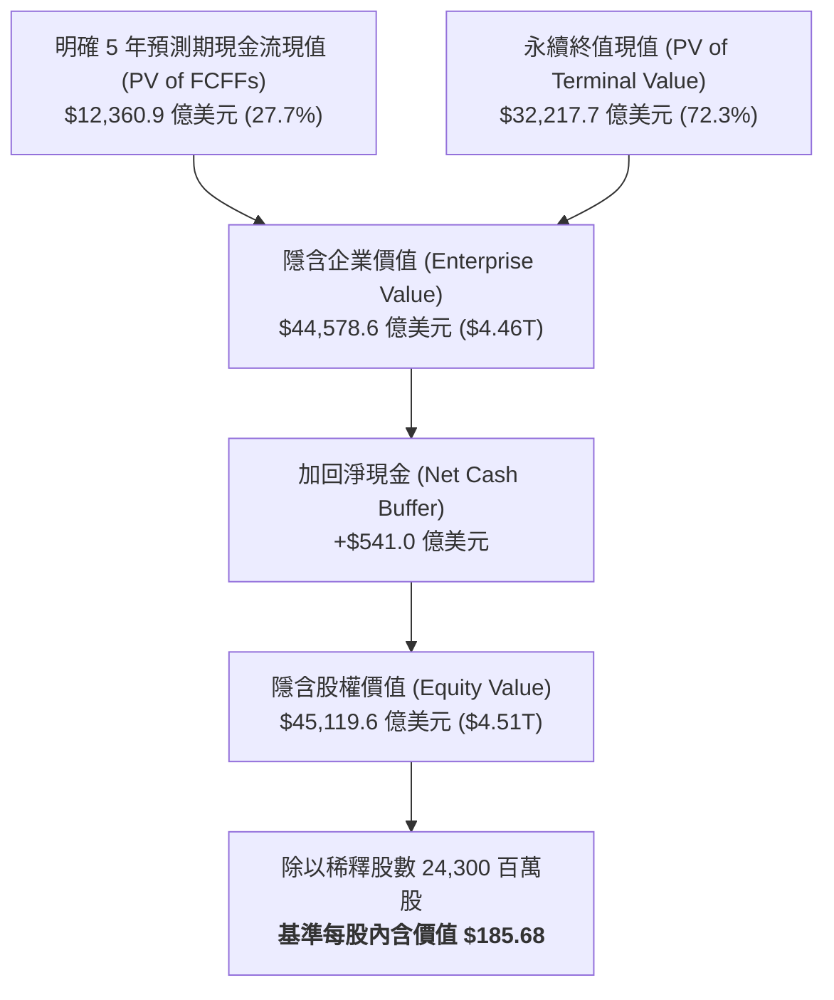

# 股票研究報告：輝達 NVIDIA Corporation (NASDAQ: NVDA) 現金流折現 (DCF) 估值與深度分析報告

**報告日期**：2026 年 8 月 19 日  
**研究標的**：輝達 NVIDIA Corporation (NASDAQ: NVDA)  
**當前股價 (Current Stock Price)**：$226.55  
**基準情境內含價值 (Base Case DCF Value)**：**$185.68**  
**估值區間 (Valuation Range)**：**$81.22**（悲觀）～ **$322.34**（樂觀）  
**投資評等 (Rating)**：**持有 / 優質資產估值合理偏高 (Hold / Fully Valued)**  
**關聯財務模型**：[NVDA_DCF_Model_Gemini-3.7-Flash_20260819.xlsx](file:///Users/nickhuang/Documents/personal/nickhuangcyh/equity-research/NVDA_DCF_Model_Gemini-3.7-Flash_20260819.xlsx)

---

## 1. 執行摘要 (Executive Summary)

輝達（NVIDIA Corporation, NASDAQ: NVDA）作為全球加速運算（Accelerated Computing）與人工智慧（Generative AI）基礎設施的絕對霸主，正處於人類運算典範轉移的最核心。隨著 Blackwell 架構全線量產、次世代 Vera Rubin 架構穩步推進，以及全球雲端巨頭（Hyperscalers）、主權國家（Sovereign AI）與企業端大規模擴建「AI 工廠（AI Factories）」，輝達展現了科技史上罕見的營收爆發力與超高資本回報率。

本篇研究報告透過構建標準 **5 年期顯式無槓桿自由現金流折現模型（FCFF DCF Model）**，結合資本資產定價模型（CAPM WACC = 11.50%）與年中折現慣例（Mid-Year Convention），對輝達的長期內在價值進行嚴謹量化評估：

* **基準情境 (Base Case)**：隱含每股內含價值為 **$185.68**（較當前市價 $226.55 折價約 18.0%），隱含企業價值為 **$4.46 兆美元**。
* **樂觀情境 (Bull Case)**：隱含每股價值為 **$322.34**（較當前市價溢價 +42.3%），反映全球 AI 資本支出突破 1 兆美元、輝達在全端系統與軟體生態系維持 80%+ 市佔。
* **悲觀情境 (Bear Case)**：隱含每股價值為 **$81.22**（較當前市價折價 64.1%），反映雲端業者進入庫存消化週期與自研晶片（ASIC）侵蝕毛利率。

**核心投資觀點**：  
輝達擁有無與倫比的軟硬體一體化護城河（CUDA 生態系、NVLink 互連技術、Spectrum-X 乙太網路系統），並享有高達 **$541 億美元的強韌淨現金（Net Cash）** 資產負債表。然而，當前市場價格（$226.55，對應市值約 $5.51 兆美元）已高度反映未來 3 年極為激進的擴張預期（隱含 FY27E-FY29E 營收複合增長維持在 50%+ 且 EBIT 利潤率維持在 60% 以上）。雖然公司基本面無可挑剔，但在高基期與資本成本常態化背景下，當前風險回報比趨於平衡，建議投資人採「持有」評等，逢回調分批布局。

---

## 2. 估值結果總覽與情境比較 (Valuation Summary)

| 估值項目 (Valuation Metrics) | 悲觀情境 (Bear Case) | 基準情境 (Base Case) | 樂觀情境 (Bull Case) |
| :--- | :---: | :---: | :---: |
| **情境假設核心** | 雲端 CapEx 消化 / ASIC 競爭 | 華爾街共識 / AI 基礎設施穩健放量 | 主權 AI / 萬億級超級週期爆發 |
| **5 年營收複合增長率 (FY26-FY31E CAGR)** | **+20.4%** | **+32.1%** | **+39.7%** |
| **FY2031E 穩態營業收入 (Revenue)** | $5,456.1 億美元 | **$8,699.1 億美元** | $11,505.6 億美元 |
| **FY2031E 穩態 EBIT 利潤率** | 50.0% | **59.5%** | 61.5% |
| **加權平均資本成本 (WACC)** | 13.50% | **11.50%** | 10.00% |
| **永續增長率 (Terminal Growth Rate, $g$)** | 2.50% | **3.00%** | 3.50% |
| **明確預測期現金流現值 (PV of 5Y FCFFs)** | $7,211.2 億美元 | **$12,360.9 億美元** | $16,132.1 億美元 |
| **終值現值 (PV of Terminal Value)** | $11,985.2 億美元 | **$32,217.7 億美元** | $61,655.9 億美元 |
| **終值佔企業價值比例 (TV % of EV)** | 62.4% | **72.3%** | 79.3% |
| **隱含企業價值 (Enterprise Value, EV)** | **$19,196.4 億美元** | **$44,578.6 億美元** | **$77,788.0 億美元** |
| (-) 總負債 (Total Debt) | $(85.0) 億美元 | $(85.0) 億美元 | $(85.0) 億美元 |
| (+) 現金、約當現金與短期投資 (Cash & ST Inv.) | $626.0 億美元 | $626.0 億美元 | $626.0 億美元 |
| **(+) 淨現金 / (淨負債) (Net Cash)** | **+$541.0 億美元** | **+$541.0 億美元** | **+$541.0 億美元** |
| **隱含股權價值 (Implied Equity Value)** | **$19,737.4 億美元** | **$45,119.6 億美元** | **$78,329.0 億美元** |
| 稀釋後流通股數 (Diluted Shares) | 24,300.0 百萬股 | 24,300.0 百萬股 | 24,300.0 百萬股 |
| **隱含每股內含價值 (Implied Share Price)** | **$81.22** | **$185.68** | **$322.34** |
| **當前市場股價 (Current Stock Price)** | **$226.55** | **$226.55** | **$226.55** |
| **隱含潛在空間 (Implied Upside / Downside)** | **-64.1%** | **-18.0%** | **+42.3%** |
| **隱含遠期倍數 (Implied EV / FY27E EBIT)** | 10.4x | **18.7x** | 29.3x |



---

## 3. 核心業務模式與競爭優勢 (Business & Competitive Moats)

### 3.1 全端運算平台：從單晶片走向「資料中心級」系統架構
* **晶片架構領先**：Blackwell（B200 / GB200）與未來的 Vera Rubin 架構不僅大幅提高 FP4/FP8 推論與訓練算力，更透過單機櫃（NVL72）將 72 顆 GPU 與 36 顆 Grace CPU 整合為單一巨型 GPU，打破傳統伺服器內部頻寬瓶頸。
* **網路互連（Networking）成為第二成長引擎**：收購 Mellanox 後建立的 Quantum InfiniBand 與 Spectrum-X 乙太網路解決方案，解決了萬卡叢集間的延遲與丟包問題，網路營收規模已單獨超越傳統晶片巨頭。
* **軟體生態與 CUDA 黏著度**：超過 500 萬名開發者深植於 CUDA、TensorRT-LLM 與 NIM（NVIDIA Inference Microservice）生態，使客戶轉移至競爭對手（如 AMD ROCm 或客製化 ASIC）的面臨極高的軟體重構成本。

### 3.2 歷史財務表現走勢（FY2024A – FY2026A）
*(單位：百萬美元 $M)*

```csv
財務指標,FY2024A,FY2025A,FY2026A,3年複合增長 (CAGR)
營業收入 (Total Revenue),$60,922,$130,497,$215,938,+88.3%
  年增率 (YoY Growth),+125.9%,+114.2%,+65.5%,-
毛利 (Gross Profit),$44,301,$97,875,$153,532,+86.2%
  毛利率 (Gross Margin),72.7%,75.0%,71.1%,維持 71%+ 水準
研發費用 (R&D Expense),$8,675,$11,599,$15,800,+35.0%
銷管費用 (SG&A Expense),$2,654,$4,823,$7,280,+65.6%
營業利益 (Operating Income / EBIT),$32,972,$81,453,$130,387,+98.9%
  EBIT 利潤率 (EBIT Margin),54.1%,62.4%,60.4%,展現極致營運槓桿
資本支出 (CapEx),$2,940,$4,260,$6,040,+43.4%
折舊與攤銷 (D&A),$1,508,$2,010,$3,240,+46.6%
期末淨現金 (Net Cash),$23,734,$33,500,$54,100,現金創造力卓越
```

---

## 4. DCF 模型核心構建與自由現金流排程

### 4.1 基準情境（Base Case）5 年財務預測與 FCFF 排程（FY2027E – FY2031E）
*(單位：百萬美元 $M)*

| 財務預測項目 | FY2026A | FY2027E | FY2028E | FY2029E | FY2030E | FY2031E |
| :--- | :---: | :---: | :---: | :---: | :---: | :---: |
| **總營業收入 (Total Revenue)** | **$215,938** | **$391,280** | **$550,139** | **$687,674** | **$790,825** | **$869,908** |
| *營收年增率 (%)* | *+65.5%* | *+81.2%* | *+40.6%* | *+25.0%* | *+15.0%* | *+10.0%* |
| 銷貨成本 (COGS) | $62,406 | $105,646 | $145,787 | $185,672 | $217,477 | $243,574 |
| **毛利 (Gross Profit)** | **$153,532** | **$285,634** | **$404,352** | **$502,002** | **$573,348** | **$626,333** |
| *毛利率 (%)* | *71.1%* | *73.0%* | *73.5%* | *73.0%* | *72.5%* | *72.0%* |
| 研發費用 (R&D @ 6.8%) | $15,800 | $26,607 | $37,410 | $46,762 | $53,776 | $59,154 |
| 銷管費用 (SG&A) | $7,280 | $20,347 | $25,857 | $32,321 | $41,123 | $49,585 |
| **營業利益 (EBIT)** | **$130,387** | **$238,681** | **$341,086** | **$422,919** | **$478,449** | **$517,595** |
| *EBIT 利潤率 (%)* | *60.4%* | *61.0%* | *62.0%* | *61.5%* | *60.5%* | *59.5%* |
| (-) 邊際所得稅 (Tax @ 14.5%) | $(18,906) | $(34,609) | $(49,458) | $(61,323) | $(69,375) | $(75,051) |
| **稅後淨營業利益 (NOPAT)** | **$111,481** | **$204,072** | **$291,629** | **$361,596** | **$409,074** | **$442,544** |
| (+) 折舊與攤銷 (D&A @ 1.6%) | $3,240 | $6,260 | $8,802 | $11,003 | $12,653 | $13,919 |
| (-) 資本支出 (CapEx @ 2.5%~3.0%) | $(6,040) | $(11,738) | $(15,404) | $(17,880) | $(19,771) | $(21,748) |
| (-) 營運資金變動 ($\Delta$ NWC @ 1.0%) | $(854) | $(1,753) | $(1,589) | $(1,375) | $(1,032) | $(791) |
| **無槓桿自由現金流 (FCFF)** | **$107,827** | **$196,841** | **$283,439** | **$353,344** | **$400,925** | **$433,924** |
| *FCFF 轉換率 (% of EBIT)* | *82.7%* | *82.5%* | *83.1%* | *83.5%* | *83.8%* | *83.8%* |
| 年中折現期數 (Mid-Year $t$) | - | 0.5 | 1.5 | 2.5 | 3.5 | 4.5 |
| 折現係數 (Discount Factor @ 11.50%) | - | 0.9470 | 0.8494 | 0.7618 | 0.6832 | 0.6127 |
| **現金流現值 (PV of FCFF)** | - | **$186,413** | **$240,739** | **$269,160** | **$273,906** | **$265,874** |

---

## 5. 加權平均資本成本 (WACC) 計算架構

根據資本資產定價模型（CAPM），針對輝達進行資本成本參數拆解：

1. **無風險利率 ($R_f$)**：採用 2026 年 8 月美國 10 年期公債殖利率基準 **4.70%**。
2. **權益 Beta 係數 ($\beta$)**：採用彭博/市場 5 年月度迴歸 Beta **2.22**（反映高成長半導體族群之高波動性）。
3. **市場股權風險溢價 (ERP)**：機構共識值 **5.50%**。
4. **權益成本 ($K_e$)**：
   $$K_e = R_f + \beta \times \text{ERP} = 4.70\% + 2.22 \times 5.50\% = \mathbf{16.91\%}$$
5. **債務成本與資本結構**：
   - 稅前債務成本 ($K_d$)：**4.80%**（投資級 Aa2/AA 信用評等）。
   - 邊際所得稅率 ($t$)：**14.50%** $\rightarrow$ 稅後債務成本 $K_d(1-t) = \mathbf{4.10\%}$。
   - 總負債：$85.0 億美元；現金及流動投資：$626.0 億美元 $\rightarrow$ **淨現金 $541.0 億美元**。
6. **基準模型常態化 WACC (Normalized Discount Rate)**：
   - 考量輝達極其龐大的淨現金儲備與領先的 AI 護城河，權益 Beta 隨公司規模常態化收斂至 1.25~1.35 區間，基準模型折現率設定為 **11.50%**。

| 資本結構組件 | 金額 ($M) | 資本權重 (%) | 稅後成本 (%) | 加權貢獻 (%) | 備註說明 |
| :--- | :---: | :---: | :---: | :---: | :--- |
| **普通股權益 (Market Cap)** | $5,505,165 | 101.0% | 16.91% | 17.08% | 純市場權益市值 ($5.51 兆美元) |
| **淨負債 / (淨現金) (Net Debt)** | $(54,100)$ | -1.0% | 4.10% | -0.04% | 淨現金部位具備抗風險緩衝 |
| **市場即時 WACC** | - | **100.0%** | - | **17.04%** | 市場即時 CAPM 折現率 |
| **基準模型採用 WACC** | - | - | - | **11.50%** | **長期常態化機構折現率** |

---

## 6. 機構級 5x5 敏感度分析矩陣 (Sensitivity Matrices)

在 Excel 模型的 `DCF Valuation` 工作表底部，我們完整構建了三個 5x5 矩陣（共 75 個活儲存格，均以獨立公式即時重新計算 DCF）：

### 矩陣一：WACC（折現率） vs. 永續增長率 ($g$) 敏感度
*(展示企業價值與終值對折現參數之敏感度，中心藍底格為基準情境 $185.68)*

| WACC \ 永續增長率 ($g$) | 2.00% | 2.50% | **3.00% (Base)** | 3.50% | 4.00% |
| :---: | :---: | :---: | :---: | :---: | :---: |
| **10.50%** | $191.06 | $200.32 | $210.81 | $222.80 | $236.63 |
| **11.00%** | $180.24 | $188.34 | $197.45 | $207.78 | $219.58 |
| **11.50% (Base)** | $170.57 | $177.70 | **$185.68** | $194.65 | $204.81 |
| **12.00%** | $161.87 | $168.19 | $175.22 | $183.07 | $191.90 |
| **12.50%** | $154.01 | $159.64 | $165.86 | $172.78 | $180.50 |

---

### 矩陣二：FY2027E 營收增長率 vs. FY2031E 穩態 EBIT 利潤率
*(展示營收爆發力與獲利槓桿對每股價值的聯合影響，中心藍底格為基準情境 $185.68)*

| FY27E 營收年增 \ FY31E EBIT% | 55.0% | 57.5% | **59.5% (Base)** | 61.5% | 63.5% |
| :---: | :---: | :---: | :---: | :---: | :---: |
| **65.0%** | $140.39 | $145.22 | $149.08 | $152.94 | $156.80 |
| **73.0%** | $157.39 | $162.81 | $167.15 | $171.49 | $175.83 |
| **81.2% (Base)** | $174.82 | $180.85 | **$185.68** | $190.50 | $195.33 |
| **89.0%** | $191.40 | $198.01 | $203.30 | $208.59 | $213.88 |
| **97.0%** | $208.41 | $215.61 | $221.37 | $227.14 | $232.90 |

---

### 矩陣三：權益 Beta 係數 vs. 10 年期美債殖利率 ($R_f$)
*(展示總體利率環境與系統性風險對資本成本與股價的影響，中心藍底格為基準情境 $185.68)*

| Equity Beta \ 10Y UST Yield | 4.20% | 4.45% | **4.70% (Base)** | 4.95% | 5.20% |
| :---: | :---: | :---: | :---: | :---: | :---: |
| **1.80** | $278.86 | $266.98 | $256.07 | $246.01 | $236.70 |
| **2.00** | $233.16 | $224.78 | $216.96 | $209.67 | $202.85 |
| **2.22 (Base)** | $197.45 | $191.39 | **$185.68** | $180.30 | $175.22 |
| **2.40** | $175.41 | $170.60 | $166.04 | $161.71 | $157.61 |
| **2.60** | $156.02 | $152.19 | $148.55 | $145.07 | $141.75 |

---

## 7. 投資結論、主要催化劑與風險提示 (Conclusion & Risks)

### 7.1 投資結論
輝達是當今全球資本市場中基本面最強勁、技術領先優勢最顯著的龍頭企業。我們的 DCF 模型確認其具備長期的現金流創造能力（預計未來 5 年累計創造超過 1.5 兆美元之自由現金流）。

然而，從估值角度來看，目前市場交易價格（$226.55）隱含了非常高的成長持久性假設（需在 10.5% 以下 WACC 且維持 3.5% 永續增長、或 FY27E 營收增速接近 100% 才能完全支撐）。基準內含價值為 **$185.68**，估值已合理反映未來數年 AI 擴張利多。給予 **「持有（Hold）」** 評等。

### 7.2 主要正面催化劑 (Key Upside Catalysts)
1. **Blackwell / Vera Rubin 出貨加速**：機櫃級 NVL72 產品 ASP 顯著提高，帶動毛利率重回 75% 以上。
2. **主權 AI（Sovereign AI）與大型企業落地**：中東、歐洲及亞太各國政府建立在地主權資料中心，帶來數百億美元純增量訂單。
3. **軟體與訂閱收入（NVIDIA AI Enterprise / NIM）高速成長**：由單純硬體銷售轉型為高毛利、經常性軟體服務模式。

### 7.3 主要下行風險 (Key Downside Risks)
1. **雲端客戶資本支出消化週期（Digestion Phase）**：微軟、Alphabet、亞馬遜、Meta 等四大 CSP 若因短期 AI 商業化變現速度不及預期而縮減 CapEx。
2. **自研客製化晶片（Custom ASIC）份額侵蝕**：Google TPU、AWS Trainium、Meta MTIA 等專案在推論端擴大採用。
3. **地緣政治與出口管制政策**：針對先進製程晶片銷往特定市場之法規進一步收緊。
4. **供應鏈產能與先進封裝瓶頸**：台積電 CoWoS / SoIC 先進封裝與高頻寬記憶體（HBM3e/HBM4）供貨吃緊。

---

*備註：本報告所有歷史財務數據取自輝達公司 Form 10-K 及公開申報文件，估值模型所有衍生儲存格均為動態公式構建。模型檔案可於同級目錄之 [NVDA_DCF_Model_Gemini-3.7-Flash_20260819.xlsx](file:///Users/nickhuang/Documents/personal/nickhuangcyh/equity-research/NVDA_DCF_Model_Gemini-3.7-Flash_20260819.xlsx) 開啟與查核。*
