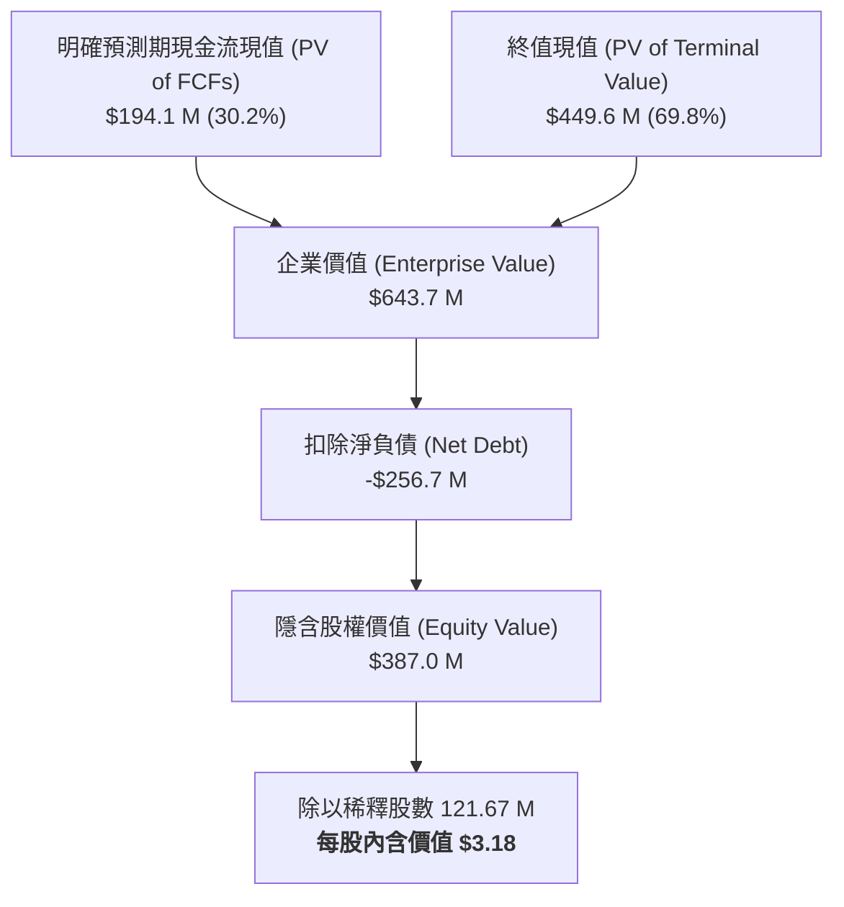

# 股票研究報告：The RealReal, Inc. (NASDAQ: REAL) 現金流折現 (DCF) 估值與深度分析報告

**報告日期**：2026 年 8 月 19 日  
**研究標的**：The RealReal, Inc. (NASDAQ: REAL)  
**當前股價 (Current Price)**：$11.20  
**基準內含價值 (Base Case DCF Value)**：$3.18  
**估值區間 (Valuation Range)**：$0.50（保守）～ $5.88（樂觀）  
**投資評等 (Rating)**：中立 / 估值回調觀察 (Hold / Fully Valued)  
**關聯財務模型**：[REAL_DCF_Model_Gemini-3.7-Flash_20260819.xlsx](file:///Users/nickhuang/Documents/personal/nickhuangcyh/equity-research/REAL_DCF_Model_Gemini-3.7-Flash_20260819.xlsx)

---

## 1. 執行摘要 (Executive Summary)

The RealReal, Inc.（NASDAQ: REAL）作為美國領先的二手認證奢侈品線上寄售平台，在經歷了 2023–2025 年的營運重組與費用緊縮後，正迎來歷史性的**「轉虧為盈」獲利拐點**。公司 2026 年最新財務指引預期全年度 GMV 將達 $2.535B～$2.565B（年增 19%～20%），營收達 $788M～$797M，調整後 EBITDA 預估達 $66M～$69M，確立了由高補貼擴張轉向高毛利、輕資產寄售的獲利模式。

本篇報告透過構建標準 5 年期無槓桿自由現金流折現模型（DCF Model），採用 CAPM 加權平均資本成本（WACC = 14.09%）與年中折現慣例（Mid-Year Convention），對 REAL 進行深入的內在價值評估：

* **基準情境 (Base Case)**：隱含每股價值為 **$3.18**（較當前市價 $11.20 折價 71.6%）。
* **樂觀情境 (Bull Case)**：隱含每股價值為 **$5.88**（AI 鑑定規模化與營運槓桿超預期）。
* **保守情境 (Bear Case)**：隱含每股價值為 **$0.50**（總體精品消費大幅放緩）。

**核心研究結論**：  
雖然 REAL 的基本面營運效率（毛利率 ~75%、營運資金需求低）顯著改善，但當前市場價格（$11.20）已反映極為激進的長期成長與利潤率擴張預期（隱含市場要求其長期營收維持 20%+ 複合增長、EBIT 利潤率達 15% 以上，且資本成本降至 10% 以下）。考量目前公司資產負債表仍承擔約 $3.76 億美元之債務（含可轉換優先票據），在估值倍數偏高及高利率環境下，建議投資人採謹慎觀望態度，待估值回調或債務再融資風險明朗後再行佈局。

---

## 2. 估值結果總覽與情境比較 (Valuation Summary)

| 估值項目 (Valuation Metrics) | 保守情境 (Bear Case) | 基準情境 (Base Case) | 樂觀情境 (Bull Case) |
| :--- | :---: | :---: | :---: |
| **情境假設核心** | 宏觀放緩 / 競爭加劇 | 達成管理指引 / 穩健擴張 | AI 鑑定效率提升 / 滲透加速 |
| **5 年營收 CAGR (2025–2030E)** | **+5.8%** | **+10.0%** | **+12.9%** |
| **2030E 穩態 EBIT 利潤率** | **5.0%** | **11.0%** | **13.5%** |
| **明確預測期現值 (PV of 5Y FCFs)** | $100.2 M | **$194.1 M** | $285.5 M |
| **終值現值 (PV of Terminal Value)** | $216.9 M | **$449.6 M** | $686.9 M |
| **企業價值 (Enterprise Value, EV)** | **$317.1 M** | **$643.7 M** | **$972.4 M** |
| (-) 總負債 (Total Debt) | $(375.8) M | $(375.8) M | $(375.8) M |
| (+) 現金及約當現金 (Cash) | $119.1 M | $119.1 M | $119.1 M |
| **(-) 淨負債 (Net Debt)** | **$(256.7) M** | **$(256.7) M** | **$(256.7) M** |
| **隱含股權價值 (Implied Equity Value)** | **$60.4 M** | **$387.0 M** | **$715.7 M** |
| 稀釋發行股數 (Diluted Shares) | 121.67 M | 121.67 M | 121.67 M |
| **隱含每股合理價值 (Implied Share Price)** | **$0.50** | **$3.18** | **$5.88** |
| **當前市場股價 (Current Stock Price)** | **$11.20** | **$11.20** | **$11.20** |
| **潛在空間 (Implied Upside / Downside)** | **-95.5%** | **-71.6%** | **-47.5%** |



---

## 3. 業務模式與營運分析 (Business & Financial Highlights)

### 3.1 核心業務：輕資產精品寄售平台 (Consignment Model)
* **商業機制**：REAL 透過認證專家與 AI 技術，為賣家提供端到端的二手奢侈品寄售服務（涵蓋女裝、男裝、頂級珠寶、鐘錶及藝術品），平均變現率（Take Rate）約在 35%～38% 區間。
* **高毛利特性**：由於寄售模式無須提前採購並承擔庫存跌價損失，毛利率穩定維持在 **74%～76%** 的優異水平。
* **營運槓桿顯現**：過去幾季公司關閉低效益線下據點、縮減低單價 direct-buy 業務，並導入自動化分揀與 AI 初檢，帶動營業費用率由 2023 年的 96.3% 降至 2026 年預期的 71.3%。

### 3.2 歷史財務走勢 (FY2023 – FY2025)
*(單位：百萬美元 $M)*

```csv
財務指標,FY2023 (A),FY2024 (A),FY2025 (A),FY2026E (Guidance)
總營收 (Total Revenue),$549.2,$600.5,$692.9,$792.5
營收年增率 (YoY Growth),-,+9.3%,+15.4%,+14.4%
毛利 (Gross Profit),$362.8,$447.5,$516.8,$598.3
毛利率 (Gross Margin),66.1%,74.5%,74.6%,75.5%
營業利益 (EBIT),$(166.3),$(56.5),$(23.9),$33.5
EBIT 利潤率,-30.3%,-9.4%,-3.5%,+4.2%
調整後 EBITDA,$(54.5),$6.2,$31.0,$67.5
資本支出 (CapEx),$24.8,$26.0,$31.5,$35.0
營運現金流 (Operating CF),$(72.5),$27.0,$37.0,$75.0
```

---

## 4. DCF 模型核心構建與自由現金流排程

### 4.1 基準情境（Base Case）5 年現金流預測（FY2026E – FY2030E）
*(單位：百萬美元 $M)*

| 財務預測項目 | FY2025 (A) | FY2026E | FY2027E | FY2028E | FY2029E | FY2030E |
| :--- | :---: | :---: | :---: | :---: | :---: | :---: |
| **總營收 (Revenue)** | **$692.9** | **$792.5** | **$887.6** | **$976.4** | **$1,054.5** | **$1,117.7** |
| *營收年增率 (%)* | *+15.4%* | *+14.4%* | *+12.0%* | *+10.0%* | *+8.0%* | *+6.0%* |
| **毛利 (Gross Profit)** | $516.8 | $598.3 | $674.6 | $746.9 | $812.0 | $866.2 |
| *毛利率 (%)* | *74.6%* | *75.5%* | *76.0%* | *76.5%* | *77.0%* | *77.5%* |
| 營業費用 (Total OpEx) | $540.7 | $564.8 | $616.9 | $663.9 | $706.5 | $743.3 |
| **營業利益 (EBIT)** | **$(23.9)** | **$33.5** | **$57.7** | **$83.0** | **$105.5** | **$122.9** |
| *EBIT 利潤率 (%)* | *-3.5%* | *+4.2%* | *+6.5%* | *+8.5%* | *+10.0%* | *+11.0%* |
| (-) 邊際所得稅 (Tax @ 25%) | $0.0 | $(8.4) | $(14.4) | $(20.8) | $(26.4) | $(30.7) |
| **稅後淨營業利益 (NOPAT)** | **$(23.9)** | **$25.1** | **$43.3** | **$62.3** | **$79.1** | **$92.2** |
| (+) 折舊與攤銷 (D&A) | $33.0 | $34.0 | $35.5 | $37.1 | $38.0 | $39.1 |
| (-) 資本支出 (CapEx) | $(31.5) | $(35.0) | $(37.3) | $(39.1) | $(40.1) | $(39.1) |
| (-) 營運資金變動 ($\Delta$NWC) | - | $(1.5) | $(1.9) | $(1.8) | $(1.6) | $(1.3) |
| **無槓桿自由現金流 (UFCF)** | **$37.0** | **$22.6** | **$39.6** | **$58.5** | **$75.4** | **$90.9** |
| 折現期數 (Mid-Year Period, $t$) | - | 0.5 | 1.5 | 2.5 | 3.5 | 4.5 |
| 折現係數 (Discount Factor @ 14.09%) | - | 0.9366 | 0.8209 | 0.7196 | 0.6307 | 0.5528 |
| **現金流現值 (PV of UFCF)** | - | **$21.2** | **$32.5** | **$42.1** | **$47.6** | **$50.3** |

---

## 5. 加權平均資本成本 (WACC) 計算架構

本模型採用 CAPM 嚴格計算權益成本與市場加權資本成本：

$$\text{Cost of Equity } (K_e) = R_f + \beta \times \text{ERP} = 4.69\% + 2.00 \times 5.50\% = \mathbf{15.69\%}$$
$$\text{After-Tax Cost of Debt } (K_d) = 7.50\% \times (1 - 25.0\%) = \mathbf{5.63\%}$$

| 資本結構組件 | 金額 ($M) | 資本權重 (%) | 資本成本 (%) | 加權貢獻 (%) |
| :--- | :---: | :---: | :---: | :---: |
| **權益價值 (Market Cap)** | $1,362.7 | 84.15% | 15.69% | 13.20% |
| **淨負債 (Net Debt)** | $256.7 | 15.85% | 5.63% | 0.89% |
| **合計 / 企業價值 (EV)** | **$1,619.4** | **100.00%** | - | **14.09% (WACC)** |

---

## 6. 三大敏感度分析矩陣 (Sensitivity Analysis)

### 矩陣 1：WACC vs. 終端成長率 ($g$)（每股內含價值 $）
*基準格（WACC = 14.09%, $g$ = 2.50%）為 **$3.18***

| WACC \ 終端成長率 ($g$) | 1.5% | 2.0% | 2.5% (Base) | 3.0% | 3.5% |
| :---: | :---: | :---: | :---: | :---: | :---: |
| **12.0%** | $3.98 | $4.43 | $4.97 | $5.64 | $6.48 |
| **13.0%** | $3.24 | $3.59 | $4.01 | $4.51 | $5.13 |
| **14.09% (Base)** | **$2.61** | **$2.87** | **$3.18** | **$3.54** | **$3.99** |
| **15.0%** | $2.20 | $2.41 | $2.65 | $2.94 | $3.28 |
| **16.0%** | $1.85 | $2.01 | $2.20 | $2.43 | $2.69 |

### 矩陣 2：營收成長變動幅度 vs. 2030E 目標 EBIT 利潤率（每股價值 $）
*基準格（營收變動 0.0%, 目標 EBIT 11.0%）為 **$3.18***

| 營收變動 \ 目標 EBIT % | 7.0% | 9.0% | 11.0% (Base) | 13.0% | 15.0% |
| :---: | :---: | :---: | :---: | :---: | :---: |
| **-4.0%** | $1.65 | $2.38 | $3.10 | $3.83 | $4.55 |
| **-2.0%** | $1.69 | $2.43 | $3.14 | $3.85 | $4.57 |
| **0.0% (Base)** | **$1.72** | **$2.45** | **$3.18** | **$3.90** | **$4.63** |
| **+2.0%** | $1.76 | $2.50 | $3.24 | $3.98 | $4.72 |
| **+4.0%** | $1.79 | $2.55 | $3.31 | $4.06 | $4.82 |

### 矩陣 3：Beta ($\beta$) vs. 無風險利率 ($R_f$)（每股價值 $）
*基準格（$\beta = 2.00$, $R_f = 4.69\%$）為 **$3.18***

| Beta \ 無風險利率 ($R_f$) | 3.69% | 4.19% | 4.69% (Base) | 5.19% | 5.69% |
| :---: | :---: | :---: | :---: | :---: | :---: |
| **1.60** | $4.68 | $4.29 | $3.95 | $3.64 | $3.36 |
| **1.80** | $4.14 | $3.81 | $3.52 | $3.26 | $3.03 |
| **2.00 (Base)** | **$3.70** | **$3.42** | **$3.18** | **$2.95** | **$2.75** |
| **2.20** | $3.34 | $3.10 | $2.88 | $2.69 | $2.51 |
| **2.40** | $3.03 | $2.82 | $2.63 | $2.46 | $2.31 |

---

## 7. 市場定價隱含預期與反向推導 (Reverse Engineering Market Price)

當前市價 **$11.20** 與基準 DCF 估值 **$3.18** 存在顯著落差。為了解市場當前定價邏輯，我們進行反向推導：

1. **若維持 WACC = 14.0%**：REAL 必須在未來 5 年維持 **25% 以上的營收年複合成長率**，且 2030 年 EBIT 利潤率需達到 **18.5%**（遠高於目前奢侈品電商同業平均水準）。
2. **若營運符合管理指引（5 年 CAGR 10%，EBIT Margin 11%）**：隱含市場要求之折現率（WACC）需降至 **8.5% 以下**（即要求 Beta 由目前的 2.0 驟降至 0.85，且無風險利率大幅下降）。

因此，當前市場股價已包含極高的「轉型成功溢價」與「極端樂觀的長期滲透預期」。

---

## 8. 關鍵催化劑與主要風險 (Catalysts & Risks)

### 關鍵催化劑 (Upside Catalysts)
1. **債務再融資與去槓桿**：公司若能以低成本延期或利用自由現金流提早贖回 2026–2028 到期之可轉債，將大幅降低資本成本（WACC）並釋放股權價值。
2. **AI 自動化技術帶動費率驟降**：AI 圖像初檢與真偽比對若能節省 30%+ 的鑑定人力，EBIT 利潤率有望突破 13% 的樂觀情境。
3. **高單價硬奢品（Hard Luxury）佔比提升**：名錶與頂級珠寶 GMV 佔比增加將大幅拉高客單價，推升單位經濟效益。

### 主要下行風險 (Downside Risks)
1. **總體可支配所得壓縮**：美國消費者信心若進一步惡化，非必需奢侈品消費可能面臨降溫。
2. **假貨與信譽風險**：二手精品平台最核心的資產為公信力，任何重大假貨爭議將重挫平台交易量。
3. **流動性與再融資成本**：在長期高利率環境下，若債務到期需以更高票息再融資，利息費用將侵蝕獲利。

---

### 報告產出與交付清單
* 完整 Excel 財務模型：[REAL_DCF_Model_Gemini-3.7-Flash_20260819.xlsx](file:///Users/nickhuang/Documents/personal/nickhuangcyh/equity-research/REAL_DCF_Model_Gemini-3.7-Flash_20260819.xlsx)
* 本估值報告已儲存於系統產出專區供隨時查閱與匯出。
