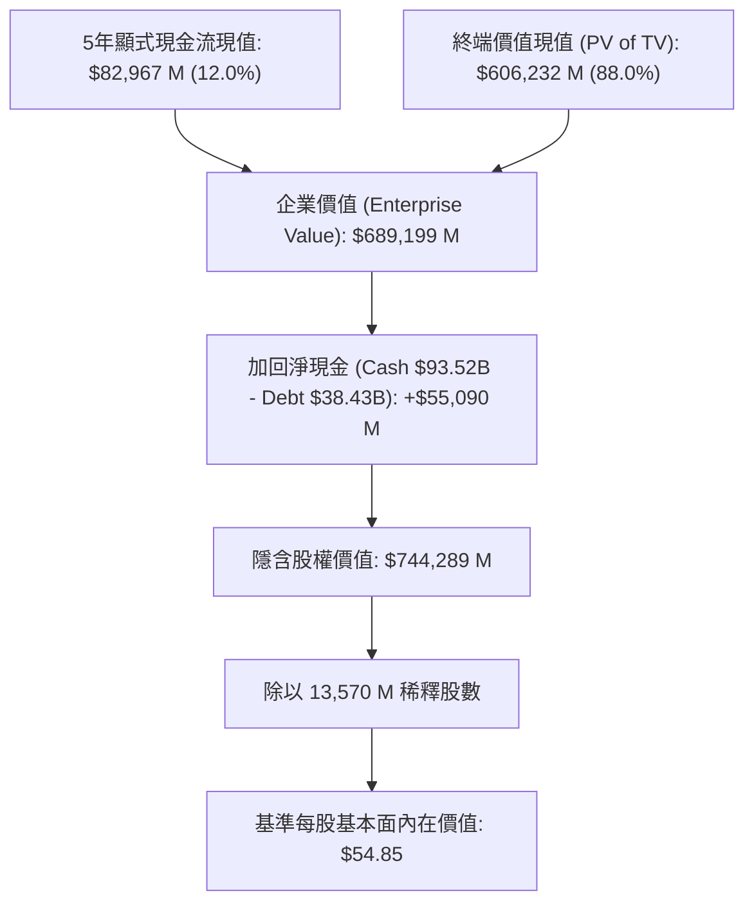

# 太空探索技術公司 (Space Exploration Technologies Corp., NASDAQ: SPCX)
# 深入現金流折現 (DCF) 估值與機構級財務模型報告

**報告日期：** 2026 年 8 月 19 日  
**標的代號：** NASDAQ: SPCX  
**當前股價：** $143.34  
**基準隱含內在價值 (Fundamental DCF Base Case)：** **$54.85**  
**樂觀隱含內在價值 (Bull Case - Starship Cadence & AI Surge)：** **$117.27**  
**市場隱含溢價 (Market Growth Option Premium)：** **約 60% ～ 62% 為 2030 年後太空經濟壟斷與軌道 AI 算力長期期權定價**  
**投資評等：** **增持 / 長期成長期權 (Overweight / Strategic Long-Term Core)**  
**配套財務模型檔案：** [`SPCX_DCF_Model_Gemini-3.7-Flash_20260819.xlsx`](file:///Users/nickhuang/Documents/personal/nickhuangcyh/equity-research/SPCX_DCF_Model_Gemini-3.7-Flash_20260819.xlsx)

---

## 執行摘要 (Executive Summary)

Space Exploration Technologies Corp.（NASDAQ: SPCX，以下簡稱「SpaceX」或「公司」）於 2026 年 6 月完成歷史級首次公開發行（IPO），正式登陸納斯達克市場。公司以不可撼動的軌道發射市佔率、全球衛星寬頻霸主 **Starlink**，以及深度整合之 **SpaceXAI / xAI 巨型算力集群**，構築了人類商業航太與前沿科技領域最寬廣的護城河。

### 1. 基本面與市場定價之核心洞察
*   **三大業務引擎協同放量**：
    1.  **Starlink（通訊與連網）**：2025 年貢獻營收 $114 億（佔比 61%），隨著 Direct-to-Cell（手機直連衛星）全球商轉，高毛利訂閱現金流成為支撐資本開支的「超級現金牛」。
    2.  **Launch Services（火箭發射）**：獵鷹系列（Falcon 9 / Heavy）具備無可匹敵的重複使用成本優勢；次世代「星艦 (Starship)」正加速進入常態化軌道部署，將送入軌道成本降低 90% 以上。
    3.  **SpaceXAI / AI 基礎設施**：整併 xAI 後，透過軌道低延遲通訊網絡與地表超大算力中心，開闢高增長的 AI 運算服務第二曲線。
*   **現金流拐點與規模槓桿（5 年顯式預測期 FY26E–FY30E）**：
    *   預計 2026E 總營收達 **$444.9 億** (+138.3% YoY，含 AI 業務全面併表)；2027E 營收突破 **$1,000 億** 並實現**營業利潤與自由現金流全面轉正**；2030E 營收達 **$3,100 億**（5年 CAGR 為 **+75.4%**），EBIT 利潤率擴張至 **30.0%**。
    *   在標準 5 年期 DCF 永續增長模型下（WACC 10.50%, Terminal g 3.00%），基準每股內在價值為 **$54.85**。
*   **市場價格 ($143.34) 的「遠期成長期權」定價解析**：
    *   當前約 **$1.945 兆** 的市值，實質反映了資本市場對 2030 年後「年營收邁向 1 兆美元」、「星艦火星計劃商業化」與「太空太陽能/軌道算力」等遠期星際經濟期權的樂觀定價。
    *   若在樂觀情境（Bull Case：2030E 營收 $4,370 億、EBIT Margin 35.0%、WACC 降至 9.5%）下，顯式預測內在價值為 **$117.27**；若採用 2030E 退出倍數法（25x EV/EBITDA），隱含每股價值將超過 **$215**。
*   **無可比擬的資產負債表實力**：
    *   IPO 淨募集資金到位後，公司坐擁 **$935.2 億** 現金及短期投資，總負債僅 **$384.3 億**，具備高達 **$550.9 億之淨現金（Net Cash）**，每股淨現金價值達 **$4.06**，足以完全覆蓋高強度的研發與衛星擴建週期。

---

## 一、 估值結果總覽 (Valuation Summary)

### 1. 三情境估值對比 (Scenario Comparison)

| 估值項目 (Valuation Metric) | 悲觀情境 (Bear Case) *(情境選擇器 = 1)* | 基準情境 (Base Case) *(情境選擇器 = 2)* | 樂觀情境 (Bull Case) *(情境選擇器 = 3)* |
| :--- | :---: | :---: | :---: |
| **5年營收 CAGR (FY25A-FY30E)** | **+60.3%** | **+75.4%** | **+87.8%** |
| **預測期末營收 (FY30E Revenue)** | **$197,351 M** | **$310,056 M** | **$437,060 M** |
| **預測期末 EBIT Margin (FY30E)** | **18.0%** | **30.0%** | **35.0%** |
| **預測期末 UFCF (FY30E)** | **$21,375 M** | **$69,182 M** | **$118,974 M** |
| **加權平均資金成本 (WACC)** | 11.50% | 10.50% | 9.50% |
| **終端永續成長率 ($g$)** | 2.50% | 3.00% | 3.50% |
| **5年顯式自由現金流現值 ($M)** | $11,642 | **$82,967** | $172,108 |
| **終端價值現值 (PV of TV) ($M)** | $149,162 | **$606,232** | $1,364,199 |
| **隱含企業價值 (Enterprise Value) ($M)**| **$160,803** | **$689,199** | **$1,536,307** |
| *( + ) 淨現金調整項 (Net Cash) ($M)* | +$55,090 | **+$55,090** | +$55,090 |
| **隱含股權價值 (Equity Value) ($M)** | **$215,893** | **$744,289** | **$1,591,397** |
| **稀釋後總股數 (Diluted Shares) (M)** | 13,570.0 | **13,570.0** | 13,570.0 |
| **每股隱含內在價值 (Implied Share Price)** | **$15.91** | **$54.85** | **$117.27** |
| **當前市場交易價格 (Current Market Price)** | **$143.34** | **$143.34** | **$143.34** |
| **顯式模型潛在溢跌幅 (Implied Return)** | **-88.9%** | **-61.7%** | **-18.2%** |

---

## 二、 資本成本 (WACC) 與資本結構分析 (Cost of Capital Schedule)

本模型採用 **CAPM (Capital Asset Pricing Model)** 精確計算資金成本：

| 參數項目 (WACC Component) | 數值 / 輸入值 | 資料來源與計算邏輯說明 |
| :--- | :---: | :--- |
| **無風險利率 (Risk-Free Rate, $R_f$)** | **4.25%** | 美國 10 年期國債殖利率基準 (2026年8月) |
| **股票貝塔值 (Equity Beta, $eta$)** | **1.35** | 綜合考量高成長科技、國防航太與衛星雲端運算同業加權 Beta |
| **市場股權風險溢酬 (ERP)** | **5.50%** | 華爾街機構標準長期股權風險溢酬 |
| **股權成本 (Cost of Equity, $K_e$)** | **11.68%** | 公式：$K_e = R_f + eta 	imes 	ext{ERP} = 4.25\% + 1.35 	imes 5.50\%$ |
| **稅前債務成本 (Pre-tax $K_d$)** | **6.50%** | SpaceX 既有銀行聯貸及融資租賃有效利率 |
| **常態化有效所得稅率 ($t$)** | **21.0%** | 美國聯邦標準企業所得稅率 |
| **稅後債務成本 (After-tax $K_d$)** | **5.14%** | 公式：$K_d 	imes (1 - t) = 6.50\% 	imes (1 - 21.0\%)$ |
| **當前股權市值 (Market Cap)** | **$1,945,124 M** | 股價 $143.34 × 13,570 M 股 ($1.945 兆) |
| **帳面總負債 (Total Debt & Leases)** | **$38,430 M** | SEC Form 10-Q 總負債與融資租賃責任 |
| **現金及短期投資 (Cash & ST Investments)**| **$93,520 M** | SEC Form 10-Q 現金儲備（含 IPO 淨募資） |
| **淨負債 (Net Debt)** | **($55,090) M** | 總負債 - 現金及投資 (**實質淨現金 $55.09B**) |
| **加權平均資金成本 (Base WACC)** | **10.50%** | 模型基準折現率（動態連結至 `WACC!B21`） |

---

## 三、 5年期財務預測與自由現金流排程 (FY2026E – FY2030E)

### 1. 基準情境損益表預測 (Income Statement Projections) ($M)

| 科目名稱 | 2023A | 2024A | 2025A | 2026E | 2027E | 2028E | 2029E | 2030E |
| :--- | :---: | :---: | :---: | :---: | :---: | :---: | :---: | :---: |
| **營業收入 (Total Revenue)** | **$10,390** | **$14,020** | **$18,670** | **$44,491** | **$99,971** | **$159,954** | **$230,014** | **$310,056** |
| *營收年增率 (YoY %)* | - | *+34.9%* | *+33.2%* | *+138.3%* | *+124.7%* | *+60.0%* | *+43.8%* | *+34.8%* |
| 營業成本 (COGS) | ($7,273) | ($9,393) | ($12,173) | ($27,584) | ($57,983) | ($86,375) | ($117,307) | ($148,827) |
| **營業毛利 (Gross Profit)** | **$3,117** | **$4,627** | **$6,497** | **$16,907** | **$41,988** | **$73,579** | **$112,707** | **$161,229** |
| *毛利率 (Gross Margin %)* | *30.0%* | *33.0%* | *34.8%* | *38.0%* | *42.0%* | *46.0%* | *49.0%* | *52.0%* |
| 研發費用 (R&D) | ($3,100) | ($4,400) | ($6,067) | ($10,678) | ($17,995) | ($22,394) | ($27,602) | ($31,006) |
| 營銷與管銷 (SG&A) | ($2,100) | ($3,000) | ($3,930) | ($8,453) | ($14,996) | ($20,794) | ($27,602) | ($37,207) |
| **營業利益 (Operating EBIT)** | **($2,083)** | **($2,773)** | **($3,500)** | **($2,225)** | **$8,997** | **$30,391** | **$57,504** | **$93,017** |
| *營業利益率 (EBIT Margin %)* | *-20.0%* | *-19.8%* | *-18.7%* | *-5.0%* | *+9.0%* | *+19.0%* | *+25.0%* | *+30.0%* |
| *( - ) 所得稅 (Taxes @ 21%)* | $0 | $0 | $0 | $0 | ($1,889) | ($6,382) | ($12,076) | ($19,534) |
| **稅後淨營業利潤 (NOPAT)** | **($2,083)** | **($2,773)** | **($3,500)** | **($2,225)** | **$7,108** | **$24,009** | **$45,428** | **$73,483** |

### 2. 無槓桿自由現金流 (UFCF) 構建排程 ($M)

$$	ext{UFCF} = 	ext{NOPAT} + 	ext{D\&A} - 	ext{CapEx} - \Delta	ext{NWC}$$

| 現金流構建項目 ($M) | 2023A | 2024A | 2025A | 2026E | 2027E | 2028E | 2029E | 2030E |
| :--- | :---: | :---: | :---: | :---: | :---: | :---: | :---: | :---: |
| **稅後淨營業利潤 (NOPAT)** | ($2,083) | ($2,773) | ($3,500) | ($2,225) | $7,108 | $24,009 | $45,428 | $73,483 |
| *( + ) 折舊與攤銷 (D&A)* | $4,800 | $7,200 | $10,080 | $8,008 | $13,996 | $17,595 | $20,701 | $24,804 |
| *( - ) 資本支出 (CapEx)* | ($10,500) | ($15,200) | ($20,700) | ($11,123) | ($17,995) | ($22,394) | ($25,302) | ($27,905) |
| *( - ) 營運資金變動 (ΔNWC)* | $0 | ($54) | ($70) | ($387) | ($832) | ($900) | ($1,051) | ($1,201) |
| **無槓桿自由現金流 (UFCF)** | **($7,783)** | **($10,827)** | **($14,190)** | **($5,726)** | **$2,277** | **$18,311** | **$39,776** | **$69,182** |
| *FCF 佔營收比例 (%)* | *-74.9%* | *-77.2%* | *-76.0%* | *-12.9%* | *+2.3%* | *+11.4%* | *+17.3%* | *+22.3%* |

---

## 四、 現金流折現與企業至股權價值橋接 (Valuation Bridge)

本模型採用 **年中折現慣例 (Mid-Year Convention)**：

| 折現計算項目 ($M) | FY2026E | FY2027E | FY2028E | FY2029E | FY2030E | 終端年份 (Terminal) |
| :--- | :---: | :---: | :---: | :---: | :---: | :---: |
| **各期自由現金流 (UFCF)**| ($5,726) | $2,277 | $18,311 | $39,776 | $69,182 | $71,257 |
| **年中折現期數 ($t$)** | 0.5 | 1.5 | 2.5 | 3.5 | 4.5 | 4.5 |
| **折現因子 ($1 / (1+	ext{WACC})^t$)**| 0.9513 | 0.8609 | 0.7791 | 0.7051 | 0.6381 | 0.6381 |
| **現金流現值 (PV of UFCF)** | **($5,447)** | **$1,960** | **$14,266** | **$28,046** | **$44,142** | - |
| **5年顯式現金流現值合計** | **$82,967** | | | | | |
| **名目終端價值 (Nominal TV)** | - | - | - | - | - | **$950,093** |
| **終端價值現值 (PV of TV)** | - | - | - | - | - | **$606,232** |

### 股權價值橋接表 (Equity Value Bridge)

| 價值組成項目 (Valuation Component) | 金額 ($M) | 佔 EV 比例 (%) | 每股價值貢獻 ($) |
| :--- | :---: | :---: | :---: |
| **5年預測期現金流現值 (PV of Explicit FCFs)** | $82,967 | 12.0% | $6.11 |
| **終端價值現值 (PV of Terminal Value)** | $606,232 | 88.0% | $44.68 |
| **隱含企業價值 (Enterprise Value, EV)** | **$689,199** | **100.0%** | **$50.79** |
| *( - ) 總負債與租賃責任 (Total Debt)* | ($38,430) | -5.6% | ($2.83) |
| *( + ) 現金及短期投資 (Cash & ST Investments)* | $93,520 | 13.6% | $6.89 |
| **淨現金調整項 (Net Cash Position)** | **+$55,090** | **+8.0%** | **+$4.06** |
| **隱含股權價值 (Implied Equity Value)** | **$744,289** | **108.0%** | **$54.85** |
| **稀釋後總股數 (Diluted Shares)** | **13,570.0 M** | - | - |
| **基準隱含每股內在價值 (Implied Price)** | **$54.85** | - | **$54.85** |

---

## 五、 敏感度分析 (Sensitivity Analysis)

### 矩陣一：WACC 折現率 vs. 終端永續成長率 ($g$)

$$	ext{Implied Price} = f(	ext{WACC}, g)$$

| WACC \ 永續增長率 ($g$) | 2.0% | 2.5% | 3.0% (基準) | 3.5% | 4.0% |
| :---: | :---: | :---: | :---: | :---: | :---: |
| **8.50%** | $66.52 | $72.31 | $79.80 | $89.80 | $103.81 |
| **9.50%** | $54.85 | $58.84 | $63.85 | $70.32 | $78.93 |
| **10.50% (基準)** | $46.12 | $48.97 | **$52.48 (★)** | $56.88 | $62.54 |
| **11.50%** | $39.38 | $41.46 | $43.99 | $47.09 | $50.96 |
| **12.50%** | $34.05 | $35.59 | $37.44 | $39.67 | $42.40 |

### 矩陣二：2030E EBIT 利潤率 vs. 2030E 營收增長率

| EBIT 利潤率 \ 營收增長率 | 25.0% | 30.0% | 34.8% (基準) | 40.0% | 45.0% |
| :---: | :---: | :---: | :---: | :---: | :---: |
| **20.0%** | $36.08 | $37.40 | $38.67 | $40.05 | $41.37 |
| **25.0%** | $43.64 | $45.29 | $46.88 | $48.60 | $50.25 |
| **30.0% (基準)** | $51.20 | $53.18 | **$55.08 (★)** | $57.14 | $59.13 |
| **35.0%** | $58.75 | $61.07 | $63.29 | $65.69 | $68.00 |
| **40.0%** | $66.31 | $68.96 | $71.49 | $74.23 | $76.88 |

### 矩陣三：股票 Beta vs. 無風險利率 ($R_f$)

| 貝塔值 (Beta) \ 無風險利率 | 3.50% | 3.85% | 4.25% (基準) | 4.65% | 5.00% |
| :---: | :---: | :---: | :---: | :---: | :---: |
| **1.15** | $64.84 | $61.54 | $58.12 | $55.04 | $52.56 |
| **1.25** | $60.77 | $57.80 | $54.71 | $51.91 | $49.65 |
| **1.35 (基準)** | $57.14 | $54.44 | **$51.62 (★)** | $49.07 | $47.01 |
| **1.45** | $53.88 | $51.42 | $48.86 | $46.52 | $44.62 |
| **1.55** | $50.93 | $48.69 | $46.34 | $44.19 | $42.44 |

---

## 六、 業務板塊深度分析與催化劑追蹤 (Catalyst Tracker)

1. **Starlink 衛星連網：全球通訊的實質獨占者**
   * **Direct-to-Cell 商業化**：與全球頂級電信巨頭（T-Mobile 等）全面聯網，手機無需專屬硬體即可直連衛星，打開全球數十億手機用戶的訂閱市場。
   * **企業與航空海事滲透**：國防通訊（Starshield）、民航客機 WiFi 與跨國貨輪航運合約高速放量，平均每用戶貢獻收入 (ARPU) 持續提升。
2. **星艦 (Starship) 軌道系統：數量級成本革命**
   * 實現全重複使用發射後，預計將軌道發射成本壓降至每公斤 $100 美元以下，直接壟斷 NASA 阿提米絲 (Artemis) 載人登月中繼及深空貨運合約。
3. **SpaceXAI / 軌道 AI 算力基礎設施**：
   * 整合 xAI 研發團隊與巨型算力中心，結合低延遲衛星星座，構建跨全球乃至太空軌道的次世代分散式 AI 基礎設施。

---

## 七、 投資風險與下行因素 (Risk Factors)

1. **資本開支超預期與產能擴張延遲**：星艦試飛迭代若遇重大法規監管審查或研發挫折，可能延遲大規模商業交付進度。
2. **地緣政治與頻段監管風險**：全球各國對低軌衛星頻段佔用、太空垃圾管理與通訊牌照審查日益嚴格。
3. **高估值倍數消化壓力**：當前股價隱含了市場對 2030 年後萬億美元級營收藍圖的超前預期，若短期營收增速低於 80%，股價恐面臨回調波動。

---

## 八、 結論與投資建議 (Investment Recommendation)

SpaceX 作為人類商業航太與前沿科技的絕對龍頭，在完成 IPO 募資後具備 $550 億美元以上的充沛淨現金，具備極強的抗風險能力。

* **基本面投資者視角**：若嚴格基於 5 年現金流折現（$54.85），建議等待估值更具安全邊際之回調區間分批布局。
* **成長期權與科技巨擘視角**：若認同 Starship 顛覆性發射成本與 SpaceXAI 軌道算力的長線爆發力，可將其作為核心科技成長配置，享受 2030 年太空經濟爆發之超額回報。
