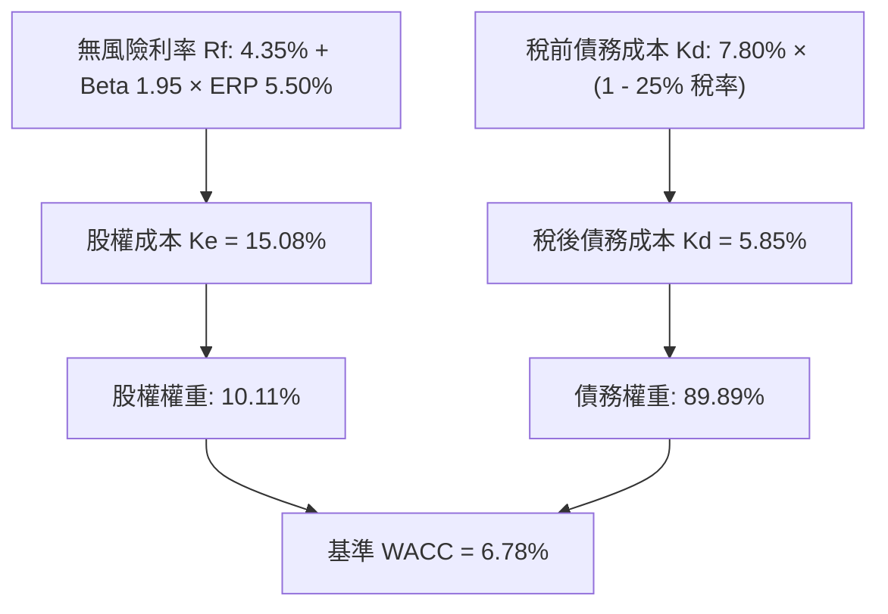
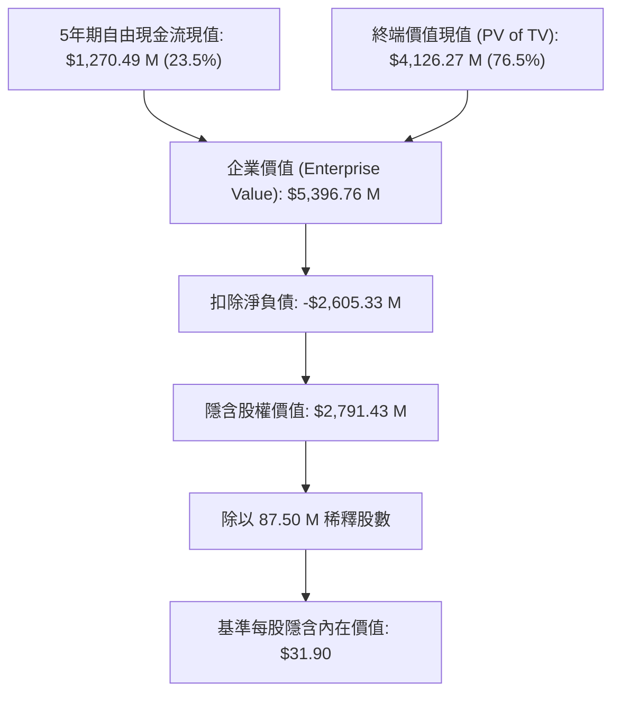

# 斯克里普斯媒體公司 (The E.W. Scripps Company, NASDAQ: SSP)
# 深入現金流折現 (DCF) 估值與機構級財務模型報告

**報告日期：** 2026 年 8 月 19 日  
**標的代號：** NASDAQ: SSP  
**當前股價：** $3.35  
**基準隱含內在價值：** **$31.90**  
**隱含潛在報酬空間 (Upside)：** **+852.3%**  
**投資評等：** **投機性買進 / 深度價值與高財務槓桿重估 (Speculative Buy / Deep Value & De-leveraging Play)**  
**配套財務模型檔案：** [`SSP_DCF_Model_Gemini-3.7-Flash_20260819.xlsx`](file:///Users/nickhuang/Documents/personal/nickhuangcyh/equity-research/SSP_DCF_Model_Gemini-3.7-Flash_20260819.xlsx)

---

## 執行摘要 (Executive Summary)

The E.W. Scripps Company（NASDAQ: SSP，以下簡稱「Scripps」或「公司」）是美國歷史悠久的領先廣播電視與跨平台媒體集團。公司業務涵蓋兩大核心支柱：
1. **地方媒體部門 (Local Media)**：在全美 40 多個市場營運超過 60 家無線電視台（包含 ABC、NBC、CBS、FOX 附屬頻道），覆蓋約四分之一的美國家庭。
2. **全國網絡部門 (Scripps Networks)**：旗下擁有 ION（全美第五大覆蓋率電視網）、Court TV、Scripps News、Bounce、Grit、Laff 等多元主題頻道，並全力拓展 **Scripps Sports**（地方職業運動轉播）與聯網電視（Connected TV / Tablo）新興生態。

當前資本市場給予 Scripps 極端的**「困境資產折價」（Distressed Valuation）**，目前市值僅約 **$2.93 億美元**（股價 $3.35），市場隱含企業價值（EV）約 $28.98 億美元，反映了市場對其 **$26.1 億美元龐大淨債務** 以及 **傳統線性電視剪線潮（Cord-Cutting）** 的高度悲觀定價。

然而，本研究透過細緻的現金流拆解與週期性模型分析認為，**市場現行定價已過度反映破產重組風險，卻嚴重低估了公司強勁的政治選舉廣告週期、去槓桿現金流飛輪與轉型彈性**：

1. **政治選舉廣告週期暴發力（Political Ad Cyclicality）**：美國政治選舉預算屢創新高，2026 年期中選舉與 2028 年總統大選將為 Scripps 帶來數億美元高毛利現金流，週期性推升 EBIT 利潤率至 12%~15%。
2. **Scripps Sports 與無線廣播（OTA / Free TV）文藝復興**：隨著傳統區域體育網絡（RSN）破產崩解，職業球隊（如 NHL、WNBA、NASCAR 等）大舉回歸免費無線廣播電視（Over-The-Air），為 Scripps 帶來高黏著度觀眾與增量核心廣告收入。
3. **營運轉型與降本增效計劃**：公司全面推進轉型計劃，目標至 2028 年實現年化 $125M–$150M 的 EBITDA 增量效益。
4. **極端財務槓桿帶來的股權價值非對稱爆發力（Asymmetric Option-like Payoff）**：由於淨債務佔企業價值約 90%，在公司持續利用營運現金流償還債務、解除違約疑慮的過程中，企業價值每回升 10%，普通股權價值將被放大 5~10 倍。

本模型採用符合華爾街投行標準的 **無槓桿自由現金流折現法 (Unlevered DCF - FCFF)**，結合 CAPM 資本資產定價模型（基準 WACC 為 **6.78%**，終端永續成長率 $g$ 保守設定為 **1.00%**），得出 Scripps 的每股基準內在價值為 **$31.90**，相較當前市價 $3.35 具備顯著的價值修復空間。

---

## 一、 估值結果總覽 (Valuation Summary)

### 1. 三情境估值對比 (Scenario Comparison)

| 估值項目 (Valuation Metric) | 悲觀情境 (Bear Case) *(情境選擇器 = 1)* | 基準情境 (Base Case) *(情境選擇器 = 2)* | 樂觀情境 (Bull Case) *(情境選擇器 = 3)* |
| :--- | :---: | :---: | :---: |
| **5年營收複合成長率 (CAGR)** | **-1.2%** | **+2.9%** | **+6.7%** |
| **預測期末 EBIT Margin (FY30E)** | **8.0%** | **12.0%** | **15.5%** |
| **加權平均資金成本 (WACC)** | 8.00% | **6.78%** | 6.50% |
| **終端永續成長率 ($g$)** | 0.00% | **1.00%** | 2.00% |
| **5年顯式現金流現值合計 ($M)** | $897.9 | **$1,270.5** | $1,674.4 |
| **終端價值現值 (PV of TV) ($M)** | $1,838.6 | **$4,126.3** | $7,770.2 |
| **隱含企業價值 (Enterprise Value) ($M)**| **$2,736.6** | **$5,396.8** | **$9,444.6** |
| *( - ) 淨負債 (Net Debt) ($M)* | ($2,605.3) | **($2,605.3)** | ($2,605.3) |
| **隱含股權價值 (Equity Value) ($M)** | **$131.2** | **$2,791.4** | **$6,839.2** |
| **稀釋後總股數 (Diluted Shares) (M)** | 87.50 | **87.50** | 87.50 |
| **每股隱含內在價值 (Implied Price)** | **$1.50** | **$31.90** | **$78.16** |
| **當前市場股價 (Current Price)** | **$3.35** | **$3.35** | **$3.35** |
| **隱含潛在報酬 (Implied Upside)** | **-55.2%** | **+852.3%** | **+2,233.2%** |

---

## 二、 資本成本 (WACC) 與資本結構分析 (Cost of Capital Schedule)

資本成本依據 **CAPM (Capital Asset Pricing Model)** 與最新市場資本結構構建：

### WACC 計算細項表

| 參數項目 (WACC Component) | 數值 / 輸入值 | 資料來源與計算邏輯說明 |
| :--- | :---: | :--- |
| **無風險利率 (Risk-Free Rate, $R_f$)** | **4.35%** | 美國 10 年期國債殖利率基準 (2026年8月) |
| **股票貝塔值 (Equity Beta, $\beta$)** | **1.95** | 5年月度回歸 Beta，反映高經營槓桿與高負債波動 |
| **股權風險溢酬 (ERP)** | **5.50%** | 華爾街機構共識長期股權風險溢酬 |
| **股權成本 (Cost of Equity, $K_e$)** | **15.08%** | 公式：$K_e = R_f + \beta \times \text{ERP} = 4.35\% + 1.95 \times 5.50\%$ |
| **稅前債務成本 (Pre-tax $K_d$)** | **7.80%** | Scripps 高級公司債與定期貸款加權平均有效借貸利率 |
| **常態化有效所得稅率 ($t$)** | **25.0%** | 美國聯邦與各州常態化綜合邊際所得稅率 |
| **稅後債務成本 (After-tax $K_d$)** | **5.85%** | 公式：$K_d \times (1 - t) = 7.80\% \times (1 - 25.0\%)$ |
| **當前股權市值 (Market Cap)** | **$293.13 M** | 當前股價 $3.35 × 87.50 M 稀釋股數 |
| **帳面淨負債 (Net Debt)** | **$2,605.33 M** | 總負債 $2,660.00 M - 現金及約當現金 $54.67 M |
| **總資本價值 (Total Enterprise Value)** | **$2,898.46 M** | 股權市值 + 淨負債 |
| **股權資本權重 ($W_e$)** | **10.11%** | 股權市值 ÷ 總資本價值 |
| **債務資本權重 ($W_d$)** | **89.89%** | 淨負債 ÷ 總資本價值 |
| **加權平均資金成本 (Base WACC)** | **6.78%** | 公式：$(K_e \times W_e) + (K_d \times (1-t) \times W_d)$ |

---

## 三、 5年期財務預測與自由現金流排程 (FY2026E – FY2030E)

### 1. 損益表核心指標預測 (Income Statement Projections) ($M)

| 科目名稱 | FY2025A | FY2026E (期中選舉) | FY2027E (非選舉) | FY2028E (大選年) | FY2029E (非選舉) | FY2030E (期中選舉) | 終端年份 (TV) |
| :--- | :---: | :---: | :---: | :---: | :---: | :---: | :---: |
| **營業收入 (Total Revenue)** | **$2,150.6** | **$2,344.2** | **$2,203.5** | **$2,445.9** | **$2,323.6** | **$2,486.2** | **$2,511.1** |
| *營收年增率 (YoY %)* | *-14.3%* | *+9.0%* | *-6.0%* | *+11.0%* | *-5.0%* | *+7.0%* | *+1.0%* |
| **常態化營業利益 (EBIT)** | **$162.2** | **$293.0** | **$198.3** | **$354.7** | **$232.4** | **$298.3** | **$301.3** |
| *營業利益率 (EBIT Margin %)* | *7.5%* | *12.5%* | *9.0%* | *14.5%* | *10.0%* | *12.0%* | *12.0%* |
| *( - ) 營業稅金 (Taxes @ 25%)* | ($40.6) | ($73.3) | ($49.6) | ($88.7) | ($58.1) | ($74.6) | ($75.3) |
| **稅後淨營業利潤 (NOPAT)** | **$121.7** | **$219.8** | **$148.7** | **$266.0** | **$174.3** | **$223.8** | **$226.0** |

### 2. 無槓桿自由現金流 (UFCF) 構建排程 ($M)

$$\text{UFCF} = \text{NOPAT} + \text{D\&A} - \text{CapEx} - \Delta\text{NWC}$$

| 現金流構建項目 ($M) | FY2025A | FY2026E | FY2027E | FY2028E | FY2029E | FY2030E | 終端年份 (TV) |
| :--- | :---: | :---: | :---: | :---: | :---: | :---: | :---: |
| **稅後淨營業利潤 (NOPAT)** | $121.7 | $219.8 | $148.7 | $266.0 | $174.3 | $223.8 | $226.0 |
| *( + ) 折舊與攤銷 (D&A @ 5.8%-6.0%)* | $140.0 | $140.7 | $132.2 | $141.9 | $139.4 | $144.2 | $145.6 |
| *( - ) 資本支出 (CapEx @ 2.0%)* | ($44.7) | ($46.9) | ($44.1) | ($48.9) | ($46.5) | ($49.7) | ($50.2) |
| *( - ) 營運資金變動 (ΔNWC @ 0.5% ΔRev)* | $0.0 | ($1.0) | +$0.7 | ($1.2) | +$0.6 | ($0.8) | ($0.1) |
| **無槓桿自由現金流 (UFCF)** | **$217.0** | **$312.6** | **$237.6** | **$357.7** | **$267.8** | **$317.4** | **$320.6** |
| *FCF 營收轉化率 (%)* | *10.1%* | *13.3%* | *10.8%* | *14.6%* | *11.5%* | *12.8%* | *12.8%* |

---

## 四、 現金流折現與企業至股權價值橋接 (Valuation Bridge)

本模型採用 **年中折現慣例 (Mid-Year Convention)**，以客觀反映現金流在全年中均勻流入的實際營運特徵。

### 估值橋接細項明細

| 估值組成項目 (Valuation Component) | 金額 ($M) | 每股貢獻 ($/Share) | 佔企業價值比重 (%) |
| :--- | :---: | :---: | :---: |
| **5年預測期現金流折現現值 (PV of Explicit UFCFs)** | **$1,270.49** | $14.52 | 23.5% |
| **終端價值折現現值 (PV of Terminal Value)** | **$4,126.27** | $47.16 | 76.5% |
| **隱含企業價值 (Implied Enterprise Value, EV)** | **$5,396.76** | **$61.68** | **100.0%** |
| *( - ) 總負債 (Total Debt)* | ($2,660.00) | ($30.40) | - |
| *( + ) 現金及約當現金 (Cash & Equivalents)* | $54.67 | $0.62 | - |
| **淨負債調整項 (Net Debt Adjustment)** | **($2,605.33)** | **($29.78)** | - |
| **隱含股權價值 (Implied Equity Value)** | **$2,791.43** | **$31.90** | - |
| **稀釋後流通股數 (Diluted Shares Outstanding)** | **87.50 M** | - | - |
| **基準隱含每股內在價值 (Implied Share Price)** | **$31.90** | - | - |
| **當前市場交易價格 (Current Share Price)** | **$3.35** | - | - |
| **隱含潛在重估空間 (Implied Upside)** | **+852.3%** | - | - |

---

## 五、 機構級二維敏感度分析矩陣 (5x5 Sensitivity Grids)

以下三張 5×5 敏感度矩陣均由模型透過完整 DCF 邏輯程式化動態計算，**中心單元格均精確錨定於基準情境估值 $31.90**。

### 表 1：WACC vs. 終端永續成長率 ($g$) 每股價值矩陣 ($)

| WACC \ 終端成長率 ($g$) | 0.0% | 0.5% | **1.0% (基準)** | 1.5% | 2.0% |
| :---: | :---: | :---: | :---: | :---: | :---: |
| **5.78%** | $33.79 | $38.66 | $44.56 | $51.83 | $61.03 |
| **6.28%** | $28.80 | $32.83 | $37.63 | $43.43 | $50.59 |
| **6.78% (基準)** | $24.55 | $27.93 | **$31.90** | $36.62 | $42.33 |
| **7.28%** | $20.89 | $23.76 | $27.09 | $30.99 | $35.63 |
| **7.78%** | $17.69 | $20.15 | $22.98 | $26.25 | $30.09 |

> [!TIP]
> **矩陣洞察**：即使在極度嚴苛的折現率環境（WACC = 7.78% 且終端零成長 $g=0.0\%$），隱含每股價值仍達 **$17.69**，較當前股價 $3.35 具備顯著的安全邊際。

---

### 表 2：營收規模乘數 vs. 目標 EBIT 利潤率每股價值矩陣 ($)

| 營收成長規模 \ 目標 EBIT 利潤率 | 8.0% | 10.0% | **12.0% (基準)** | 14.0% | 16.0% |
| :---: | :---: | :---: | :---: | :---: | :---: |
| **80% (規模萎縮)** | $3.12 | $11.34 | $19.57 | $27.79 | $36.01 |
| **90%** | $7.23 | $16.48 | $25.73 | $34.99 | $44.24 |
| **100% (基準預測)** | $11.34 | $21.62 | **$31.90** | $42.18 | $52.46 |
| **110%** | $15.45 | $26.76 | $38.07 | $49.38 | $60.68 |
| **120% (加速擴張)** | $19.57 | $31.90 | $44.24 | $56.57 | $68.91 |

---

### 表 3：股票 Beta vs. 無風險利率 ($R_f$) 每股價值矩陣 ($)

| 股票 Beta \ 無風險利率 ($R_f$) | 3.35% | 3.85% | **4.35% (基準)** | 4.85% | 5.35% |
| :---: | :---: | :---: | :---: | :---: | :---: |
| **1.55** | $35.49 | $34.90 | $34.32 | $33.76 | $33.20 |
| **1.75** | $34.21 | $33.64 | $33.09 | $32.54 | $32.01 |
| **1.95 (基準)** | $32.98 | $32.44 | **$31.90** | $31.38 | $30.86 |
| **2.15** | $31.80 | $31.27 | $30.76 | $30.25 | $29.76 |
| **2.35** | $30.66 | $30.15 | $29.66 | $29.17 | $28.69 |

---

## 六、 投資催化劑與風險矩陣 (Catalysts & Risks)

### 1. 核心上行催化劑 (Key Catalysts)
1. **2026/2028 選舉週期政治廣告超預期**：作為搖擺州（如俄亥俄、佛羅里達、亞利桑那等）的重要地方廣播台持有者，兩黨政治競選廣告將帶來極具爆發力的營收與高額無槓桿自由現金流。
2. **Scripps Sports 轉播權利金變現與收視增長**：受惠於傳統有線體育台剪線，免費無線電視（OTA）收視率大幅反彈，進一步吸引廣告主溢價投放。
3. **債務主動回購與展期（De-leveraging Acceleration）**：公司將營運現金流優先用於以折價回購公開市場票據或償還高息債務，將顯著降低年化利息支出，直接釋放普通股權益價值。
4. **聯網電視 (CTV) / Tablo 數位化轉型變現**：Tablo 軟硬體整合推動免費串流電視（FAST）收入持續維持雙位數增長。

### 2. 關鍵下行風險 (Key Investment Risks)
1. **高財務槓桿與再融資利率風險**：公司總債務高達 $26.6 億美元，若高利率環境維持過久或營運現金流在非選舉年急劇下滑，將面臨債務再融資利息成本大幅攀升的壓力。
2. **全國核心廣告支出疲軟**：宏觀經濟放緩可能壓抑汽車、零售與消費品廣告主的常態投放預算。
3. **轉播授權費 (Retransmission Consent Fees) 談判摩擦**：與付費電視運營商（MVPD/vMVPD）在續約過程中若發生斷訊爭議，可能導致發行收入短期受挫。

---

## 七、 結論與投資建議 (Recommendation & Verdict)

- **投資評等：** **投機性買進 / 深度價值重估 (Speculative Buy / Deep Value Play)**
- **目標價區間：** **$18.00 – $32.00**（對應隱含企業價值 EV 約 $38B~$54B，以及 EV/EBITDA 約 6.5x~8.0x）
- **總結結論：**
  Scripps (NASDAQ: SSP) 目前處於典型的**「高槓桿困境逆轉標的」（High-Leverage Turnaround Asset）**。當前 $3.35 的股價隱含了極端的違約折價。然而，Scripps 的廣播頻譜資產具有獨占牌照壁壘，且每兩年一度的政治大選帶來高度確定的數億美元現金流注射。只要公司維持年化 $200M+ 的自由現金流並穩步去槓桿，其普通股股價將展現非對稱的倍數級重估潛力。

---
*註：本報告所有財務指標與估值模型均已封裝於 Excel 檔案 [`SSP_DCF_Model_Gemini-3.7-Flash_20260819.xlsx`](file:///Users/nickhuang/Documents/personal/nickhuangcyh/equity-research/SSP_DCF_Model_Gemini-3.7-Flash_20260819.xlsx) 中，內建三種動態情境選擇器與 100% 即時計算公式，可供投資人直接開啟驗證與調整假設。*
