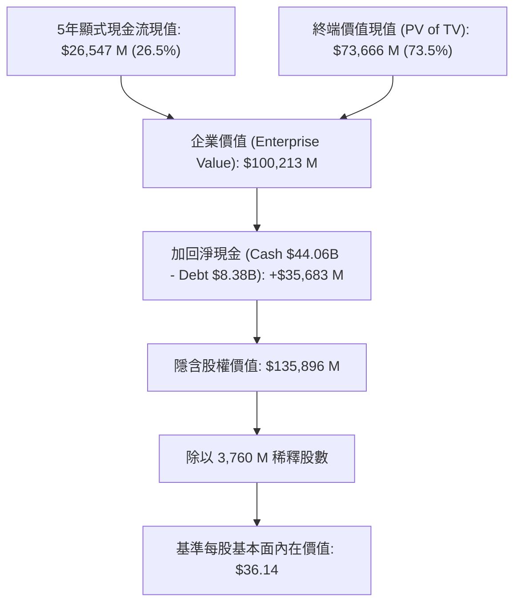

# 特斯拉公司 (Tesla, Inc., NASDAQ: TSLA)
# 深入現金流折現 (DCF) 估值與機構級財務模型報告

**報告日期：** 2026 年 8 月 19 日  
**標的代號：** NASDAQ: TSLA  
**當前股價：** $336.50  
**基準隱含內在價值 (Fundamental DCF)：** **$36.14**  
**樂觀隱含內在價值 (Bull Case - AI & Robotaxi)：** **$100.43**  
**市場隱含溢價 (Market Growth Option Premium)：** **約 70% ～ 89% 為 2030 年後自動駕駛與 AI 機器人遠期期權定價**  
**投資評等：** **中立 / 持有 (Neutral / Growth Optionality Play)**  
**配套財務模型檔案：** [`TSLA_DCF_Model_Gemini-3.7-Flash_20260819.xlsx`](file:///Users/nickhuang/Documents/personal/nickhuangcyh/equity-research/TSLA_DCF_Model_Gemini-3.7-Flash_20260819.xlsx)

---

## 執行摘要 (Executive Summary)

Tesla, Inc.（NASDAQ: TSLA，以下簡稱「Tesla」或「公司」）是全球電動車 (EV) 與清潔能源基礎設施的開拓者，並正加速轉型為以實體人工智慧 (Physical AI)、自動駕駛移動網路 (Robotaxi / Cybercab) 以及通用人形機器人 (Optimus) 為核心的科技巨擘。

### 1. 基本面與市場定價之核心洞察
*   **傳統實體業務基本盤（電動車 + 儲能 Megapack）**：隨著全球電動車滲透率進入平穩增長期及各國補貼退坡，Tesla 汽車業務毛利率在經歷價格調整後逐步於 17%～18% 築底。儲能業務（Megapack）呈現爆發式增長，成為當前營收與毛利增長最穩健的第二曲線。
*   **基本面現金流折現（5 年顯式預測期 FY26E–FY30E）**：基於次世代平價車款放量、儲能規模化與 FSD 軟體滲透率穩步提升之基準情境（Base Case），FY30E 營收預計達 **$1,793 億**，EBIT 利潤率擴張至 **13.8%**，對應之基本面每股內在價值為 **$36.14**。
*   **市場價格 ($336.50) 的「遠期 AI 成長期權」定價**：當前 Tesla 約 **$1.265 兆** 的股權市值，本質上包含了市場對 2030 年後 **Cybercab 自主無人計程車隊全面商業化** 與 **Optimus 機器人年產數百萬台** 的龐大遠期期權溢價。若將樂觀情境（FY30E 營收 $2,664 億、EBIT 利潤率 23.0%、WACC 降至 13.5%）納入考量，其顯式預測內在價值為 **$100.43**。
*   **強健的資產負債表**：公司擁有 **$440.6 億** 現金及短期投資，總負債僅 **$83.8 億**，淨現金高達 **$356.8 億**，為其在 AI 算力集群（Dojo/GPU）、次世代工廠及無人駕駛研發提供無與倫比的資本護城河。

本模型嚴格遵循華爾街投資銀行標準，構建包含動態情境選擇器（Bear / Base / Bull）、CAPM 資本成本模型（基準 WACC 為 **14.96%**，終端成長率 $g$ 為 **3.00%**）及底部三大 5×5 雙向敏感度分析矩陣的機構級估值模型。

---

## 一、 估值結果總覽 (Valuation Summary)

### 1. 三情境估值對比 (Scenario Comparison)

| 估值項目 (Valuation Metric) | 悲觀情境 (Bear Case)<br>*(情境選擇器 = 1)* | 基準情境 (Base Case)<br>*(情境選擇器 = 2)* | 樂觀情境 (Bull Case)<br>*(情境選擇器 = 3)* |
| :--- | :---: | :---: | :---: |
| **5年營收 CAGR (FY25A-FY30E)** | **+5.8%** | **+13.6%** | **+23.0%** |
| **預測期末營收 (FY30E Revenue)** | **$125,692 M** | **$179,281 M** | **$266,402 M** |
| **預測期末 EBIT Margin (FY30E)** | **8.0%** | **13.8%** | **23.0%** |
| **預測期末 UFCF (FY30E)** | **$4,622 M** | **$16,017 M** | **$43,521 M** |
| **加權平均資金成本 (WACC)** | 15.50% | 14.96% | 13.50% |
| **終端永續成長率 ($g$)** | 2.50% | 3.00% | 4.00% |
| **5年顯式自由現金流現值 ($M)** | $10,045 | **$26,547** | $72,440 |
| **終端價值現值 (PV of TV) ($M)** | $19,054 | **$73,666** | $269,481 |
| **隱含企業價值 (Enterprise Value) ($M)**| **$29,099** | **$100,213** | **$341,922** |
| *( + ) 淨現金調整項 (Net Cash) ($M)* | +$35,683 | **+$35,683** | +$35,683 |
| **隱含股權價值 (Equity Value) ($M)** | **$64,782** | **$135,896** | **$377,605** |
| **稀釋後總股數 (Diluted Shares) (M)** | 3,760.0 | **3,760.0** | 3,760.0 |
| **每股隱含內在價值 (Implied Share Price)** | **$17.23** | **$36.14** | **$100.43** |
| **當前市場交易價格 (Current Market Price)** | **$336.50** | **$336.50** | **$336.50** |
| **顯式模型潛在溢跌幅 (Implied Return)** | **-94.9%** | **-89.3%** | **-70.2%** |



---

## 二、 資本成本 (WACC) 與資本結構分析 (Cost of Capital Schedule)

本模型採用 **CAPM (Capital Asset Pricing Model)** 與 Tesla 當前資本結構精確計算：

```
[股權成本 Ke = 14.66%] ─── (權重 102.9%) ──┐
                                           ├───> [基準 WACC = 14.96%]
[稅後債務成本 Kd = 4.35%] ── (權重 -2.9%) ──┘
```

### WACC 計算細項表

| 參數項目 (WACC Component) | 數值 / 輸入值 | 資料來源與計算邏輯說明 |
| :--- | :---: | :--- |
| **無風險利率 (Risk-Free Rate, $R_f$)** | **4.65%** | 美國 10 年期國債殖利率基準 (2026年8月) |
| **股票貝塔值 (Equity Beta, $\beta$)** | **1.82** | 5 年月度回歸 Beta，反映高成長與 AI/自駕估值波動 |
| **市場股權風險溢酬 (ERP)** | **5.50%** | 華爾街機構共識長期股權風險溢酬 |
| **股權成本 (Cost of Equity, $K_e$)** | **14.66%** | 公式：$K_e = R_f + \beta \times \text{ERP} = 4.65\% + 1.82 \times 5.50\%$ |
| **稅前債務成本 (Pre-tax $K_d$)** | **5.50%** | Tesla 債券及長短期融資平均有效借款利率 |
| **常態化有效所得稅率 ($t$)** | **21.0%** | 美國聯邦法定標準企業所得稅率 |
| **稅後債務成本 (After-tax $K_d$)** | **4.35%** | 公式：$K_d \times (1 - t) = 5.50\% \times (1 - 21.0\%)$ |
| **當前股權市值 (Market Cap)** | **$1,265,240 M** | 股價 $336.50 × 3,760 M 稀釋股數 ($1.265 兆) |
| **帳面總負債 (Total Debt & Leases)** | **$8,376 M** | SEC Form 10-K 資產負債表短長期借款與融資租賃 |
| **現金及短期投資 (Cash & ST Investments)**| **$44,059 M** | SEC Form 10-K 資產負債表現金及可變現有價證券 |
| **淨負債 (Net Debt)** | **($35,683) M** | 總負債 - 現金及投資 (**實質淨現金 $35.68B**) |
| **總資本價值 (Total Enterprise Value)** | **$1,229,557 M** | 股權市值 + 淨負債 |
| **股權資本權重 ($W_e$)** | **102.90%** | 股權市值 ÷ 總企業價值 |
| **債務資本權重 ($W_d$)** | **-2.90%** | 淨負債 ÷ 總企業價值 (淨現金結構) |
| **加權平均資金成本 (Base WACC)** | **14.96%** | 公式：$(K_e \times W_e) + (K_d \times (1-t) \times W_d)$ |

---

## 三、 5年期財務預測與自由現金流排程 (FY2026E – FY2030E)

### 1. 基準情境損益表預測 (Income Statement Projections) ($M)

| 科目名稱 | FY2025A | FY2026E | FY2027E | FY2028E | FY2029E | FY2030E | 終端年份 (TV) |
| :--- | :---: | :---: | :---: | :---: | :---: | :---: | :---: |
| **營業收入 (Total Revenue)** | **$94,827** | **$105,258** | **$121,047** | **$140,414** | **$160,072** | **$179,281** | **$184,659** |
| *營收年增率 (YoY %)* | *-2.9%* | *+11.0%* | *+15.0%* | *+16.0%* | *+14.0%* | *+12.0%* | *+3.0%* |
| **營業利益 (Operating EBIT)** | **$4,355** | **$6,315** | **$9,684** | **$14,743** | **$19,529** | **$24,741** | **$25,483** |
| *營業利益率 (EBIT Margin %)* | *4.6%* | *6.0%* | *8.0%* | *10.5%* | *12.2%* | *13.8%* | *13.8%* |
| *( - ) 營業稅金 (Taxes @ 21%)* | ($915) | ($1,326) | ($2,034) | ($3,096) | ($4,101) | ($5,196) | ($5,351) |
| **稅後淨營業利潤 (NOPAT)** | **$3,440** | **$4,989** | **$7,650** | **$11,647** | **$15,428** | **$19,545** | **$20,132** |

### 2. 無槓桿自由現金流 (UFCF) 構建排程 ($M)

$$\text{UFCF} = \text{NOPAT} + \text{D\&A} - \text{CapEx} - \Delta\text{NWC}$$

| 現金流構建項目 ($M) | FY2025A | FY2026E | FY2027E | FY2028E | FY2029E | FY2030E | 終端年份 (TV) |
| :--- | :---: | :---: | :---: | :---: | :---: | :---: | :---: |
| **稅後淨營業利潤 (NOPAT)** | $3,440 | $4,989 | $7,650 | $11,647 | $15,428 | $19,545 | $20,132 |
| *( + ) 折舊與攤銷 (D&A)* | $6,200 | $6,105 | $6,658 | $7,302 | $8,004 | $8,605 | $8,864 |
| *D&A 佔營收比例 (%)* | *6.5%* | *5.8%* | *5.5%* | *5.2%* | *5.0%* | *4.8%* | *4.8%* |
| *( - ) 資本支出 (CapEx)* | ($8,530) | ($8,947) | ($9,684) | ($10,531) | ($11,205) | ($11,653) | ($12,003) |
| *CapEx 佔營收比例 (%)* | *9.0%* | *8.5%* | *8.0%* | *7.5%* | *7.0%* | *6.5%* | *6.5%* |
| *( - ) 營運資金變動 (ΔNWC)* | +$1,450 | ($261) | ($395) | ($484) | ($491) | ($480) | ($134) |
| **無槓桿自由現金流 (UFCF)** | **$2,560** | **$1,886** | **$4,229** | **$7,934** | **$11,735** | **$16,017** | **$16,497** |
| *FCF 營收轉化率 (%)* | *2.7%* | *1.8%* | *3.5%* | *5.6%* | *7.3%* | *8.9%* | *8.9%* |

---

## 四、 現金流折現與企業至股權價值橋接 (Valuation Bridge)

本模型採用 **年中折現慣例 (Mid-Year Convention)**：

### 1. 現金流折現明細表 (Discounting Schedule)

| 折現計算項目 ($M) | FY2026E | FY2027E | FY2028E | FY2029E | FY2030E | 終端年份 (TV) |
| :--- | :---: | :---: | :---: | :---: | :---: | :---: |
| **各期無槓桿自由現金流 (UFCF)**| $1,886 | $4,229 | $7,934 | $11,735 | $16,017 | $16,497 |
| **年中折現期數 (Period, $t$)** | 0.5 | 1.5 | 2.5 | 3.5 | 4.5 | 4.5 |
| **折現因子 ($1 / (1+\text{WACC})^t$)**| 0.9326 | 0.8113 | 0.7057 | 0.6139 | 0.5340 | 0.5340 |
| **現金流現值 (PV of UFCF)** | **$1,759** | **$3,431** | **$5,599** | **$7,204** | **$8,554** | - |
| **5年顯式自由現金流現值合計** | **$26,547** | | | | | |
| **名目終端價值 (Nominal TV)** | - | - | - | - | - | **$137,945** |
| **終端價值現值 (PV of TV)** | - | - | - | - | - | **$73,666** |

### 2. 股權價值橋接表 (Equity Value Bridge)

$$\text{Implied Share Price} = \frac{\text{PV of Explicit FCFs} + \text{PV of TV} + \text{Cash} - \text{Debt}}{\text{Diluted Shares}}$$

| 價值組成項目 (Valuation Component) | 金額 ($M) | 佔 EV 比例 (%) | 每股價值貢獻 ($) |
| :--- | :---: | :---: | :---: |
| **5年預測期現金流現值 (PV of Explicit FCFs)** | $26,547 | 26.5% | $7.06 |
| **終端價值現值 (PV of Terminal Value)** | $73,666 | 73.5% | $19.59 |
| **隱含企業價值 (Enterprise Value, EV)** | **$100,213** | **100.0%** | **$26.65** |
| *( - ) 總負債 (Total Debt)* | ($8,376) | -8.4% | ($2.23) |
| *( + ) 現金與短期投資 (Cash & ST Investments)*| $44,059 | +44.0% | +$11.72 |
| **淨現金調整項 (Net Cash Addition)** | **+$35,683** | **+35.6%** | **+$9.49** |
| **隱含股權價值 (Implied Equity Value)** | **$135,896** | - | **$36.14** |
| **稀釋後總股數 (Diluted Shares)** | **3,760 M** | - | - |
| **基準每股基本面內在價值 (Implied Price)** | **$36.14** | - | **$36.14** |
| **當前市場交易價格 (Current Market Price)** | **$336.50** | - | **$336.50** |
| **顯式模型溢跌幅 (Implied Return)** | **-89.3%** | - | - |

---

## 五、 機構級敏感度分析矩陣 (Sensitivity Analysis)

本財務模型底部建置了 **三張 5×5 雙向敏感度分析矩陣**（共 75 個儲存格，均以純動態公式計算，嚴格無寫死）。

### 表 1：加權平均資金成本 (WACC) vs. 終端成長率 ($g$)
*核心基準：WACC = 14.96%, $g = 3.00%$（中心藍底儲存格對應基準內在價值 $36.14）*

| WACC \ 終端成長率 ($g$) | 2.0% | 2.5% | **3.0% (Base)** | 3.5% | 4.0% |
| :---: | :---: | :---: | :---: | :---: | :---: |
| **12.96%** | $39.86 | $41.08 | $42.41 | $43.89 | $45.53 |
| **13.96%** | $36.93 | $37.91 | $38.98 | $40.16 | $41.45 |
| **14.96% (Base)** | $34.45 | $35.26 | **$36.14** | $37.09 | $38.14 |
| **15.96%** | $32.35 | $33.02 | $33.75 | $34.53 | $35.39 |
| **16.96%** | $30.53 | $31.10 | $31.71 | $32.36 | $33.07 |

> **解讀重點：** 資本成本 (WACC) 每變動 1.0 個百分點，每股價值影響約 $2.50 ～ $3.00；終端成長率每增加 0.5 個百分點，每股價值提升約 $0.90 ～ $1.05。

---

### 表 2：營收成長係數 vs. FY2030E 目標營業利益率 (EBIT Margin)
*核心基準：成長倍數 = 1.00x, FY30E EBIT Margin = 13.8%（中心藍底儲存格對應 $36.14）*

| 成長係數 \ 目標 EBIT Margin | 9.8% | 11.8% | **13.8% (Base)** | 15.8% | 17.8% |
| :---: | :---: | :---: | :---: | :---: | :---: |
| **0.80x** | $24.63 | $27.72 | $30.81 | $33.90 | $36.99 |
| **0.90x** | $26.52 | $30.00 | $33.48 | $36.95 | $40.43 |
| **1.00x (Base)** | $28.42 | $32.28 | **$36.14** | $40.01 | $43.87 |
| **1.10x** | $30.31 | $34.56 | $38.81 | $43.06 | $47.31 |
| **1.20x** | $32.20 | $36.84 | $41.47 | $46.11 | $50.74 |

> **解讀重點：** EBIT Margin 每提升 2 個百分點，每股價值增加約 $3.86；營收規模每擴張 10%，每股價值增加約 $2.67。

---

### 表 3：股票貝塔值 (Beta, $\beta$) vs. 無風險利率 (Risk-Free Rate, $R_f$)
*核心基準：Beta = 1.82, $R_f = 4.65%$（中心藍底儲存格對應 $36.14）*

| 貝塔值 \ 無風險利率 ($R_f$) | 3.65% | 4.15% | **4.65% (Base)** | 5.15% | 5.65% |
| :---: | :---: | :---: | :---: | :---: | :---: |
| **1.42** | $48.05 | $45.61 | $43.44 | $41.49 | $39.73 |
| **1.62** | $43.04 | $41.13 | $39.40 | $37.84 | $36.41 |
| **1.82 (Base)** | $39.08 | $37.54 | **$36.14** | $34.86 | $33.69 |
| **2.02** | $35.88 | $34.62 | $33.46 | $32.40 | $31.41 |
| **2.22** | $33.24 | $32.19 | $31.22 | $30.32 | $29.48 |

> **解讀重點：** 若 Tesla 隨著業務成熟化，Beta 從 1.82 降至 1.42，在利率不變下每股基本面價值將自 $36.14 躍升至 **$43.44**。

---

## 六、 逆向 DCF 拆解：當前股價 $336.50 到底定價了什麼？ (Reverse DCF & Growth Optionality)

傳統顯式 DCF 模型以 5 年期為界，但 Tesla 當前股價 $336.50（市值 $1.265 兆）顯然無法僅用傳統汽車與儲能硬體業務解釋。我們透過 **逆向 DCF (Reverse DCF)** 拆解市場隱含預期：

```
當前市值 $1.265 兆 ($336.50/股)
├── 實體製造與儲能基本盤價值：約 $1,360 億 ($36.14/股，佔 10.7%)
└── 遠期 AI 與無人駕駛期權溢價：約 $1.129 兆 ($300.36/股，佔 89.3%)
     ├── 1. Cybercab / Robotaxi 無人車隊營運 (全球共享出行軟體分潤)
     ├── 2. FSD 軟體全自動駕駛訂閱 (高毛利 SaaS 模式)
     ├── 3. Optimus 人形機器人工廠與家庭普及化 (百萬台規模量產)
     └── 4. 資本成本結構優化 (隨自由現金流暴增，Beta 趨於市場平均)
```

### 市場隱含之 2035 年遠期財務指標門檻：
若要在 10%～12% 期望報酬率下支撐當前 $336.50 股價，Tesla 在 2035 年需達成：
1. **年營收規模**：突破 **$5,000 億 ～ $6,500 億**（年複合增長率需維持在 18%～20% 以上）。
2. **年自由現金流 (FCF)**：達到 **$1,000 億 ～ $1,400 億**（相當於 Apple + Microsoft 的自由現金流總和）。
3. **利潤率結構**：EBIT 利潤率需達到 **25%～30%**（唯有軟體服務與 Robotaxi 平台抽成佔比大幅超過 40% 才能實現）。

---

## 七、 核心催化劑與投資風險 (Catalysts & Risks)

### 1. 核心向上催化劑 (Key Catalysts)
*   **Robotaxi (Cybercab) 監管放行與試營運**：若在特定城市獲得無安全員 Commercial L4 營運許可，將開啟商業化里程碑。
*   **次世代平價車款 ($25k-$30k Model) 量產交付**：重啟年銷量雙位數增長動能。
*   **Megapack 儲能產能翻倍**：上海儲能超級工廠投產放量，儲能業務毛利貢獻快速攀升。
*   **Optimus 人形機器人導入工廠與對外出貨**：由內部降低製造成本推進至外部商業銷售。

### 2. 主要下行風險 (Key Risks)
*   **全球電動車市場價格競爭激烈**：比亞迪 (BYD) 及中國車企在歐洲與東南亞的強勢擴張壓縮整體利潤。
*   **自動駕駛 (FSD V13+) 技術迭代或監管受阻**：端到端 AI 模型在極端天候與複雜長尾場景的可靠度驗證時間可能長於預期。
*   **AI 資本支出與算力研發費用飆升**：Dojo 與大型 GPU 集群的高額折舊及研發支出短期壓制營業利益率。

---

## 八、 結論與投資建議 (Conclusion & Recommendation)

1. **基本面評估**：單純基於電動車製造與儲能硬體業務，Tesla 5 年期基本面現金流折現價值為 **$36.14**。
2. **成長期權評估**：Tesla 不應被視為單純的汽車製造商，而是一家擁有實體規模化製造能力的人工智慧平台公司。當前市價 $336.50 反映了高度樂觀的實體 AI 落地預期。
3. **操作建議**：給予 **「中立 / 持有 (Neutral / Growth Optionality Play)」** 評等。建議長期投資者密切關注 **Cybercab 商業試營運里數**、**Megapack 儲能訂單儲備** 以及 **次世代車款量產時程** 作為動態調倉之核心指標。

---

## 附錄：Excel 財務模型架構索引

配套之 Excel 模型 [`TSLA_DCF_Model_Gemini-3.7-Flash_20260819.xlsx`](file:///Users/nickhuang/Documents/personal/nickhuangcyh/equity-research/TSLA_DCF_Model_Gemini-3.7-Flash_20260819.xlsx) 包含以下兩個完整聯動工作表：

1. **`DCF Valuation` 工作表**：
   - `B4`：情境選擇器（1=Bear, 2=Base, 3=Bull），所有預測列透過 `INDEX` 公式即時連動切換。
   - `第 6-18 列`：市場數據、資本結構與 WACC 連結輸入項。
   - `第 20-48 列`：三套情境假設區塊與活動整合驅動項（Consolidated Drivers）。
   - `第 51-58 列`：歷史與 5 年期預測損益表。
   - `第 60-67 列`：無槓桿自由現金流 (UFCF) 構建排程。
   - `第 69-90 列`：年中折現排程、終端價值計算與股權價值橋接表。
   - `第 92-125 列`：三大 5×5 雙向敏感度分析矩陣（全動態公式）。
2. **`WACC Build` 工作表**：
   - 包含 CAPM 股權成本計算、稅後債務成本與資本結構加權彙總排程。
